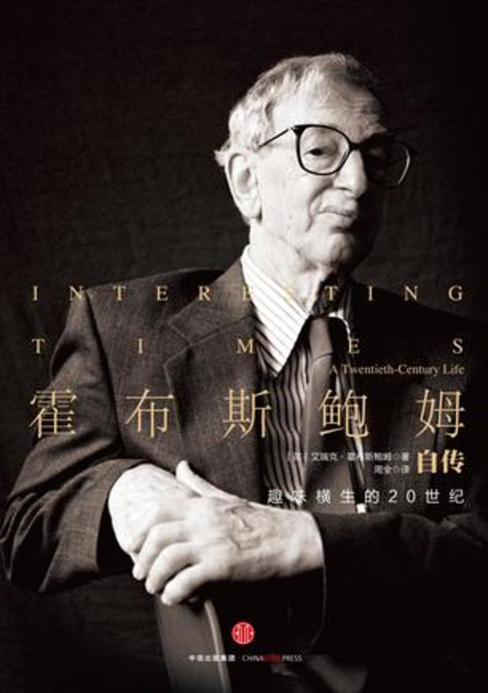
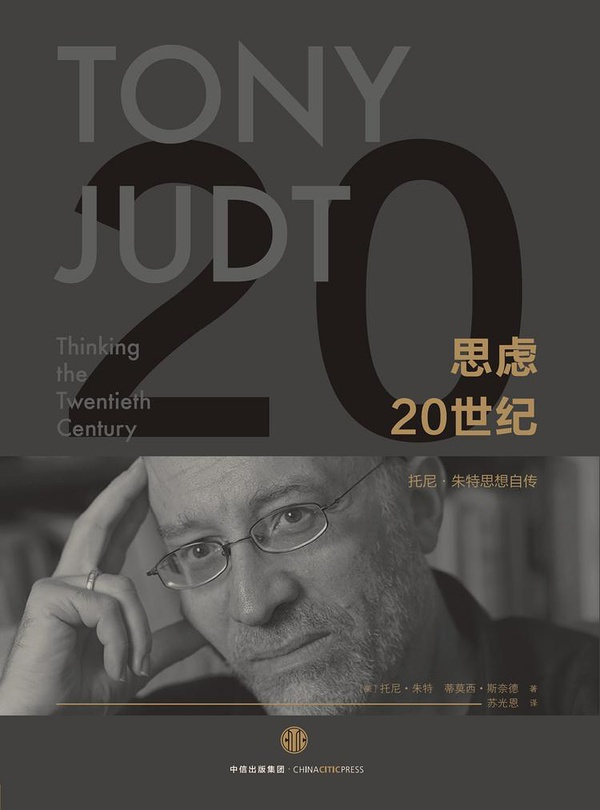
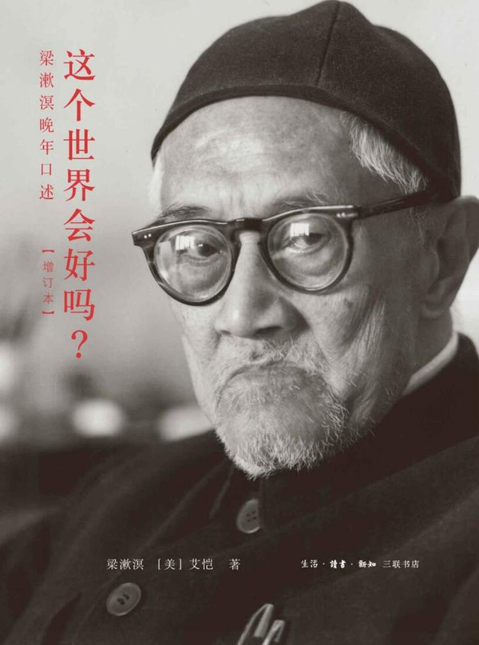
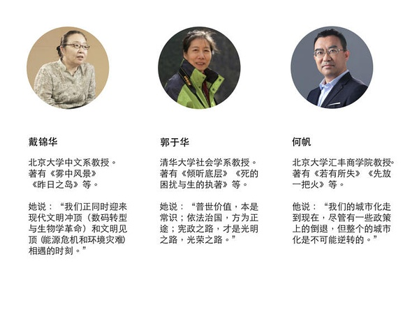
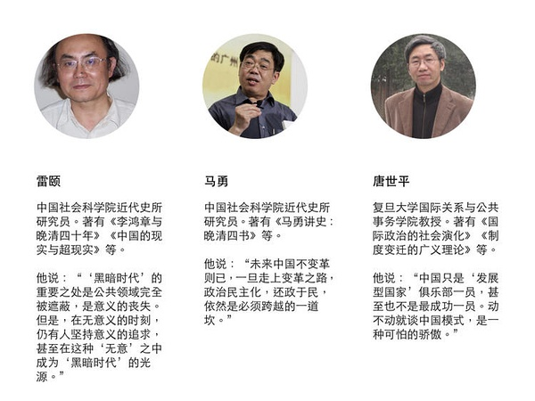
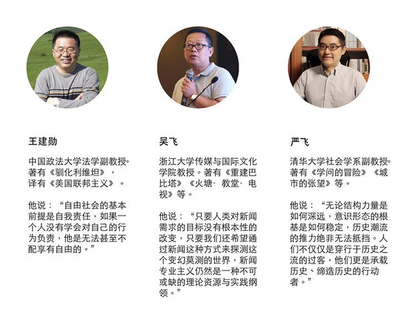
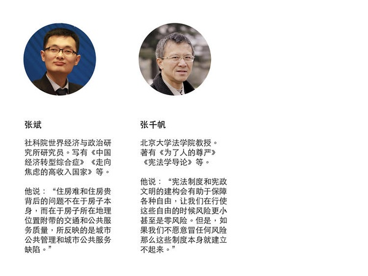

#“有时候，关键的不是去改变世界，而是去解释世界”｜我们如何与未来相处

 [好奇心日报](http://www.qdaily.com/)  2018-04-03 07:08:57

本文作者： 曾梦龙

**“有时候，关键的不是去改变世界，而是去解释世界。”**

埃里克·霍布斯鲍姆， 1968 年在剑桥大学对他的学生这么说。

当时，二战后出生的婴儿潮一代正处于青春期。他们回望父辈留给他们的世界——全球经历了两次大战，启蒙时代诞生的文明和进步的社会共识被质疑，西方世界分割为两大敌对部分……恶行如何发生并控制了世界？与此同时，传播业因为电视出现而娱乐化，核讹诈成为人类的恐惧，环境问题开始出现……在这个可能是青年人口占比最高的时候，几乎在全球范围内都出现了青年人为主体的群众运动。整个世界躁动不安。

[一年多以前，《好奇心日报》曾经做过系列报道“这个社会，对年轻人太好了吗？”](http://www.qdaily.com/articles/37985.html)。

我们当时提出的问题是：

一个社会，需要传承。如果传承给年轻人的是一个乌七八糟的社会：价值观混乱、缺乏信任和尊重、犬儒主义泛滥、暴戾、愚昧、不知好歹……如果人类积淀的文明被漠视，那么，无论如何我们不能认为这是“对年轻人的好”。

一年以后，不论是从官方宣传的新时代语境，还是民间传递出来微弱的质疑声音，都告诉我们现在正处于一个历史关口之中。与去年的话题不同之处在于，可能不仅仅是上一代或两代人留给年轻人一个什么样的社会的问题，而是所有人可能都在面临历史关口时刻，如何看待、解释这个世界，以及更重要的，我们如何与未来相处。

霍布斯鲍姆在 1968 年以一个历史学家的冷静，告诉他的年轻一代学生，“有时候，关键的不是去改变世界，而是去解释世界。”——这与他终身信奉的马克思主义鼻祖所说的那句著名的话正好相反。

课堂上一位叫托尼·朱特的学生对此话记忆深刻，事隔多年之后，他成为美国最著名的思想家与公共知识分子。

正如托尼·朱特之于埃里克·霍布斯鲍姆，引用这个典故除了告诉我们“解释”一个世界的重要性，另外一层意义在于传承的重要性：在某个关键时刻，关于如何解释这个世界，如何与未来相处，我们需要听听睿智、独立的声音。

“我的孩子丹尼尔和尼克拉斯过着青少年的繁忙生活。但是，他们腾出时间和我讨论这些篇章中的很多主题。确实，正是我们在餐桌上的对话，使我第一次完全了解到今天的年轻人多么关注我们留给他们的世界——而我们又没有给他们提供足够的办法来改进这个世界。这本书是献给他们的。”托尼·朱特在《沉疴遍地》一书中写道。

我们邀请了经济学、法学、社会学、传播学等领域的 20 余位专业人士，回答了我们的问题。

此前，我们已经刊出[盛洪先生](http://www.qdaily.com/articles/50996.html)、[唐世平教授](http://www.qdaily.com/articles/51345.html)的部分访问内容。

我们的大部分采访在 2017 年底到 2018 年初进行。今天我们感受到的关口，在采访之时已经全部准备停当，一如诸多被访者所料。

这个系列，也如去年一样，我们的问题从过去一年令年轻人困惑的社会问题出发。

这些问题包括：

正在崛起的中产阶层，如何看待他们对于财富和教育、就医等稀缺资源表现出的焦虑；

因为北京文科状元的一个访谈，引发的阶层流动与固化的担忧；

如何看待城市化过程中，低端就业人口与高端城市定位之间的矛盾；

改革开放 40 年，我们如何看待过去的成就，未来是否可持续；

在更长的时间段内，我们如何面对历史，比如文革；

农村变得凋敝，东北失去活力，这会折射出我们未来的停滞吗；

我们如何理解城市化和未来，尤其当我们已经是一个城市化的既得利益者的时候；

公共事件出现以后，越来越多的发声究竟意味着什么，我们如何营造一个理性的公共话语空间；

中产阶级对于这个社会究竟意味着什么，它们会被寄予现代化转型的希望吗；

如何看待越来越严重的民族主义情绪，未来我们如何带着“中国”的标签与世界相处；

政府的强势，民间社会的缺失，一个缺乏弹性的社会隐藏什么样的危机；

问题纷繁而且复杂，但与年轻一代的未来生活息息相关。在被访者眼中，是一代“盛世孩子”（严飞语）也好，丧文化左右的“小时代”（戴锦华语）也好，出发点都是希望留给未来年轻一代的这个世界运转良好而且文明进步，在复杂而且迷茫的世界中，保持独立与理性。

很多人提到了乐观。北京大学汇丰商学院教授何帆提及，从经济发展角度看，一旦启动不会轻易停止，工业化、城市化和创新三个引擎会推动这个社会向前发展。北京大学法学院教授张千帆说：“一个国家在发展过程当中免不了会左右摇摆，包括中国也是这样。今年变得好一点，明年可能差一点，但它不会改变宪政民主的大趋势，所以不要对这种暂时现象做过度解读。”

乐观尽管在每个人那里都不同程度地表达出来，但一个乐观的未来并非仅仅依赖愿望的存在而轻易到来。在达成未来的过程中，需要解决的问题还有很多，它几乎无一不是对应着我们现时的困惑和茫然。

戴锦华说到流行文化中的“丧”。“因为所有的挫败都是合理的，所有造成挫败的结构性的原因都是不可逆转的，所以我们就拥抱这点，拥抱这些丧，接受这些不可能。所以我是这么体验这个东西，而这个东西对我来说变得有点可怕。其实原本小时代、小确幸和小确丧本身没有什么可怕之处，因为当我们称它为流行的时候，就意味着它旋生旋灭，不必过于挂心。但是在这个当中，我自己在代沟的这一边，我自己体验到了这样的一种结构性的支撑在它后面”。

王建勋提及红黄蓝幼儿园事件中的“信任”问题。“幼儿园的事情我觉得比较重要，比较值得关注。因为幼儿园其实折射出来一种问题就是说人与人之间没有信任可言。”

唐世平提及过分自信可能会遮蔽我们判断自身能力的视野。“我那篇文章并不是说中国不成功，而是说它不是最成功。应该这么说，我们花了 40 年，还没有进入 OECD 水平（经合组织世界高收入经济体）。而韩国、日本、新加坡和中国台湾花了 30 年或者 40 年，就进入了 OECD 国家或地区。所以，我们还是有很长的路要走。”

张斌提到了还是那个老问题——留给年轻人一个什么样的未来世界。“按照我们现在经济增长情况，一步一步比较稳健，我相信这个社会的治理也会越来越好。我们要担心的是一些不确定的事物，军事上、外交上、政治上的一些出人意料的东西。如果特别出乎意料的事情发生的话，对我们现在的社会来讲，未必经得起这个考验。”

吴飞看到未来的一种可能性是，在一个参与者广泛的社会中，少数人的权重过大。“……其实是充满不确定性，因为这个社会流动的，它没有说一个固定的形态在那个地方，你永远处于一种对话的一个状态。当然，只要让我们所有的对话都处于一种开放的心态，它一定会朝着好的方向去发展，但是我们这块被切断了，那这个社会就可能……因为它只是少数人决策的话，少数人的智慧毕竟总是有限的。”

郭于华担忧一个民间社会如何壮大起来。“这个期限要拉得相当长，也就是中国付出改革、付出转型的代价可能还要相当大。我觉得还是寄希望于公民的力量，寄希望于社会的力量。公民自己是没有办法，因为公民的意义本身也包含了他的社会性。他一个人单打独斗是成不了公民的，一定要有公民和公民的这种联合，公民和公民的这种连接。对，就公民社会的这种成长。”

王建勋还提到一个细节。“我们自身比如说教育孩子，通常父母都会告诉孩子，见了陌生人千万不要跟他说话。那他就是假定一个基本前提：陌生人都是坏人。所有的人都是这么教育孩子。我们不关心这个陌生人是谁？他需要什么？我们都会一刀切地告诉孩子们不能跟陌生人说话，而西方人绝不会这么教育孩子。这个陌生人假如说处于危机之中，他特别需要帮助，你既然不理他，那他有可能死掉。这就反映了从小我们孩子因为没有安全感而导致了我们让他不要相信别人。一代一代的人成长起来之后，除了你对自己的朋友家人、特别亲近的人你信得过之外，其他人都不相信。没有一个陌生人之间的信任关系，可以说是家庭、学校都负有这种责任。”

戴锦华则感性而直接地指出了一个“可怕”的现实：“就是对所有反抗和叛逆的不可能性，甚至成为了一种要把所有的理想性的东西都污名化的一种趋向。比如说情怀党，比如说伪君子。当这个世界我们只相信真小人的时候，它是多么可怕。”

总结下来，尊严，权利，信任，人、人性和人的地位——这些可能在上一轮 1980 年代的思想解放运动中被唤起的东西，我们如今还是要再度提起。

历史学家马勇在被访时提及“历史的偶然性”——细节决定了很多历史走向，它可能是 1793 年的马戛尔尼使节访华，也可能是他自己赶上了高考：“毛泽东再活 10 年完全有可能，93 岁也不大。那可能对我们来讲，这一代人可能就结束了。恢复高考我也不会再考了。这就是历史的偶然性决定我们（的命运），那么在最近 40 年其实也都是历史的偶然性。”

雷颐的说法与之近似，他说，我们眼下遇到的问题可能只是历史的小旋涡，但“于我们一个人来说，有可能是你的一二十年，甚至你的几十年、半辈子就过去了”。

一个小旋涡，可能就是我们的一生一世。

所以，在我们针对的问题之外，我们的系列文章中还将涉及好社会的标准、年轻一代如何自为、这个世界未来究竟会走向哪里……

我们的报道从我们的读者最关注的一个“大”问题开始——这个世界还会好吗？

这句话同样来自于一个典故：恰好在 100 年前（1918 年），梁漱溟（1893-1988）父亲梁济在对世界绝望中选择自杀，在自杀前曾经问他“这个世界会好吗？”很多年后，一个美国芝加哥大学的教授艾恺，在编梁漱溟晚年口述时，又用这句话当作书名《这个世界会好吗》。

*（后续报道，陆续更新）*

**本篇报道涉及到的采访人物：**

制图：冯秀霞

题图为电影《戏梦巴黎》剧照，来自：豆瓣