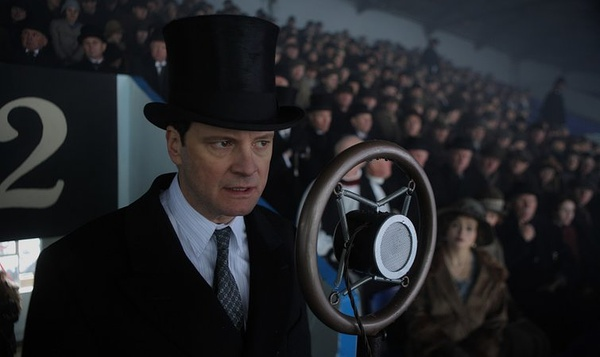

#潮流是任何人无法挡住的，此时，我们为什么还可以坚持乐观 | 我们如何与未来相处②

 [好奇心日报](http://www.qdaily.com/)  2018-04-11 07:14:14

本文作者： 曾梦龙

**“有时候，关键的不是去改变世界，而是去解释世界。”**

**在某个关键时刻，关于如何解释这个世界，如何与未来相处，我们需要听听睿智、独立的声音。**

**我们邀请了经济学、法学、社会学、传播学等领域的 20 余位专业人士，回答了我们的问题。**

**正在崛起的中产阶层，如何看待他们对于财富和教育、就医等稀缺资源表现出的焦虑；**

**因为北京文科状元的一个访谈，引发的阶层流动与固化的担忧；**

**如何看待城市化过程中，低端就业人口与高端城市定位之间的矛盾；**

**改革开放 40 年，我们如何看待过去的成就，未来是否可持续；**

**在更长的时间段内，我们如何面对历史，比如文革；**

**农村变得凋敝，东北失去活力，这会折射出我们未来的停滞吗；**

**公共事件出现以后，越来越多的发声究竟意味着什么，我们如何营造一个理性的公共话语空间；**

**中产阶级对于这个社会究竟意味着什么，它们会被寄予现代化转型的希望吗；**

**如何看待越来越严重的民族主义情绪，未来我们如何带着“中国”的标签与世界相处；**

**政府的强势，民间社会的缺失，一个缺乏的弹性的社会隐藏什么样的危机……**

**问题纷繁而且复杂，但与年轻一代的未来生活息息相关。被访者希望，留给未来年轻一代的这个世界运转良好而且文明进步；在复杂而且迷茫的世界中，保持独立与理性。**

以下为第二篇。它涉及我们如何看待目前我们所处的阶段，即使问题多多，我们为什么还可以保持乐观。

>**【1.为什么我们不用害怕全球化眼下在全球范围内的势微？】**

**特朗普、法国民粹、英国脱欧等反全球化行为在几百年全球化历史中只是“小漩涡”**

**雷颐  中国社会科学院近代史所研究员**

我觉得从全球化来说，我们现在通常把哥伦布发现新大陆作为全球化的一个开始，这五六百年，你看整个是越来越强。它在各个不同的时期，会有一种很强烈地反全球化的东西。但是，你看因为经济的发展、科技的发展，它已经是从大的范围来说是无法遏制的。当然，它一个小漩涡作为我们一个人生，恐怕就在这一个漩涡中过去了。

但是，毕竟你想想现在的程度，比如说包括英国脱欧，这是很大的大事。但是，你放在历史上看，欧盟的建立是很难，几乎从前是不可想象的。包括我们看，第一次世界大战爆发之后，和国家利益之间的交往越来越紧密相连。那都是为了利益，就可以打一场那么大的战争，觉得必须有一个国际性的机构来协调管理，就成立了一个机构，叫做“国联”。“国联”的权威是很有限的，几乎可以说任何权威都没有，美国又没参加，是它发起的，但是它国会就通不过，更不要说它有任何其他的权威了。你像日本侵略了中国东北，“国联”调查，虽然谴责了日本，你也毫无作用。并且日本一愤怒，我退出“国联”。你谴责我，我退出，结果导致了第二次世界大战的爆发。

第二次世界大战在快结束的时候，就觉得恐怕得有一个更强有力的国际机构——“联合国”。“联合国”它有种种问题，但你比较“联合国”和二十多年前的“国联”，它的权力要比“国联”大得多了，有维和部队，国际间还成立了一系列的金融机构。现在哪个国家发钞发得多了，甚至都会受到其他国际金融机构，什么国际货币组织的管束。按照从前观念，我发钞发多发少，完全是我一个国家的主权。现在你都不能不顾及到了。

（实际上，你觉得像美国、英国、法国这些情况可能都只是小漩涡？）

当然了。但这个“小漩涡”，对于我们一个人来说，可能你的一二十年，甚至你的几十年、半辈子就过去了。但是从全球化来看，这个趋势来说，我觉得是（不可阻挡的）。与全球化相关的，它下面那套自由民主的价值观也是一样的。

>**欧美宪政体制上总体是健康的，发展过程当中的摇摆不用过度解读**

**张千帆  北京大学法学院教授**

全球化有所退缩。特朗普当选只是一个现象，它会反映出一些更加深刻的原因。欧洲主要就是反移民，比如说为什么“德国另选”（AFD）会一下子得到 13% 的选票，就是因为这些选民厌倦了基督教民盟和社民党代表的主流选择，而是要另辟蹊径。这个“蹊径”基本上就是要回到排外和种族主义的老路上去。去年底大选，它可以说大获全胜。奥地利现在也是保守党组阁，所谓的“保守”对于他们来讲好像有点要走纳粹老路的意思了。但这只是一个端倪，距离纳粹很远，没有什么可能性。主要也是受到某些事件激发，比如说移民一下过多，默克尔可能是太猛了。这样就会造成一些社会问题，然后再引发一些社会情绪。等到平息之后，它又会恢复正常。毕竟，德国的 AFD 也就是得了 13% 点几的选票，离纳粹当年得到百分四十几还差得很远。就跟人体一样，不仅各种病毒细菌都存在，甚至癌细胞也都存在，就看你体内的免疫力有多少？你的健康的细胞有多少？活力有多大？

应该说，欧美的宪政体制总体上仍然是健康的，川普面临的各种制度约束和监督就是很好的证明。一个国家在发展过程当中免不了会左右摇摆，包括中国也是这样。今年变得好一点，明年可能差一点，但它不会改变宪政民主的大趋势，所以不要对这种暂时现象做过度解读。

>**为什么全球进入到一个保守主义时间段？**

**洪涛  复旦大学国际关系与公共事务学院教授**

20 世纪是一个革命的世纪，理想主义的世纪，当然，也是一个给人类带来巨大灾难的世纪。到了 1970 年代，情况发生变化。西方大概是在 1970 年代末、1980 年代初开始走向保守。中国晚一点，差不多要到 21 世纪，大家都开始告别革命了。

为什么会有这样的变化，我没有做全面的研究。想来经济或许是最重要的一个因素，资本主义的整套经济机制不仅普遍化了，而且固化了，不论你号称什么样的意识形态、声张什么样的文化，都不得不融入其中，因为只有这样你才有利益，作为国家才能富强。这个力量非常强大。它所产生的一系列后果：技术工业的发展、理性官僚制、消费主义等等，都易于使每个个体陷于无奈而顺应的格局之中，可以这样说，理想主义的衰落和保守主义的兴起，乃是资本主义这一“坚壳”降临于人类的一个结果。

当然，“保守”这个问题本身很复杂，从不同的角度看，有不同的“保守”。从权力的角度来说，“保守”意味着秩序主义和服从。权力者总是希望老百姓能够听话，我们经常从各种不同类型的官僚嘴里，听到对老百姓不够听话的抱怨。他们最好是要你怎样，你就怎样。不仅是说要你怎样，你就怎样；而且是不说要你怎样，你也能怎样。权力者就是这样，你能怎样？这是“保守”的一种。古往今来的所有政权，古今中外的所有统治者，都是这种意义上的“保守主义者”，他们当然不会喜欢激进。

还有一种“保守”，源于对现代性的反思，是一种文化上的保守主义。它对现代生活的许多重要方面，如技术控制的意识形态、世俗主义、国家主义等等，有不同的看法，主张对其进行反思。

这两种“保守”很不一样。前者认同现代秩序乃至一切秩序，后者不满足于现代秩序，而是主张对现代秩序进行反思。前者是政治上的，后者是文化上的，两者要作区分。

向政治上的保守主义发展，符合现代逻辑。现代性的核心观念，便是管控。对人的管控，其政治形式，便是现代官僚制。官僚制把人的生活、人的工作、人的行为纳入严格的固定轨道，其极端形态便是使整个社会官僚化。长期习惯于在轨道中生活的人，自然容易成为“政治上的保守主义者”。无论是经济上，还是在社会生活方面，都如此。

>**【2.为什么说城市化本身是不可逆的？】**

**因为城市化本身孕育着巨大的增长可能性，没有人能忽略它**

**何帆  北京大学汇丰商学院教授**

你要是说最宏大的影响，2017 年肯定是十九大，但是我觉得，我们看历史要拉长去看。拉长去看的话，你把十九大放在一个宏大的历史里面去看，我觉得其实是一个未来两年和未来 20 年。

未来两年就跟政策相关。因为从现在到二十大，最重要的一个年份就是 2020 年。2020 年是要全面建成小康社会，所以你可以设想，从现在到 2020 年之前，主要的工作基调肯定还是稳中求进。解读一下，就是说好消息是不会发生大的变化，坏消息是不会发生大的变化，所以它基本上是一个保持平稳增长。

然后，从三个主要任务来看，无论是防范风险，还是精准扶贫、环境问题，其实都是在治理原来发展模式中存在的问题。目前来看，还没有看出来新的动能和新的动力主要出现在哪里？可能还要再等待一些更大的改革。

如果你要是看更远，未来 20 年的话，我觉得中国现在已经进入了一个，我把它叫做“你一旦打开，然后回不去”的趋势——工业化、城市化和创新。你说起来，这些东西都已经发生了至少十几年，然后也很平淡无奇。

所以，你要这么去想的话，其实对中国未来的经济应该是不用担心的。因为它有几个趋势：工业化，中国的制造业肯定会进一步升级换代；然后城市化，尽管你有一些逆城市化的政策，驱逐XX就业人口什么的，但是总体来看，城市化肯定还是要发展的。二线城市发展速度甚至超过了一线城市，沿海地区出现了湾区、城市带、都市圈。未来如果政策有松动的话，可能农村会有很大的变化，会出现分化；创新也是，中国的市场规模、原来的基础设施以及现在拥有的这些“过度”教育的人口红利——就我们的科学家、工程师、海归的数量很多，这都是家庭付出了巨大成本，最后收益（它有正的外部性收益）被企业收割，所以这些是停不下来了。

所以，我觉得经济倒不担心，风险可能在于，我们现在已经从一个单维社会变成一个多维社会。过去你只要看经济增长就行，政府的合法性就有了，老百姓的生活就过得好了。但现在就很多了，除了关心经济增长，还要关心民生，关心环保。而且各项目标之间，很可能是互相冲突的，像煤改气这个事情，环保、民生和经济增长之间，实际上是有冲突的。

>**【3.为什么说世界化过程这个潮流是挡不住的？】**

**中国近代道路就是一个“世界化”的过程，最近几十年的成功说明潮流的正确，而不是相反**

**马勇  中国社会科学院近代史所研究员**

我们最大的期待就是说，不要出大的挫折，不要发生战争冲突，不要发生国内大规模动荡冲突。当然，我们是从一个善良的愿望讲，就不要发生，但是真的发生，也许就破局了。

那么，不要发生的原因，我们讲一个自然规律。对自然人来讲，生命的存在就是一个过程。它总会往你们这一代人去转变，一代一代总是这么要度过。你遇到历史的节点，这时候怎么办？那就毫无办法了。所以，可能我分析的这一点既不好明确，但是至少我可以感觉到，没有任何好乐观的东西，这都是静静的（改变）。在这样一种过程当中，每一个人都学会自我保护，每个人都学会不要伤害自己或伤害别人。

那么，知识人我觉得可能更重要的是要认清方向。究竟这个方向（是什么）？我想我们可能有一个问题要认识到，就是近代以来，人类发展的这种潮流有没有逆转？过去 500 年来工业革命所走过的路径，有没有因为我们这几十年的经济增长而逆转？思考了这些年后，我觉得可能还没有，没有逆转人类工业革命之后的这么一个方向，而且也没有逆转中国的近代道路。

中国近代道路就是一个“世界化”。过去胡适最早是讲“西方化”，可能讲得比较不能接受，但是我想“世界化”应该是中国一百多年的一个方向和潮流。不能因为我们今天经济的增长，而且也只是我们自己说说了，我们老百姓走出北京，大概一百公里都不要，就一百华里，那才是我们真实的中国。

>**【4.为什么公民意识这个潮流是不可阻挡的？】**

**控制是控制不了的**

**吴飞  浙江大学传媒与国际文化学院教授**

以前普遍都认为，一个比较好的社会实际上是一个纺锤体结构，中间阶层相对比较大，最上面一端和最下面一端都比较小。它处于一个高速旋转的时候，这个结构是比较稳定的。但是，我们中国现在仍然是一个金字塔结构，最少的人控制了社会大量的机会和财富，中产阶级现在反而变成一个比较缩小的部分，中间膨胀大了一点时间，现在又变得越来越少了。

这个东西其实我又讲不太明白。怎么说呢？我个人仍然是倾向传统理论模型。我总觉得需要有一个比较大的中间层，来缓冲上下之间的矛盾。实际上，从某种意义上讲，一定是有矛盾的，而有一个大的中间阶层可以吸纳和释放很多的能量，也是一个很好的过渡。我不知道现在的政策设计为什么要变成这个样子？当然，我们仿佛看见的是上面越来越少地集中权力和财富，下面越来越大了，中产阶级在缩小。

但是，实际上，可能真实情况未必如此。我要讲的意思是这样。比如说我们现在在讨论这种类型的问题，在以前那种真正很强权控制的时候，是不可能的。但是，我们今天不还是有这个可能性吗？我们有各种不同的学习小组、读书会、公民行动，尽管可能会受到很多限制。（虽然最近）“读书会”被抓了，但是不管怎么样，东方不亮西方亮，还是有（其他）在。这个东西已经形成一个公民意识，你真正想要控制是控制不了的。这次你把微博关了，微信又出来了。你下次把微信关了，它可能会有另外一个圈子出现。

所以，当公民觉醒过后，你完全采取以前集权的控制方式是不太可能，我从这个角度相对比较乐观，但也许是过于乐观了。

（有点像孙中山之前说的，“ 世界潮流，浩浩荡荡，顺之则昌，逆之则亡”。这是一个大势，没法阻挡。）

对。

>**【5.那么，经济增长呢？】**

**旧的在死，新的在生，经济规律让新制造业保持未来成长**

**张斌  中国社会科学院世界经济与政治研究所研究员**

宏观经济领域，2016、2017 年我还是比较关注供给侧结构性改革。供给侧结构性改革里面重要的任务讲“三去一降一补”，这个其实跟 2018 年宏观经济形式的变化有很密切的联系。这个可能是大家都比较关心的，因为不光是现在，供给侧结构性改革可能还会往下推，不是说一年、两年的事。

（那么，）我们现在的经济发展究竟面临什么样的问题？对于这些问题，我们的政策大概是怎样应对的？

宏观经济问题大概可以分成两个类型的问题。第一是稳定类的问题。你的资源有没有被充分利用？有没有被充分利用其实有两个维度去看，要么就是没有被充分利用，要么就是被过度利用。没有被充分利用是需求不足的问题，有一些资源，包括人力资源、实物资本没有被充分使用。过度利用就是需求过度旺盛，这就会引起通货膨胀。怎么去判断呢？大家一般用的是物价，物价如果相对稳定，就业比较充分，那么基本就认为是一个相对稳定的宏观经济形势。应对这类宏观经济稳定问题，主要的措施就是货币政策、财政政策，或者需求管理政策。

还有一类是结构类问题。前面说保持经济增长是要资源得到充分利用，结构类问题是说，通过改善结构，提高资源利用效率。如果有更高的资源利用效率，它会提高你的潜在增长速度。

其实经济学家看宏观经济问题，就跟医生看病差不多。首先做一个诊断，你面临的是个什么样的问题？我们要从这两个维度来看：

先讲第一个维度，稳定类问题。2017 年经济稳定类问题怎么样？大家说，2017 年比起 2014 ~ 2016 年，有大幅改善。2014 ~ 2016 年，中国面临需求不足的问题，具体的表现就是我们的 PPI（ 生产价格指数）连续为负， GDP 平减因子接近于 0 ，非常低。如果 PPI 长时间为负，意味着生产出来产品的价格在不断下降，企业利润会受到很大影响。不光是企业利润，政府税收、投资者信心、就业市场都会出现很大的问题。因为企业不愿投资了，自然也不会有就业。 2014~2016 年的时候，有很明显的这方面特征。但是到了 2017 年之后， PPI 迅速转折，由负变正，工业品价格持续回升。这样的话，企业利润、政府税收、劳动力市场、投资者信心，2017 年都比 2014 ~ 2016 年有了大幅改善，很大缓解。

为什么会有这么大的变化呢？我想有几方面的原因。第一，市场自身周期性运行规律。2014~2016 年的时候，房地产在市场运行周期的底部，即便在没有任何调控措施的情况下，可能到了 2016 年下半年、 2017 年，本身市场有一个向上的力量。同时，又叠加了别的力量，政府的供给侧改革。供给侧结构性改革，第一个就是“去产能”，把一些落后产能淘汰之后，甚至未必是落后的，反正总归部分产能淘汰以后，供给端下来之后，价格自然就上去了，整个行业就得到了很大改善。物价只要是正的，对于企业投资、运营就有一个很大改善。2014~2016 年的时候，货币政策好像也在慢慢放松。这种政策的作用，加上市场自身周期性回弹的力量，两个放在一块，就促成了 2017 年价格的回升、好转。

还有一个是结构类问题。结构类问题更值得谈，为什么？因为结构类问题是真正的难题。为什么说是真正的难题？因为我们的经济增长速度从 2012 年之后持续下降，在这个总的增长数据持续下降背后，其实中国的经济结构有非常大的变化。这个变化如果以最宏观意义上的总结就是，中国经济已经过去了工业化高峰期，正在从制造向服务业转型。整个经济活动，慢慢地开始从制造业部门退出，进入到服务业部门。

与这个变化同时发生的——其实是一个现象不同的侧面——是我们的消费占比在提高，而投资占比达到一个高点后不再上升，甚至已经下降。我们的产业方面——从制造到服务的转移——与此同时发生的，一方面是大量低端、特别是劳动密集的企业被淘汰了，而一些新的制造业，产业升级情况，其实进展是不错的。大概有三个维度去看：1）从我们的研发投入的占比，中国的 GDP 中研发投入的占比已经超过了 OECD 国家的平均水平；2）从专利数量和质量，这些都有明显的改善；3）然后是产业集中度，还有产品生产复杂程度，这些也都可以看出来产业升级的情况。但从我们日常生活里，你可以看到的最明显的是国产制造业品牌市场份额的提高，这个代表性的就是手机和汽车。手机和汽车都不是一个单独的手机厂商或者汽车厂商能完成的事，这里面有大量的配套。它是一个系统，这个市场份额的提升都是反映了背后整个产业的升级能力。

你可以看到，旧的在死，新的在生，产业升级整个进展情况是不错的。但为什么这块不错，整个经济增长还是在持续下行呢？为什么还有很多企业觉得有很大的压力呢？因为工业化高峰期过去之后，经济增长速度下行，大部分高收入国家在类似的发展阶段都会有这样的经历。因为工业部门总的来说是一个生产效率提高比较快的部门，然而我们今天，工业化高峰期过去之后，加上生产效率快速提升的相对来说少，尽管有些部分涨得不错，但是体量上来讲，它没那么大。从制造到服务的转型过程当中，你可以看到，最有增长潜力的是服务。但是服务有一定的限定范围，只有那些人力资本密集型服务业才会有更快地增长，劳动密集型服务业并不会有很大的增长，这就是其他国家的经验——欧美、日韩在这个发展阶段也是这样的。中国其实也是这样，过去五六年，服务业总体来说都比制造业涨得更快，但服务业内部也在分化，人力资源密集型的服务涨得很快，劳动密集型的服务涨得并不快。

>**【6.后工业社会增长多少是正常的？】**

**中国经济增速下行是个自然现象**

**韦森  复旦大学经济学院教授**

自 1978 年中国改革开以来，中国经济已经高速增长 30 多年了。实际上到目前为止，中国经济基本上完成了这一轮科技革命发展阶段上的工业化过程，故中国经济增速下行是个自然现象。中国经济的增速下行自 2012 年就潜移默化地在发生自己的去工业化过程，其直接表现是工业增加值占 GDP 的比重开始下降。这两三年去产能、去库存、去杠杆的“三去一补”，实际上也暗含着中国经济的去工业化过程。在任何国家和地区的历史上，在工业化时期，经济都会高速增长；到去工业阶段，没有一个国家的经济增速不放缓的。所以，一个经济体就像一个人体一样，都有一个快速成长的周期。你可能 15 到 20 岁之间长得很快，一年长个几公分。但是，任何一个人都不能总是这样快的增长。一个经济体完成了自己的工业化过程，到了一个“成熟经济”，经济增速就会下来，这没有什么奇怪的，也没有例外。

中国经济到今天已经达到 13 万亿美元的体量，已经是世界第二了，现在增速有些下行，并不意味增长的总量在减少。近几年国家统计局每年报的 GDP 增速是 6.5% 到 6.9% ，乘上现有的 GDP 总量，还是一年比一年大。这其中蕴含着中国的全社会固定资产投资增速在下降，但投资总量还在增加的因素。投资年年长，投资的效率却越来越低，故我甚至觉得中国经济的潜在增速已经没有这么高了，目前还有点像运动员一样靠吞服更多的兴奋剂来保持自己世界第一的记录一样。所以，从这个意义上，这几年我一直呼吁，不要太注重 GDP 增速了，一定要不能出金融风险和大的经济衰退。实际上，我甚至呼吁政府应该放弃每年的 GDP 的增长目标，让经济自然增长，然后每年只报上年的实际经济增速。最高决策层也意识到了这一点。中共十九大报告中一个字都不提 GDP 增速，并提出一个重大判断：“我国经济已由高速增长阶段转向高质量发展阶段” ，这是一个重大的经济国策的转变。 2017 年 12 月 18 日- 20 日在北京召开的“中央经济工作会议”则把这一重大判断进一步明确为“新时代我国经济发展的基本特征”。并且，自 2017 年以来，这两年政府的宏观政策一直是把放金融风险放在整个经济调控的一个核心地位，我个人感觉这是十分理性和正确的，确实是符合中国经济现在的实际情况。

这几年我也一直讲，尽管我判断中国经济增速在下行，但我对对中国经济并不悲观。因为我们的 GDP 已经到了 13 万亿以上了，人均 GDP 也超过 9000 美元，这时候经济增速能达到 5% 、 6% 都是高的。按照荷兰经济学家安格斯·麦迪逊在《世界经济千年史》的历史估算，大英帝国崛起的时候，1820 年到 1870 年这 50 年间，平均增速才 2.05% 。法国更低，这 50 年间的经济增速只有 1.07% 。德国统一之后，1871 年到 1913 年这 40 多年时间里，它的经济算是高速增长的，但也只有 2.85% ，后来就一次世界大战了。不算 20 世纪 80 年代，即使从 90 年代算起，我们的高速增长也 30 多年了。现在到了 82 万多亿元人民币， 13 万多亿美元的经济体量，这时候经济增速下降一点没什么问题，几十下降到 5% 上下，从人类历史来看也是高速增长。只要中国的就业没大问题，经济增速高一点、低一点均没大问题。这是我整个的判断。 故要用平常的心态来看待中国经济增速的下行。

第二条，中国经济这么大，且到了这一轮科技革命发展阶段上工业化的中后期，光靠巨量投资来维持高增长显然是不可能了，且会越来越危险。目前中国的投资规模每年都在 60 万亿到 70 万亿元之间。但我们 13.8 亿中国人一年创造的 GDP 增量仅仅是有 5 万多亿元，有专家计算，目前中国的边际资本产出率（ICOR）差不多到 6 元了，即现在要新增投资 6 块钱才能产 1 块钱 GDP。这种状况显然不能长期维持下去。所以，要防金融风险，一定要控投资。但是，只要一控制投资， GDP 增速就下来了。控制不了投资，就控制不了贷款，控制不了贷款，就只会加杠杆，而不是去杠杆。且在全社会的边际资本产出率都很低的情况下，大多数加的杠杆必定是坏杠杆，反映在银行贷款上就是坏账，反映在债券上就是垃圾债。另一方面，控制不了投资，控制不了贷款规模，在银行还没有大面积倒闭破产的情况下，就会贷款创造存款，最后增加广义货币总量。所以在中国的这种宏观格局中，我们要防风险，去杠杆，那首先就要控投资，控贷款。但投资下来了，贷款下来了，广义货币增速也下来了， GDP 增速也会下来了。这就是中国经济增长的逻辑，且很难改变。

另一问题是，近几年在各地保 GDP 增速不断扩大基础设施投资的情况下，地方政府负债这些年不断攀升和积累。越是穷的省份和地区，政府负债率一般越高。政府负债率越高的省份，越没有财力扩大投资。地方政府没有钱了，负债越来越大，投资自然下降。前两年，财政部出了个主意，靠财政部、发改委和工商联一起搞 PPP 来搞基建。但后来发现，一些靠 PPP 融资的项目，本身将来就可能不盈利。私有企业不愿投，结果还是国有企业参与政府的 PPP 项目多。但国有企业借的贷款已经很多，高负债、高杠杆，也没钱投资，结果成了国有企业与政府联合起来向银行贷款搞 PPP ，结果后来发现风险更大。

正是因为这一情况比较普遍， 2017 年 11 月 10 日财政部出台了《关于规范政府和社会资本合作（PPP）综合信息平台项目库管理的通知》（“92号文”），要求在 2018 年 3 月 31 日前对已经入库项目进行集中清理，不宜继续采用 PPP 模式实施、不符合规范运作要求、可能构成违法违规举债担保的已入库 PPP 项目将予以清退。接着， 2017 年 11 月 29 日，国资委又发了一个1 92 文，严控央企参加 PPP 项目。这样一来，地方政府负债累累没钱投，最近的 PPP 项目又被叫停，地方许多刚开始的基建项目就停了下来，故 2018 年以后，中国的投资增速也会肯定下来。

在这种宏观经济格局中，投资、消费和净出口都有问题，那未来中国经济增长还得靠科技创新。技术创新是经济增长三个动力之一。人们通常所说的三驾马车并不是经济增长的动力，而是经济增长的统计结果。推动经济增长三个动力，一个是固定资本投资，一个是人力资本投资，还有一个是劳动生产率的提高。固定资本投资我们已经很大了，要下降。人力资本投资，我们到 2015 年，人口红利就有拐点了，劳动力供给也在下降。这两个投资都在下降。未来中国经济要增长，只有一条路，就是提高劳动生产率。劳动生产率怎么提高？要靠产业升级，靠科技创新，还有进行企业改造，就只有这一条路才能保持未来经济增长。

所以，最近我讲得比较多的是这个东西，但是这个东西又不是一个简单的事情。你想创新也很难。创什么？现在大家人工智能，谈工业 4.0 ，但是人工智能实际上并没有改变现实的制造产品。你生产了一个手机，一台电脑，一辆汽车，现在用人工智能了，不过是改变了一些定制的生产程序，最终产品还是现在的东西。不过是更多样化了，一些方面更先进了。能够带来人类生活方式变革的下一次工业革命是什么时候？我们现在不清楚。所以在这种情况下，我觉得目前在新能源、生物医药、纳米工程、人工智能方面对人类社会经济增长的推动力还非常有限，还构不成改变人类生活方式的科技革命，故还不能推动人类社会的一波强劲的增长。

根据上述情况，这些年我一直讲中国经济增速下行是一个改变不了的趋势，未来几年可能还会继续下行。就像人长到 30 岁以后，就不会长了。这里面牵扯到，如果不改变现在的增长方式，肯定是越来越加杠杆，越来越投资，坏账越来越多。贷款和债务还不起了，那就是金融危机。

>**【7.如何理解有些趋势你一旦打开，就没有人能让它停下来】**

**创新可能存在于你想不到的地方**

**何帆  北京大学汇丰商学院教授**

我在 2017 年最大的感受就是我们认为新鲜的东西其实并不新鲜，我们认为新奇的东西其实都很平庸。我们觉得新的东西，像什么共享经济，然后你仔细去看，其实很平庸，远比我们想象得要平庸，但是我们觉得很平凡的东西，甚至我们觉得很平庸的东西，它反而是代表着创新。

所以，我觉得我们在思考风口、潮流可能想错了，比风口和潮流更基本的一个趋势应该是洋流。这个洋流你好像感觉不到，但实际上它的力量要强大得多。去年我看到一个消息，就是在非洲市场上，中国有一个造手机的企业，现在已经占到第一了。这个企业其实名不见经传，叫“传音”，国内也不卖。然后你一查，会发现很有意思。因为传音的团队最早的时候是从“波导”出来的，“波导”是原来在中国最早做手机的时候搞出来的，那时候铺天盖地打广告——“手机中的战斗机”，后来也没搞出来。所以这个企业其实并不算是非常出类拔萃，不是说在技术上非常强，然后能够一年差不多要在非洲卖出去一亿部手机。你就想，现在有很多中国制造，中国建造，还有整个城市发展过程，这个洋流是挡不住的。

我们从历史上来看，美国西北大学有一个经济学教授叫罗伯特·戈登（Robert J. Gordon），他写过一本书——《美国经济增长的兴衰》（The Rise and Fall of American Growth）。那里头就讲，大概从 1870 年到 1970 年，美国经济出现了一个大跃进。全球范围内，我们现在享受的这种现代生活，历史并不久远，其实也就是过去 100 年的时间里（发生的）。然后他又说，美国经济增长最快的是 1920 到 1970 年。你要是看的话，1920 年到 1970 年——1929 年出现了股灾， 1930 年代是美国的大萧条，然后到 1930 年代末、 1940 年代初，就被拖到了第二次世界大战，1950 年代美国是一个管制经济，有很多政府管制。它一直经历了这么多的变化，美国经济居然还是经济增长速度最快的。

所以，它意味着什么？意味着这些趋势是你一旦打开，没有办法合上。比如像汽车行业，1930 年代美国经济一直很低迷，但是福特 T 型车一直在不断更新。因为车最开始的时候，连车棚都没有，然后慢慢地加上车篷、挡风玻璃、雨刷、车灯、仪表盘，各种各样的都出来了。

*（后续报道，陆续更新）*

**本篇报道涉及到的采访人物：**

制图：冯秀霞

题图为电影《国王的演讲》剧照，来自：豆瓣