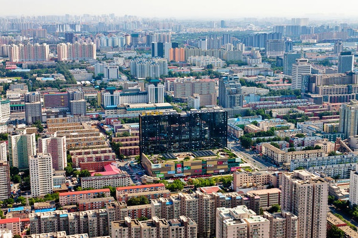
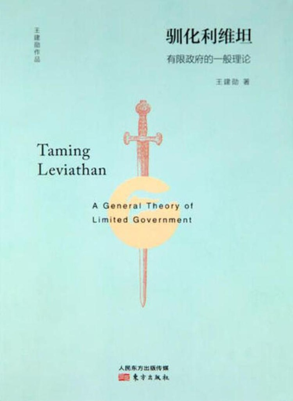
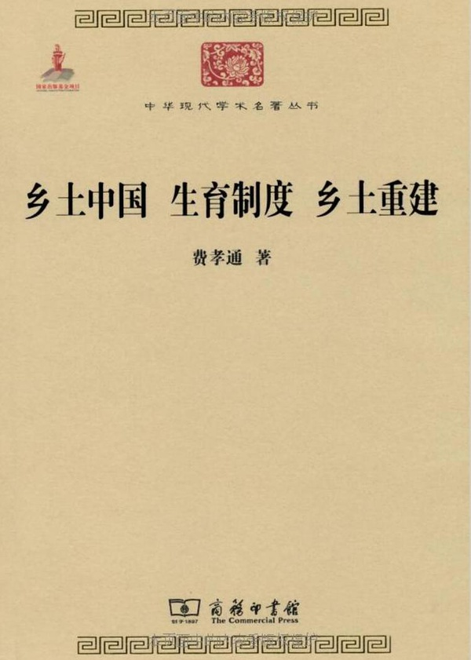
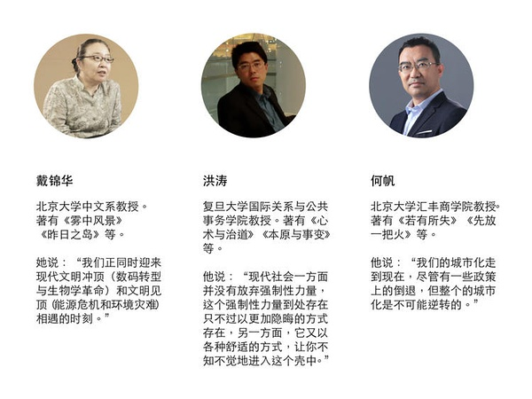
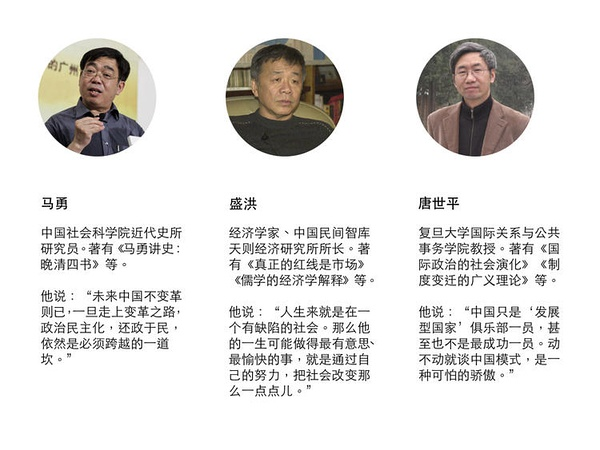
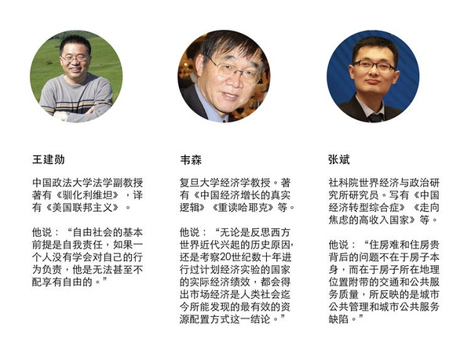

#好时代过去了，我们应该警惕什么，担忧什么？ | 我们如何与未来相处③#

 [好奇心日报](http://www.qdaily.com/)  2018-04-14 07:14:26

本文作者： 曾梦龙

**“有时候，关键不是去改变世界，而是去解释世界。”**

**在某个关键时刻，关于如何解释这个世界，如何与未来相处，我们需要听听睿智、独立的声音。**

**我们邀请了经济学、法学、社会学、传播学等领域的 20 余位专业人士，回答了我们的问题。**

**问题纷繁而且复杂，但与年轻一代的未来生活息息相关。被访者希望，留给未来年轻一代的这个世界运转良好而且文明进步；在复杂而且迷茫的世界中，保持独立与理性。**

**在此前一篇中，我们的被访者认为：不可阻挡的潮流决定了过去多年所形成的共识继续存在的可能性。在一个巨大的时间段内，不论是世界范围内的全球化和它所涵盖的文明、进步的普适价值，还是中国融入世界，它们是不可逆转的。所以，眼下虽然问题多多，我们还是可以保持乐观。**

以下为这个系列的第三篇。它涉及我们未来面对的风险所在；流行文化背后我们的软弱；技术与官僚体制合流意味着什么；更重要的是，在一个民间社会缺失的社会中，我们将付出什么多余的代价。

在面对“这个世界会好吗”的提问时，肯定或者否定回答无关紧要，被访者提醒我们担心什么，警惕什么才是根本。

>**【1.政府真的懂什么是“美好生活”吗？】**

**政府官员好不容易学会了招商，突然发现他们要对“美好生活”负责**

**何帆  北京大学汇丰商学院教授**

好消息就是，其实十九大已经讲了，你“对美好生活的向往”，这一个关键词已经提出来了。但是，坏消息是政府其实现在还没有转型。

我们现在遇到的这种情况有点像 1980 年代初，就是原来我们的主要矛盾是无产阶级和资产阶级，所以是以阶级斗争为纲。原来的官员习惯的是抓阶级斗争，然后你突然跟他说，不搞阶级斗争了，我们现在是搞经济建设，所以他很慌，不知道该怎么去搞经济建设。那么，慢慢转型，他现在也知道了，就是我要招商，我要去引资，我要改善我的投资环境，我要有一些创新，包括具体怎么卖地、搞工业园区，这都已经非常熟练了。然后，你突然现在又跟他说，说不对，我们现在不是只看经济增长，我们现在是看“美好生活”。这“美好生活”是啥？他又慌了。这个东西是原来没做过的，所以这里头很可能会出现一些潜在风险。

**生活富裕可能也不是全部**

**何帆  北京大学汇丰商学院教授**

随着收入水平的提高、人口年龄结构的变化，会有一些新的风险。比如说代沟，上一代的人不理解下一代的人。

我们现在有很多简单假设，我只要能够继续把你的生活过得更富裕，那么这肯定就是“美好生活”。不是的。因为下一代的想法和上一代的想法是不一样的。我们去看 1968 年，几乎在全球范围内出现了一次年轻人的运动。像巴黎“五月风暴”，按道理，当时法国美好生活算实现了——因为法国在过去几百年的时间从来没有过，突然进入了一个和平富裕的阶段，出现了最好的情况。

但是，那一代年轻人跟二战那一代人不一样，没有经历过战争，所以他们并不觉得现在这种和平、富庶的生活多么的好，反而觉得很困惑，然后很压抑，就开始起来。起来之后，巴黎的墙上到处都是学生写的标语。其中有一个标语说，“我想发表自己的观点，但我不知道自己该说啥”。年轻一代的焦虑在这句话里反映出来得最淋漓尽致。其实他也不知道他自己想要啥，但他就是不满。

这个东西就很麻烦。因为我们现在很多政策，并不是基于对出现的新的社会问题和新的一代、新的人口，非常前瞻性地了解。这时候，你很可能在应对的时候就会出现有一些失误，所以我觉得，风险不在经济，风险在社会问题。

>**【2.为何公共服务提供者，却很少在公共服务上投入资源？】**

**人力资本密集的服务业出现了问题，但政府选择了“疏解”**

**张斌  中国社会科学院世界经济与政治研究所研究员**

你可以看到，我们经历着从制造到服务的转型，经济增长速度有一些下降，这是很自然发生的事。制造业的产业升级境况是不错的，服务业也朝着人力资本密集型服务业去发展，这些都是国际上的经验。这背后的力量其实是我们需求偏好的变化。大家的收入水平提高了之后，希望更多地改善生活。改善生活靠的是什么呢？更好的制造业商品当然是一方面，但更重要的是更好的服务，而这些服务是那些需要更多人力资本投入的服务，不是低端的服务，是中高端的服务。到现在为止，从总体来说都不错。

今年，尽管经济增长速度有下来点，但是从方向上来看，经济结构的变化是一个正确的方向。很多人关心，中国会不会陷入中等收入陷阱？中国会不会不能够成为高收入国家？从这点上来看，不用太担心。因为你从国际经验来看，如果一个国家能够大概按照标准的市场化资源配置方式，过了一个工业化高峰期，然后它又没有成为一个高收入国家，在历史上还找不到这样的例子。很多人把高收入国家和工业化国家划个等号。中国的工业化，动作非常标准，人均 GDP 达到了 8000 - 10000 美元，工业部门 GDP 占比大概 40% 左右，开始发生转型。这都是高收入国家类似发展阶段类似的东西，中国非常标准。然后接下来，我们产业升级情况不错，人力资本密集产业也有发展。我从来不怀疑中国会成为高收入国家，因为高收入国家门槛并不高，按照现在的标准， 12000 多美元吧。

中国现在真正面临的结构类问题是什么呢？是哪怕你跨入了那个门槛，你会走多远的问题。刚才我讲的是乐观的东西，那不足的地方也是很明显的。不足的地方可以从两个维度体现出来。第一个维度就是——其实你从生活中就可以感觉到，你生活中最缺什么？在什么地方得不到满足？说白了，老人看病、孩子上学，另外就是住房。住房背后不是房子本身，是房子带给你的交通、医疗、教育、工作。它背后是公共服务的问题。养老、上学也是服务的问题。其实我们现在真正缺的，都是一些人力资本密集的服务问题。这些服务过去几年有没有很明显的改善呢?其实，即便是有改善，也是很有限的。当然这是从生活的维度，每个人的感受是不一样的。但我说的这种感受，不是我一个人的感受，是很多人的感受。

**城市化率不高，城市服务不好，这是政府公共服务出现了问题，但我们的政府却借此做出了更离谱的决策**

**张斌  中国社会科学院世界经济与政治研究所研究员**

还有一个维度，就是和国际上经验比较来看。我们同样把中国跟高收入国家类似发展阶段做比较，你会发现差距。第一个差距，中国第二产业和第三产业的就业占比还是偏低，第一产业的就业占比偏高，第一产业主要是农业。第二个差距，分产业去看，我们政府服务这块占比很小。对比高收入国家类似阶段，我们要小得多。政府服务是联合国的定义，宽泛一点，它其实背后包括的是医疗、教育、卫生、国防、行政管理，很多。我们是偏低的。还有一个差距是城市化率。发达国家工业化完成之后，城市化率大约都到 70% 了，中国即便到了 2016 年，只有 57% 左右。

这三个东西其实背后是类似的，城市化率低；农业就业人口偏高，而二、三产业就业人口偏低；公共服务偏低。这三个东西其实是一件事的不同侧面，就是在增长过程当中，很多人没有办法随着工业化的进程，留在城市，享受城市的公共服务，城市没有给他们提供这样的公共服务。这是中国跟很多高收入国家类似历史发展阶段的差距。这些差距背后说明了什么问题？说明我们的土地政策在城市的公共服务方面，面临很大的缺陷，有很大的差距。不是跟高收入国家比，是跟高收入国家的类似发展阶段比，也有很大的差距，这块要补课的。

而这个差距背后又是什么呢？是政府的职能定位不足。你的资源没有更多地放在这方面——不光是经济资源没有放在这块，你的政策导向、职能定位也没有。过去我们总是强调要发展，发展，发展，发展更多的项目，搞生产，但有多少公共资源是用在公共服务上面的？这是我们现在面临的很大差距。

这个其实跟我讲的我们生活中的感受也是一致的，缺的就是一个东西，就是一些公共服务类东西没有跟上。为什么会有这个短板呢？短板是因为我们的政府职能定位有问题，过度地强调了发展，不够平衡。你的主要矛盾已经不再是发展问题，而是通过更好地提供服务满足社会突出矛盾。但是政策资源是不是再往这个方面用？财力资源是不是在往这个方向调整？可能也在往这方面调整，但跟不上需求的变化。

**政府只会“搞项目”，还没学如何做服务**

**张斌  中国社会科学院世界经济与政治研究所研究员**

接下来我们讲结构问题。我们经济真正的短板是这些服务业的发展，而推动这些发展是要政府职能转型。怎么才能推动政府职能转型呢？很多人会讲，因为有利益集团的阻挠，转不了。但是在中国，我觉得利益集团是一方面，但这个不是主要的，毕竟还有党的领导嘛。这不是一句空话。更重要的是观念。有一大部分人还是认为，过去发展了几十年，成功经验的积累是怎么做建设、怎么做投资，很少去想怎么做公共服务，也没有激励机制设置让他去做好的公共服务。他把他过去的成功经验放到现在，还是搞项目，不是做服务。这是观念。

>**【3.“集中精力办大事”这句话有何不妥？】**

**集权确实提升效率，但走到极权就害人害己**

**马勇  中国社会科学院近代史所研究员**

也许明天，也许 10 年。最悲观的估计，也许 30 年。我想人类社会、历史的节奏在加快， 30 年我不相信。 30 年，我们可能在过去几十年的积累都消耗完了。而且我看国际趋势，现在西方民主体制开始对中国这么咄咄逼人，有一种恐惧感。

我认为班农是一个“先知”。他确实看到了冷战的参与。苏联是解体了，但冷战没有结束。我们今天看俄罗斯，看中国，看朝鲜，都是这个问题。但是，民主体制有个很大的问题。民主体制下，虽然有班农这样的“先知”去化解这个问题，但是民主体制的动员非常难。因为大家只要能够凑合得过去，对独裁这个东西是没有一种主动干预的冲动。我们看 1930 年代，墨索里尼、希特勒的事情，它当时就民主体制，实际上国民意识到了，但是，你做你的，我做我的，不会主动出手遏制他。这也是为什么集权有效率？

但集权不能走到极权。集权可以使你国家有效率，但是走到极权，就对人民会有危害。就在这个节点上。中国的未来可能会在这种偶然之间，在一个偶然的时间点，在一个大家都没想到的时间点，发生变化。我看过去一百多年来，就是这样子。我们不能走到一个良性的状态，可能就会出现这种突然的改变，所以我想可能是明天，也可能是十年，也可能是五年，就看整个国际格局的变化和中国内部各种力量的变化。

>**【4.我们为什么要警惕“人脸识别”这样的技术？】**

**官僚意识形态的核心，便是以管控为至高无上的目标，当代技术的发展很大程度上满足了这一对管控的要求**

**洪涛  复旦大学国际关系与公共事务学院教授**

从 20 世纪的历史，可以看出，哪种技术发展得最快，这就是服务于战争目的，以及服务于控制的技术。我住酒店，发现不少酒店已将人脸识别技术用于身份登记。电子计算机，最初是因战争需要而发展起来的。两个方面，一是对外战争，一对内控制，从根本上说，两者都是为了控制。现代人世界观的核心就是控制：控制自然界、控制他人或社会、控制人的身体和思想。 17 - 18 世纪，控制自然的技术发展得很快； 19 - 20 世纪，控制社会和他人的技术高度发展了；现在到了 21 世纪，控制技术已不仅针对个体，而且针对个体的每一时刻、身体的每一运动。今天，控制人的身体机能的那种技术将会获得迅速发展，譬如生命科技、遗传科技等等，它们都将服务于权力者对人身的直接或间接的控制。

现代人，为了控制生活世界、为了控制人类自己，发明了两样东西：现代科技和现代组织（主要是官僚组织）。官僚制很古老，但与科技高度结合的官僚组织，形成于现代前期，即绝对主义国家时代。从那时起，政府便开始将技术手段和组织工具，运用于对社会中每一个体的控制。这一进程从 17 、 18 世纪起步，不断加速， 21 世纪，它或许将从根本上改变人类的政治面貌。

马克斯·韦伯谈官僚制谈得比较多，谈技术比较少。技术这一面我觉得不能忽视。因为理性化主要体现于技术进步。今天，大概没有一个国家愿意对技术进步以及技术运用对人性、对社会、对人类的后果，做认真的反思。建立一个全控制社会，是它们共同的理想。在每一个角落都装上监控器，不是很好吗？再进一步，在每一个人身上都装上监控器，不是更好吗？犯罪问题将彻底消失。现在政府都非常愿意推动这些技术和管理方式的广泛使用。为什么？有利于控制。官僚制的核心意识形态就是，管理上的便利或效率是唯一的至少是至高无上的诉求，而技术能帮助它实现这种便利或效率。

奥威尔在《一九八四》中所预言的这一前景，其实就是我们今天的现实。他的预言与我们的现实之间有些差距，在他那里，技术控制是压迫性的，而我们今天的技术控制既没有那么公然、又以人民喜闻乐见的形式展开，但是，强制并非不存在，而且恰恰是其隐秘的核心。

今天，管控技术以加速度发展着。无论官僚化进程，还是技术控制的发展，都看不出有减缓的趋势，也看不到有任何其他力量的制约——官僚权力消灭了任何一种独立于它的社会力量，而技术对人类生活的掌控，也在很大程度上阻碍了人的主体性的生成。看不到任何希望。我相信，很快，每一个体对其人生的“规划”、“设计”将不再可能。人的“自由”将被定义为暂时不为权力所关注，而从根本上，每个人都处于严密的控制之中，只有暂时不为权力所关注时，才有了暂时的“自由”。一个人唯一能做的，就是祈祷他不为权力之眼所关注。

现代国家不仅在一般意义上掌控着个体，而且可以在任何一个时刻对个体进行定位。不仅可以找到任何一个个体，了解其状况，而且可以直接影响到他的身体和思想。个人不仅毫无反抗的余地，而且完全无法逃脱国家的控制。今天，作为一个行动的责任者的个体概念将不再是清晰的，会出现这样的状况，即个体不再能够为其行为负责，因为他是被遥控的，至少是被遥制的。由此，现代“主体”概念将面临危机，现代的产物——人作为道德主体和法权主体，自我决定和自我责任，等等，在现代的全控制技术之下，都会成为过时了的观念。在人被全控制（就像《一九八四》中的那样）的社会中，我不知道人（至少是那些可以被随意控制的绝大多数被统治者）还有什么生活的意义和价值，或许偶尔的挣脱就是其意义和价值吧？

这就是现代国家的逻辑，它的力量已经完全渗透并掌控了整个社会，它的触角，延伸到了每一个个体。整个地控制社会，控制每一个个体，控制每一个个体的每一分钟、每一次肌肉的颤动、他们的每一个念头，就是现代国家的理想。这一理想的实现的那天，我想大概不远了。

**如果我的邻居掌握了我的档案……**

**洪涛  复旦大学国际关系与公共事务学院教授**

《档案》（广西师范大学出版社，作者为蒂莫西·加顿-艾什）一书的作者说， 1970年代他在东德，走哪里都有人盯他，他甚至怀疑他的女朋友也是被派来盯他的。可是，在今天的英国，控制的手段要比当时的东德厉害得多。为什么？不是说英国已经成了一个像东德那样的特务国家，而是说技术的飞速发展，使得现代的哪怕民主国家的控制手段也为过去的专制国家所难以企及。

20 世纪 80 年代英国的一部电视剧《是，大臣》中有一个情节，当时媒体讨论，倘如掌握我的档案的那个人正好住在我隔壁怎么办？他对我的一切了如指掌，我怎么在我邻居面前生活？今天的大数据，搜集了更多、更全面、更广泛的个人信息，其贮存和传播又是如此便利，个人隐私的问题无疑更为严重。

但我们今天几乎没有对这样重要问题的讨论，统治者干脆告诉老百姓，请他们放弃隐私，今天的中国人没有隐私。当然，没有隐私的只是老百姓，统治者自己是有隐私的，他们都有古各斯之戒。

官僚意识形态的首要原则是官僚组织管控的便利或效率，在这一目的之下，凡有可能采取的更有效的工具和技术手段，就必然会去采取；这种技术只要能够发展，就必然会去发展。我相信，中国在这上面肯定会做得最好。 20 世纪以来，中国人就有一种技术崇拜，只要是新的，就是好的，很少有人愿意对技术发展做一些反省。在现代国家，权力是完全不受制约的，权力者可以对老百姓做任何事情，后者却根本无从反对，因为一切都是隐秘的。统治者也不会因为四处安装监视监听设备、下毒放药而觉得有悖于他们自己嘴里口口声声的“法治”，因为，唯有他们享有充分的、彻底的“自由”。

>**【5.为什么说“小确幸”和“小确丧”背后，是对强权文化的屈从和对“权力秩序”的认可？】**

**什么是“正常”的人生观**

**戴锦华  北京大学中文系教授**

近来我尝试观察和体认的是所谓“小确丧”。这大概毋需也很难精确定义或我抽象阐释。在我的感知中，它联系着所谓 2017 年流行语的另外一组：“佛性青年”/“阶级固化”，似乎便不难理解了。

在很多演讲中，我说过多次，抛开《小时代》作为电影和小说（的价值和意义）不谈，也暂时搁置对“粉丝文化”的追问，我在社会潜意识层面，它吸引了众多年轻人的原因之一，是它在不期然间，表达了某种对时代的理解和命名。

经历 20 世纪终结——我同意那个说法—— 20 世纪早在 八九十年代之交已经终结。 20 世纪终结同时开启了一次全球性的文化建构：我们告别革命，同时告别大时代。于是我们拥抱“小时代”。所谓拥抱“小时代”，无外乎就是说我们只是作为个体，只是作为个人，我们所拥有的只能是我们个人生命从生到死的短暂时段。

这样一种对生命、对世界的体认，使得伴随“重写文学史”而涌动的“张爱玲热”产生了另外一种始料未及的效果。“岁月静好，现世安稳”成了我们能求到的人生佳境。这个逻辑衍生出“小确幸”——琐琐屑屑、差强人意、柴米油盐，个人生活可能抵达和把握的微末幸福。

其实很好玩，抛开别的都不讨论，“岁月静好，现世安稳”——张爱玲写下这句话的时候，生逢乱世、遇人非淑。它是一个可望不可及的祈愿。就像人们追逐着自台湾转口而来的“小确幸”时，忽略或无知与其原出处：村上春树那里，对生命的琐屑与无奈所表达的深深的疲惫，也许是辛酸。然而在当下的语境中，当“岁月静好、现世安稳”不仅是对美好生活的祈愿、“平常心”，而是一种至高的生命理想时，人们很快会发现，这样的追求尽管先在地剔除、隔绝了对超越性的生命与价值的追求，却在凸显日常生活的同时，凸显了物质性的基础。于是，这有限的“幸福”也并非唾手可得。“小确幸”的微笑由此很容易衍生为“小确丧”的蔓生——种种小小的挫败、小小的无助与无奈，手足的上升与满足空间。名为“小确丧”，可能也不期然成就了一份自欺。当我们关注这些小挫败，小无助时，或许正好忽略我们生命整个的被阻塞状态。

在对这种种“小”世界的观察中，我体认到一种令我个人深感沮丧的文化。我不确知这是否是“几零后”独有的文化，在我感知中，她不仅弥散在青年流行文化中，也是某种社会文化的暗河：一种强大的、对于权力秩序的内在认可——强者恒强，弱者恒弱。或者换句话说，弱者要为自己成为弱者负责任，或者强者成为强者，自有其内在依据。在我体认中，这份内在臣服的前提是：“变化是不可能的”。

这似乎是某种共识或常识：所有的改变现实的努力似乎只意味着更大的破坏，意味着对我们已经拥有的这点“小确幸”的丧失。在这样的意义上，“小确幸”和“小缺丧”逻辑共通。因为所有的挫败都是合理的，所有造成挫败的结构性原因都不可逆转，所以我们唯有承受或拥抱，接受这些不可能。在类似的体认中，这类文化事实令我心惊。原本“小时代”、“小确幸”和“小确丧”本身无可厚非。当我们称它为流行的时候，就意味着它旋生旋灭，无须挂齿。但是在 “代沟”的这一边，我看到了一种比流行远为强大的结构性基础，这基础令我沮丧，甚或是悲哀。

（现在很多年轻人对权力秩序可能真的认同，很少人有一种反抗和叛逆的感觉，大家都挺乖的。）

对，当改变、反抗被共识为不可能时，半生的，必然是经所有理想性追求和表达污名化的趋向。比如说“情怀党”，比如说“伪君子”。在最低层面上，想象一下为 “真小人”所充满的世界，真不寒而栗。

>**【6.如何看待社会粗鄙化？为什么我们更要警惕理想性的东西的污名化？】**

**社会没有表现出应有的活力和动力**

**戴锦华  北京大学中文系教授**

我并不认为我们这个时代在在加速粗鄙化。从某种意义上说，伴随着富裕，人们正在有些盲目、极为焦虑地在寻找有质量的生活方式。就像我们的百万富翁都要去爬珠穆朗玛一样，他们在学会做富人。经常有一些外国人问我说，为什么你们的顶尖级富翁都要去爬珠穆朗玛？我其实不知道为什么。想一想，我以为他们是在尝试获得一种与其财富相衬的生活方式。因为我们没有一个已经成型的顶层、中层、底层，因而也没有既成的相关社会方式与内容。一切都在急剧变化中。

所以，中国的新中产阶级也是在尝试学习一种中产阶级的生活，尝试找到中产阶级生活的内在。人们（追求）有房有车，但有房有车之后，我们怎么去寻找内在？吸猫吸狗是一种，同时，比如有阅读习惯的恢复，或者说阅读量的上升， 各种各样的付费经济，可能会吸引到一些人，而且也不光是“如何快速致富”这样的节目，还可能包括各种各样的文化产品，开始在吸引人们。我觉得人们都在尝试寻找日常生活的一种更为内在和非物质层面的东西。

在这个意义上，我不认为社会在粗鄙化。可问题在于，当丧失了追逐梦想、改变社会的全部动能之后，我认为整个社会的文化并未显现与中国经济增长可以相匹配的活力和动力，“小确丧”所显影的正是社会文化中活力和动力的匮乏。我大概在这个意义上去理解主流嘻哈，或者今天的流行相声。我倒更怀念曾经有过的“小品年代”，或者说社会笑话、政治笑话流行的年代。表面看上去那似乎是一种对立性力量，它们实则表现了一种社会活力，一种介入与共享意识。而在今天的流行文化当中，我没有看到与经济活力共同增长的社会活力，这是我所忧虑的东西。

>**【7.为什么我们社会中各个层面都失去了相互信任？】**

**幼儿园事件凸显了没有安全感的社会，人和人之间的信任机制被破坏了**

**王建勋  中国政法大学副教授**

幼儿园的事情我觉得比较重要，比较值得关注。因为幼儿园其实折射出来一种问题就是说人与人之间的信任问题。我们（把小孩子）交给你们这些人，你们本来是最应该值得信赖的人，结果你们居然信不过，我没法相信你们。这个社会不是严重的危机嘛？

如果一个社会丧失了起码的信任的话，这个社会是非常可怕的。一个人在任何时候都想办法提防着别人，那怎么可能有合作怎么可能有互助怎么可能有集体行动？如果没有这些东西的话，你怎么可能改变专制体制？没有集体行动的话，你不可能改变专制体制，因为不是靠单个人的力量，而是无数人要联合起来，但是无数人要联合起来的一个基本前提就是无数人相互信任，你才有可能联合。我如果不信任你的话，我不可能和你合作、联合起来做一件事情，对不对？

当然不仅仅是幼儿园，其实这个社会发生的大量事情都反映出来我们没有起码的信任。包括那些扶老人被讹诈了，那也是没有信任。导致现在人们都不敢扶，有人倒了那就倒着吧，这都是信任出现了问题，人心败坏了。人心败坏了这个社会就很难救了，就非常危险。如果政府办很好办，假如普通人没有败坏的话。如果人心都败坏了的话，这个社会救起来会是一个非常长期的过程。

（形成这个局面的）原因比较复杂，我觉得也是多方面的。

一方面，跟现在的体制有关系。比如为什么现在老年人倒下，我们不敢扶？那就是法院有奇怪的判决。你居然支持了讹诈别人的人。这种判决无论如何都不应该的。你居然从体制上支持了这种糟糕的人、心地坏的人。你这不是助长了社会上的这种风气吗？

但是，另外一方面，我觉得也跟我们自身有关系。比如说我们教育孩子，通常父母都会告诉孩子，见了陌生人，千万不要跟他说话。那他就假定一个基本前提：陌生人都是坏人。所有的人都是这么教育孩子。我们不关心这个陌生人是谁？他需要什么？我们都会一刀切地告诉孩子们，不能跟陌生人说话。而西方人绝不会这么教育孩子。这个陌生人假如说处于危机之中，他特别需要帮助，你竟然不理他，那他有可能死掉。这就反映了从小我们孩子因为没有安全感，而导致了我们让他不要相信别人。那一代一代的人成长起来之后，除了你对自己的朋友、家人、特别亲近的人信得过之外，其他人都不相信，没有一个陌生人之间的信任关系。可以说是家庭、学校都负有这种责任。

当然，整个的包括我们互联网上的交往等等。很多领域都对我们人与人之间的信任关系产生影响。包括我们订立合同，动不动就违反合同了。违反合同之后，有可能你打官司还打不赢，对方赢了。这一系列东西都影响到人与人之间的信任，包括我们法律上定的这种违反合同承担的责任太轻了，这都助长了人们不守信用。违反就违反了，无所谓，我赔你一点钱。但是，我们不是说你要是这么轻易违反合同，就严厉惩罚，赔很多钱，让你倾家荡产。

很多方面也跟中国的传统有关系。中国传统上，向来也都是以家庭为单位。我们信得过的人就是家庭和家族内的人，超过家庭之外的人，我们就是一种疏远的关系。所以它像费孝通所说的“差序格局”，等级亲属关系不一样。它跟诸多因素都有关系。

**财富阶层不再认可这个体系怎么办？**

**唐世平  复旦大学国际关系与公共事务学院教授**

最可怕的问题之一肯定是中国的财富阶层对整个体系丧失信心。政府当然可以通过很多管制来限制财富的流失。但是，这也仍然不能解决给投资者带来的激励问题。因为，没被投资的财富其实只是在吃利息，却并没有发挥资本的效果（财富不等于资本）。

所以，我比较担心的是中国的财富阶层不再认可这个体系能够给他们带来收益。政府要解决这个问题，需要让自己的承诺可信，而且改革的方向要正确。

>**【8.难道不是每个人都有可能犯错误的吗？】**

**执政党的抗批评能力考验它存在的意义**

**盛洪  经济学家、中国民间智库天则经济研究所所长**

我担忧这个执政党。这个执政党缺乏批评的传统。出现一两个人，他们职位很高，他们说什么，就没有人敢去提不同意见，敢去提批评意见。而这些职位很高的人可能都在犯错误，所以这是我很担忧的。但是，我也知道共产党严格来讲，就没有好的批评传统。这主要是毛时代造成的，毛就是不许别人批评。但是如果全是一些唯唯诺诺之人，这个党有什么意义呢？出了什么问题，为什么没有人出来说，党内先去讨论讨论？党内为什么就一个声音呢？那他们存在有什么价值呢？

**没有锐意的改革，中国经济就没有稳定的可持续的增长**

**韦森  复旦大学经济学院教授**

近几年，全球化从贸易弹性来讲，很明显是负增长。贸易弹性是每增加 1 块 GDP ，贸易是增还是减。如果贸易弹性小于 1 ，就意味全球贸易在萎缩；大于 1 ，意味着贸易在增加，全球化在加速。这几年，贸易全球化确实回潮很厉害，特别特朗普公开说美国利益至上，带头进行贸易保护主义。其他发达国家也都是。但是，资本要逐利，大家还得进行贸易。中美贸易战的主要原因并不完全是经济上的。主要的问题是特朗普把中国视为假想敌，这已经已经酝酿甚久了。今年 1 月 26 日晚，特朗普在瑞士达沃斯的世界经济论坛发表闭幕演讲，在这次讲演中，特朗普说：“我们也在努力改革国际贸易体系，守规矩的人都能获益，我们要想获得自由贸易的话，就不允许有些国家利用这种体制，给别人带来伤害。我们支持自由贸易，但也必须是公平，必须是互惠的。因为不公平的贸易就会破坏我们大家的努力，对那样的单方行为，美国不会再睁一眼闭一眼，包括大规模的知识产权的偷窃，以及国家操纵的计划经济。”这被国际媒体解读为批评中国：说决不允许中国以“国家操纵的计划经济”打乱国际贸易秩序的“掠夺性贸易”。这实际上可以解读为特朗普政府对华贸易战宣言。目前这场已经开始的贸易战，如何开打，如何结束，如何收场，乃是影响如何，我们还要观察。

去年到今年，国内许多人包括决策层都比较担心金融风险。在去年的凤凰财经年会上，我个人却认为还没那么严重。关键如果是中国千万不能背离市场化改革的道路。中国改革开放 40 年，中国经济增长了 30 多年，成功经验千条万条，最后归结为一条，我们走对了市场化改革的道路，初步孕育生成了中国当下的市场经济体制。如果背离了市场化改革道路，中国经济不可能是大跌，但是企业家会丧失信心，会移民到国外、转移资产到国外，年轻人失去了信心，也不会有在创业的动力。在这种情况下，中国经济可能不会出现大的波折，但会慢慢地衰落。这才是真正的危险所在。

没有锐意改革，也没有中国经济长期稳定的可持续的增长。我不知道 80 后、90 后怎么想的。当改革的张力越来越大的时候，就会断裂。断裂就是革命。中国经不起革命，经不起大的折腾。这几年，我也一直在说，得慢慢化解掉这些年改革过程中积累起来的问题和矛盾。当社会被控制得越多，社会紧张度越高、改革的张力越大，经济增长的动力就会越衰减。最后社会就会变的非常刚性，也非常脆弱。那就不是小事，可能使几十年的改革的成果毁于一旦。

我们好时代过去了。过去 30 年，全球没有大范围的战争，世界各国都在进行市场化改革，民营企业在崛起，各国的经济都在增长。中国在过去 30 年中，赶上全球化大潮，用巨大且低成本的劳动力资源参了与全球分工，导致了经济的快速增长。过去 30 年是很难得的机会。这是好时代，但已经结束了，以后会麻烦越来越多。

最后要说的是，创新、创造和产业升级，乃至企业的增长，都需要自由的氛围。自由的另一面就是法治。如果没有自由，没有宽松的氛围，很多企业家和普通人看不到未来的美好前景，哪会有创造力？哪会有企业的创造力？若中国的企业家没有创新的动力，企业家没有做强、做大自己企业的动力，那会怎么有未来中国经济的长期稳定的和可持续的增长？

*（后续报道，陆续更新）*

**本篇报道涉及的采访人物：**

制图：冯秀霞

题图为电影《窃听风暴》剧照，来自：豆瓣