#如何理解世俗社会，它在我们的生活里为何缺位？ | 我们如何与未来相处④

 [好奇心日报](http://www.qdaily.com/)  2018-04-29 07:44:55

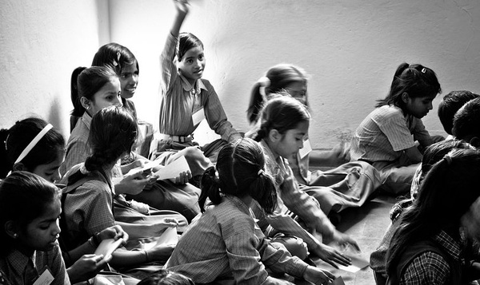

本文作者： 曾梦龙

**“有时候，关键不是去改变世界，而是去解释世界。”**

**在某个关键时刻，关于如何解释这个世界，如何与未来相处，我们需要听听睿智、独立的声音。**

**我们邀请了经济学、法学、社会学、传播学等领域的 20 余位专业人士，回答了我们的问题。**

****问题纷繁而且复杂，但与年轻一代的未来生活息息相关。被访者希望，留给未来年轻一代的这个世界运转良好而且文明进步；在复杂而且迷茫的世界中，保持独立与理性。**

去年底，郭于华参加了[“大爱清尘”](http://www.daaiqingchen.org/)的 2017 年度会议，注意到政府部门态度的转变。“大爱清尘”是个 2011 年成立的非政府公益组织，目标是专项救助中国 600 万尘肺农民，推动预防和最终消除尘肺病。一些著名的公众人物，比如袁立、姚晨、陈坤、贾樟柯、赵涛、徐小平等，都是这个组织很重要的支持者。郭于华是清华大学社会学系的教授。

郭于华发现的变化在于政府“不再觉得他们是来捣乱”的。她认为这个转变主要还是来自于“上层”态度的变化。 2016 年 1 月，十部委[联合发文](http://www.acftu.org/template/10041/file.jsp?cid=1078&aid=92266)说要加强农民工尘肺病防治工作，救助尘肺病人，等于承认了“大爱清尘”这样的组织做了一件好事。

作为职业伤病的一种，尘肺病与恶劣的工作环境、缺乏支持的劳动保护体系有关，而这一行业的劳工主体——农民工，不论在国家的劳动保护体系里，还是在公司运营者当中，都是得到关心和保护的一群人。

郭于华觉得，“非常好的事，等于说他们其实成为一个很经典性的社会组织，和政府有一个比较好的合作关系、良性互动的这么一个案例”。

一个经典问题是，为什么 NGO 组织与政府和谐共事——这样的案例如此之少？

2017 年 12 月，北京大兴火灾之后，清理人口过程当中，[我们曾经做过一次调查](http://www.qdaily.com/articles/47786.html)。其中，不论是已经有过 NGO 经验的组织，还是临时拼凑起来希望给无家可归者提供支持的热诚公益人士，他们面对的一个共同问题是，没办法组织起来一个有效的服务。一团糟的局面一直持续到这个事情渐渐淡化。

郭于华从“大爱清尘”这个角度看，对公共事件的不同理解可能是一个原因。“官方统计 60 万尘肺病工人。实际上是 10 倍，是 600 万尘肺工人。”这个数字的差异，可能决定了政府希望淡化问题的存在，而 NGO 组织希望用事态的迫切性来引起更多的人重视。

这种差异，有的时候——可能很多时候，发展成一种敌意：政府与公益组织、公民组织之间。

而越来越强大的政府决定了一个顺理成章的结果：一个没有世俗社会的社会。或者说，一个没有“社会成分”的社会。

我们这篇报道将围绕中国的世俗社会是如何越来越疲弱的；为什么不能容忍一个世俗社会的存在；政府，也就是权力部门应该扮演什么样的角色；权力如何控制好自己的权力；世俗社会存在的价值在哪里；如何重建一个理性的社会等问题探讨。

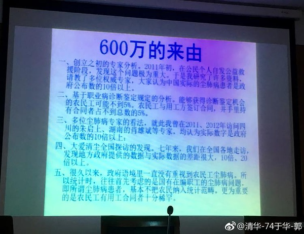

>**【1.为什么没有中间社会？】**

**中国的官僚制：古代与现代**

**洪涛  复旦大学国际关系与公共事务学院教授**

中国的官僚制形成得很早。从秦汉开始，中国就成为了一个中央集权的官僚制国家。尤其秦朝，具有一种非常典型的官僚制形态。这还不是现代类型的官僚制，用马克斯·韦伯的话来说，它是家产制官僚制。皇帝把国家当作家产，一代一代传下去，这本身是违背官僚制原则的，而官僚制只是皇帝的一种统治工具或手段，因为看到官僚制的高效性，看到官僚制下的官僚与国家之间的非实质性关系——这是有利于皇帝独占国家作为其私产的。对中国古代官僚制理论，贡献最多的是法家，譬如申不害，不少西方的中国学者就称其为中国的官僚制理论家。

不过，在传统中国，官僚制始终受到一种力量的牵制，这一力量主要来自儒家。在从战国到西汉的儒、法之争中，一个重要内容就与对官僚制的看法有关：儒家讲亲情、人情，法家则认为，儒家所强调的亲情、人情，以及所重视的家庭、家族，有可能干扰政令的统一和执行，因为，人的一切行动都是要听君主或皇帝的指挥的。从历史看，儒、法争论的结果是各有所得。后来人们常常把中国古代的科举制与现代西方的文官制度相提并论，这并不准确。科举制产生的不是官僚制意义上的官僚，而是一种“反官僚”。韦伯在《儒教与道教》中讲，“君子不器”是儒家的一个理想，而官僚制却要求官僚成为专业技术人才，即成为“器”。所以两者的道不同。

现代官僚制总体上与现代中国的国家建设同步发展。在 20 世纪的大部分时间里，因为革命，因为大规模的民众运动，现代官僚制在现代中国的发展不顺利。直到 1970 年代前期，即“文革”后期——这是中国现代国家建设的一个关节点，官僚制的建设进入正轨，这也是一个大谈法家的时代，两者并非巧合。改革开放后，官僚制进入迅速发展期。大概有两个原因。第一，与现代经济制度的建立和完善有关，如现代企业制度、公司制度，在某种意义上，所采取的组织形式都是现代官僚制。第二，政治在一定程度上摆脱了高度动员状态，逐渐常规化、日常化。政治过程的程序化及活动的制度化，都要求官僚制形态。而在根本上， 20 世纪中国国家建设的动力和主题，是与世界其他国家（列强）竞争，所以，追求富强是首要目标，于是不可避免要“现代化”。什么是“现代化”？在某种程度上，就是韦伯意义上的“理性化”，现代官僚制是其基本形式。

所以，改革开放之后，尤其在前期，批传统或儒家的“人情”观、批“人情社会”很盛行，认为人情导致腐败。这体现出当时官僚化的要求很迫切。官僚制在本质上要求斩断人情关系，剥离人际关系。今天舆论普遍反对在现代大学中延续重情感的传统师生关系，表明了对大学的官僚制化的要求。当然，除了这些经济上的或观念上的影响之外，中共本身的影响不容忽视。建国后，它至少也有迅速官僚制化的一面。在某种程度上，这或许是“文革”的一个原因，但不是唯一的、也不是主要的原因。因为在“文革”后期，其实又回到了官僚制化的老路。政党官僚制化、政府官僚制化，以及由于党和政府在社会中的核心领导地位，由于它们对社会生活的全面渗透，出现一种官僚化社会，是不难理解的。

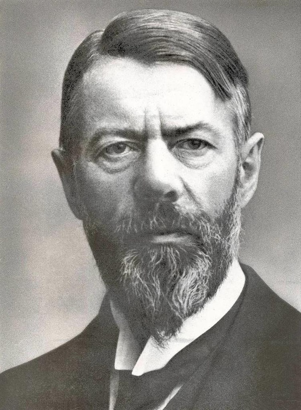

>**今天，遏制官僚权力的力量在哪里**

**洪涛  复旦大学国际关系与公共事务学院教授**

在现代国家中，有议会制，有普选制。这些制度是对官僚制效应的一种对冲。关于这些，韦伯讲得比较多，晚年他特别讨论了议会制，也讨论了总统制。官僚制的发展尽管是现代国家的一种重要倾向，却不是唯一的，也有与之相反的方面。在韦伯看来，在议会斗争和民众政治斗争中，能产生与官僚不同的另一种类型的政治从业者，即政治家。这是对官僚统治的一种克服，因此，产生政治家的机制是重要的。

在不同国家中，这两种力量的发展也不同。在威权国家中，议会常常是象征性的。议会本身就可能就已经官僚制化了，或者，议员很可能受到官僚机器的操纵。威权国家的政治领导人，主要产生自官僚组织，政党也好，政府也好，都这样。所以，政治家和官僚之间的界限是模糊的。就这两种制度而言，威权国家缺乏对官僚制的抑制力量，而且，由于在威权国家中，官僚化的政党和政府对社会的主导地位，由于它的权力全面渗透于社会，所以，威权国家的社会的官僚化程度往往也很高。譬如，一个社区，到底是一种官僚层级呢，还是一种社会自治组织。答案不难得出，这是一种官僚层级——尽管它并不是政府的一个部门，因为它履行的依然是命令的传送、执行的功能，而与民众的共同生活没有多大关系。

极权国家有一种反官僚制的表象。其实，这只是在形成它的第一阶段，即极权主义运动的阶段，是这样。但是，在极权主义运动高潮过去之后，冷却下来的，凝固下来的，依然是一部官僚机器。希特勒执权之后，很快灭掉了像冲锋队之类的运动的激进力量。斯大林也是，斯大林主义之后，是一个高度官僚化的国家。极权主义并不能使自己始终保持为高度动员的民众运动状态，到最后都会冷却为一种官僚制国家的形态。甚至运动本身，都会成为官僚化的例行程序，就像奥威尔在《一九八四》中所描绘的。

马克斯·韦伯对能否遏制全面官僚化，并不乐观。他似乎认为，即便西方国家，也难逃全面官僚化的宿命。奥威尔《一九八四》也预言了这一前景。韦伯看到了官僚制与现代精神之间的关系。官僚制不止是一种组织形态，而且体现了现代人对世界的态度，这就是无穷尽的权力欲。从对自然的全面掌控和操纵，必然会走向对人本身——整个社会和所有人，从人的身体到人的灵魂——的全面掌控和操纵。一方面是权力欲的放任，另一方面是理性成为欲望的奴仆。这是官僚制在现代之所以合理的基础。官僚制反映了现代人的世界观，对世界、生命、自我和他人的态度。如果没有从根本上反思和改变这种态度，现代政治就无法摆脱官僚统治这一前景。

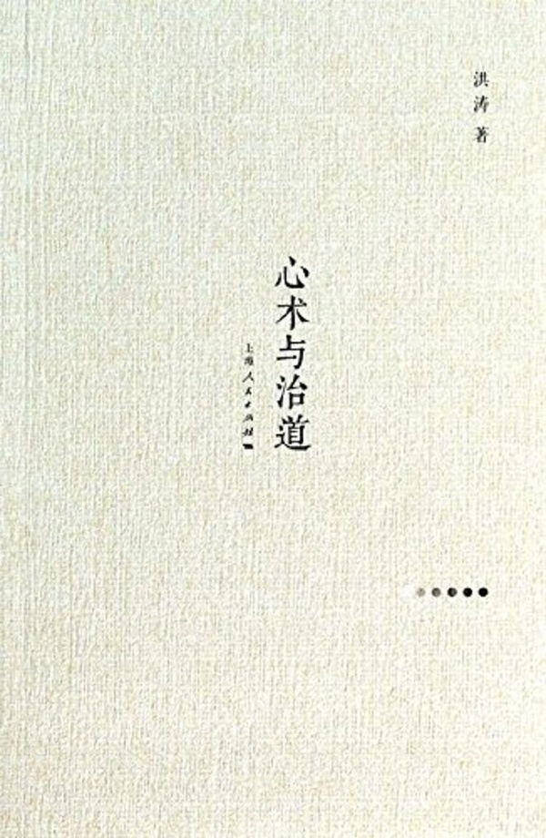

>**国家以单位的名义吃掉了社会**

**任剑涛  清华大学政治学教授**

纺锤体也好，一盘散沙也好，可能是针对橄榄型社会，想对中国社会形态作为一种概括的尝试。中国社会已经不是一盘散沙。中国社会甚至从来说的不是一盘散沙。直到今天，中国社会的基本控制结构还是单位制。虽然社会学家早就替我们宣告单位制已经终结了，其实是错误的。因为从我本人的经历上来讲，我就知道中国的单位控制很强。因为我从高校间调动过两次，都是 “985” 高校，大城市之间，北上广深之间调动，还不是东北和西北的高校，属于国家保护型。那么，第一次调动花了 10 个月时间。第二次调动更惨。北京市内调动，花了两年时间。我前年 1 月份到清华，今年 1 月份才办完调动手续。所以单位控制制度实际上是非常强。它就是单位组织化社会。单位组织化社会，你当然可以说散沙般的，但肯定不是散沙。中国社会的强控，有隐性机制和显性机制两种。对于城市居民来说，显性机制就是单位，隐性机制就是国家的政治控制机制。所以基本上，你是被安排在社会的网格格局里，我们公安局的一个城市管理办法，叫网格化管理。所以公安局有网格的格长，你被划在这里被管理。 

而我们一般如果要说散沙般社会，主要是指的啥？就是公民日常秩序是散沙般。比如我八小时在单位外了，单位就不管我了。那这个时候，我们没有组织起来。我就没有真正地社会动员。比如按兴趣来说，我有钓鱼协会、棋牌协会、麻将协会。就是 8 小时之外，你要有这种社会的协会在干预你。或者是按地缘，正式组织起来，比如川人协会、湘人协会，也没有很好地运作。这些都是高层成员自娱自乐。他的社会动员、触角，并没有伸向社会。那么业缘性组织，就更是行政性的附属性组织。你看我们也有教育工会，但教育工会基本就是旅游，过节发一点油米之类的，表示工会在关注我们。但实际上，它丧失了工会真正进行行业组织的作用。所以这个意义上说，中国社会是个散沙般社会是有道理的。而我们前面实际上谈到的所有问题放到这里来，你就可以说，公民的自组织社会需要业缘、地缘和趣缘，交叠重复，组织起来，使公民们确实 24 小时都有组织归属感，而不是 8 小时有单位归属的。所以在这个意义上，社会建构是个复杂的事物，需要我们原来在国家吃掉社会的情况下，让社会重新获得它应有的空间。

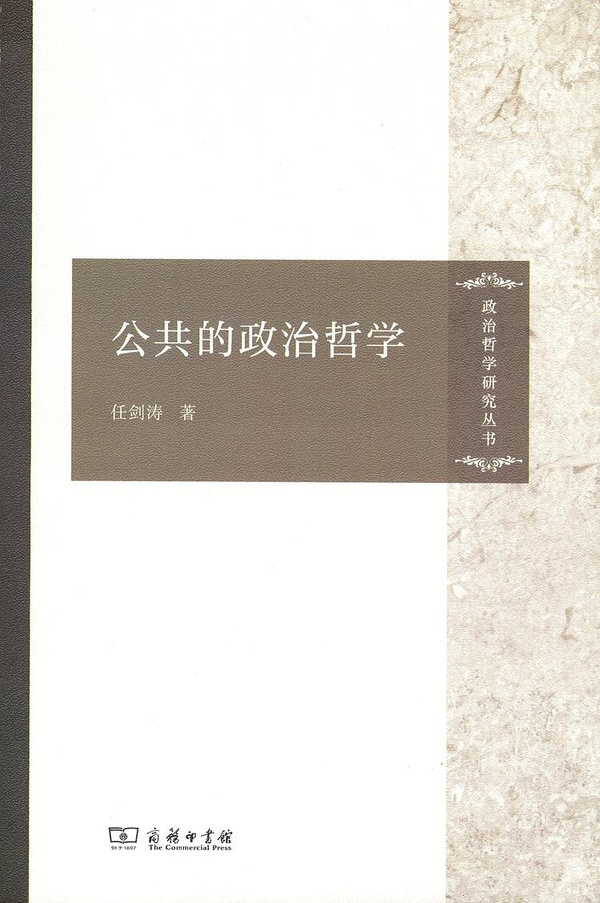

>**【2.中间社会缺失，带来种种弊端】**

**没有自主的社会，就没有自主的公民，公民无法自己治理，无助于良序社会的养成**

**任剑涛  清华大学政治学教授**

目前这样的状态是改革开放 40 年来都在处理的一个基本矛盾。这个基本矛盾曾经被人简单地概括为“一放就乱，一收就死”。对于中国公民的自治组织和公民的公益组织来讲，我们有一段时间要建和谐社会的时候，放得比较开。放得开之后，那么我们没有在政策上和资源上做出很好的筹划，所以国际 NGO 迅速进入，于是我们就有了国家安全的考虑。另外一个就是公民自治组织多了之后，我们因为没有做好心理准备、心理调试，那么党政组织结构觉得有了跟我们组织性质不同的另类组织，有内部不安全的感觉。 

所以在这个时候，它就产生了双重管理的需要。所谓双重管理，一个是政治管理，但是我们的政治管理常常变成政治控制。我一放开你，我觉得要建和谐社会，所以社会就自组织了，国际 NGO 进来，我们也欢迎。国际 NGO 组织有资源，公民的自治组织有互助，然后我们政府就可以撒手不管了。在初期阶段，其实党政部门是喜闻乐见的。因为免除了我们很多责任。但是，没有料到免除责任的同时，它也就把你所具有的权力指挥能力给下降掉。所以这个时候，政治上它就需要加强控制。那么另一种叫秩序性管理的需要。我认为是一种客观的需要。在一个国家的社会迅速成长的时候，中国因为市场力量的推动，首先在盈利型社会，它已经有相当高的自主性。我们也看到，在十九大大前后，对市场组织高度不放心的情况下，中央还不得不制定一个重视企业家精神的政党文件。因为它涉及到整个中国经济发展秩序问题。如果你打压太厉害，现在非常简单，我即使通过国家的银行体系转移不了资金，我通过地下钱庄，资金大量流出。最关键的危机信号是什么呢？就是民营资本在投资增长方面，甚至处于明显下降。这个让中央积极回应。所以有了培育企业家精神，甚至有顾雏军案重新审理，尊重企业家产权，所以中央这个政策的重要调整相对是比较及时。换言之，我们现在要对盈利性社会吃定心丸。 

但是，原来我们在加强政治管理和秩序性管理的同时，我们一收就死，其实又难于做出调整。它就跟盈利性社会一样。因为盈利性社会涉及 GDP 的增长，数据一来，他很清楚。而做一个公民自组织的社会，不会明显影响经济数据。因为不会明显影响经济数据，那么党政机构制定相应政策也变得更为迟缓。如果没有显示出某种社会矛盾和不可克服的社会压力的时候，政策是很难跟进。因为近几年中国公民的自律性下降，就证明自律的公益社会和公民自组织社会的状态正在衰变的一个社会信号，但相应的政策跟进就没有像盈利性社会那样，因为民营资本投资的下降，中央就着急了，马上就可以在司法上、在政策上、在中央的政治文件上，有迅速的反应。那么后者到目前，还没有什么迅速的反应。

其实对于中国社会来讲，盈利性社会、非营利社会以及公益社会，这是社会一般认为的三个空间，后两者的重要性是非常重要、非常明显的。原因在于，公民的组织利益社会和公益组织社会涉及公民生活的自主、自治和自律。我们原来是期望公民不自治，不自主，但是他们要做到自律。这是我们一般的盼望。但这种盼望对长期的计划经济国家来说，也没有什么错误。这是他的惯性思维必然有的一个判断。

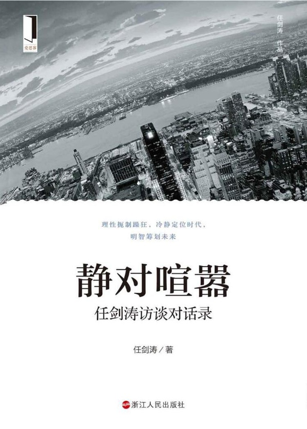

但是，我们现在不得不恢复一个现代常识，就对于公民的盈利社会也好，自治社会也好，还是公益社会来好，如果它不能自主，它就有依赖性心理。党和政府戳一下，它就跳一下。不戳一下，它就不跳一下。甚至你戳几下，它才跳一下。因而党和政府所使用的资源非常之多，耗费非常之巨，但效果不能令人满意。今天，为什么中国式过马路的问题一直在城市社会解决不了？说到底，就是没有自主的公民，就没有自律。而自主的公民它一定要通过自治，自治是什么？是相互的治理。它是个社会治理，而不是国家权力治理。那么，社会的公民自我治理，有了习惯之后，才有所谓我们期望的正气，才压得住邪气。比如说，你三五个人横穿马路，七八百人都怒目而视，你就自觉了，但是只有三五个人守这个“红灯停，绿灯行”的城市过马路规矩，七八百人都在过马路，这三五个人已经被裹挟进去了。所以，自治的社会才是个自律的社会。自律了，公民们就能够判断是非善恶好坏。今天中国社会，很难判断是非善恶好坏。比如说城市居民在违反交通规则的时候，明明错了，他也得跟维护交通规则的城管或者是警察、辅警闹下，甚至扇执法者一个耳光都有。

为什么如此不自律？他判断不了是非。因为长期以来，是非混淆。他就不知道我这错误。以往我骑个摩托逆行一下，从来没说罚款。现在，你居然要罚我的款，你吃饱了撑的，你缺 50 块钱？！然后肢体动作就出来了。所以这个时候，我们要搞清楚一个基本常识，必须是一个自主的社会才能有自治的能力，而有自治能力的公民他才是能够自律的公民，而只有自律的公民，他才跟一个良序社会挂钩，而良序社会在支持我们十八大、十九大都特别强调的法治国家。没有这个良性的匹配关系，你只是在政策布局上去控制社会，那是不行的。社会控制只能叫压服，不是叫治理，或者叫口服，而不能是心服。心服就会体现在行动上。

强控的社会可能是一个地火运行的社会。因为是地火，所以你也不知道在哪里喷发。因为是地火，喷发到什么程度，你也无法预测。你应当给社会一个随时随地的解压阀。我把解压阀开得多大，你会发泄多少社会愤怒，我们是可以计算的，或者是可以预估的。那么这样的社会管理，他就会走上良性轨道。而没有这个解压阀，可能把这个社会压得大家不谋求上进，不谋求出头，平常也没有干预公正的愿望，更没有去维护公正的行动。你觉得这个是乖乖公民，但实际上，因为长期的压制，这个公民内心的暴躁已经在蓄积着，就像地火运行，一喷发出来，局面就有可能难以收拾。最近伊朗的个案很明显的，你想在一个神权国家，突然是数百万人在大城市里头抗议、游行。这个各方都没预料到。那么，中国一定要避免像伊朗这种管理悲剧。

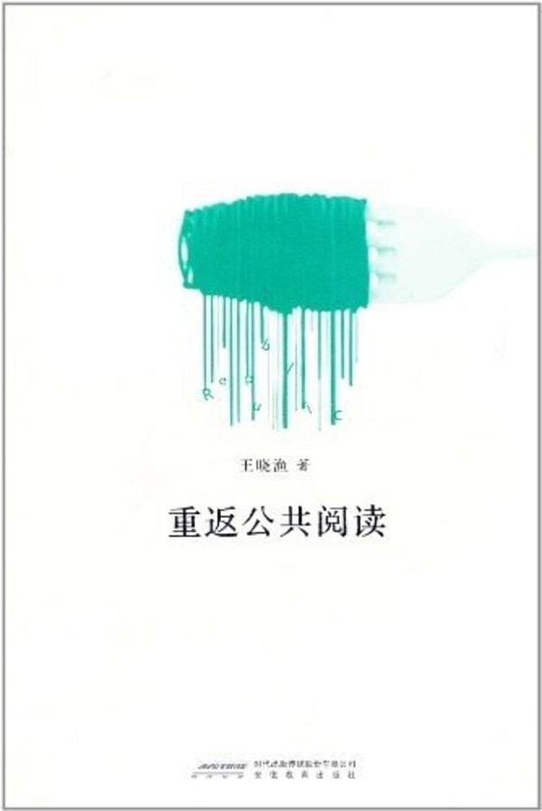

>**公共生活缺失的时候，集体生活会成为一个替代品，比如广场舞**

**王晓渔，同济大学中文系副教授**

有公共空间是好事情，但有可能现在新出现的问题是很多人已经生活在一个虚拟世界中，不再有寻求现实中公共生活的诉求。现在经常出现的场景是：朋友聚餐但并不聊天，去听讲座却似乎对讲座内容没有兴趣，而是各自拿着手机拍照、刷朋友圈或者玩游戏。

从小就接触虚拟空间的更年轻一代，甚至有可能觉得现实空间是另外一个世界。这个差异开始变得越来越大，变成我们所说的一个平行世界了。前段时间与朋友聊天谈到弹幕，这位朋友用很多时间关注 00 后的虚拟世界。我平常也看弹幕，但是听朋友介绍过才明白弹幕里面有很多分层，就是说什么人能发什么弹幕，什么人能看什么弹幕，这里面都有很多分层。相对而言，我平时看到的弹幕只是非常表面的。弹幕是很小的一个细节，但从这个一个细节可以看出代际之间的隔膜。

从人的角度而言，我想公共生活肯定应该是个必需品。不管是从亚里士多德开始，还是按照中国过去所说的“群而不党”，人都有一个社会属性。我不完全认同“离群索居”的说法，结果很容易变成单一的原子化。普鲁塔克有篇文章《“隐秘无闻的生活”是一个好准则吗》，讨论过这个问题。当然，我也能理解高压之下个人被动的撤退，只是不必把这种被动的撤退描述为超凡脱俗的理想境界。

一种共和式的公共生活应该作为一种必需，但是享有这种必需有时又是很艰难的，因为公共生活的丰富是以社会空间、社会组织的丰富为前提。老人们的广场舞经常成为话题。如果不扰民，我并不讨厌广场舞。但为什么广场舞成为老人为数不多的选择？

在缺乏公共生活的时候，集体生活肯定会取而代之。公共生活与集体生活的参加者都是复数的，但两者之间又有一些根本的区别。区别在于公共生活是向外开放的、内部允许差异的，集体生活比较强调一致性，有时会有排他性。原子化的个人生活几乎是不可能的，所以当公共生活缺失的时候，集体生活就会兴起。如果对集体生活不感兴趣，可能会进入虚拟世界。

我没有否定网络的意思，网络为公共生活提供了便利。从 2000 年以后，它使得我们有可能超越地理界限寻找同道。因为此前你与他人产生关联，一定是要有现实原因，往往是同乡、同学这种关系，但这种关系有封闭性，不是兴趣和价值的共同体，往往是地缘的共同体。所以网络提供了超越地理限制，寻求兴趣和价值共同体的可能。

虽然有了网络，公共生活仍然是稀少的，如果缺乏社会组织这么一个要素，还是很难形成一种更为普遍性的公共空间。比如除了广场舞，老人们也可以通过参与公益缓解闲暇时的孤独，现在的情况似乎并非如此。

不过，也不能把公共生活的缺失全然归咎于公共空间的缺少。如果习惯朋友聚会时各自抱着手机，那就要想想公共生活的缺失是不是和自己有关了。

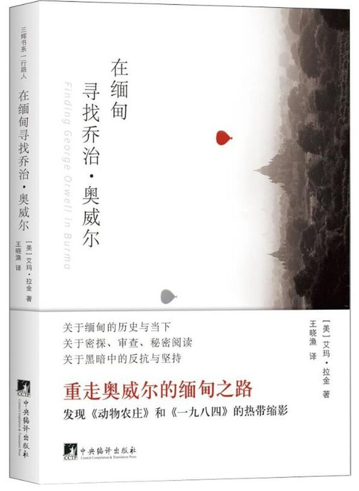

>**“无人”统治或“匿名”统治，是官僚统治的特点**

**洪涛  复旦大学国际关系与公共事务学院教授**

官僚统治的重要特点，用汉娜·阿伦特的话来讲，是“无人统治”。她的这一说法并不新，马克思、韦伯都曾揭示过这一点。从表面看，公开是官僚政治的特点：官府有公开的招牌、公开的规则和公开的程序，这使得这种现代政治看起来很坦荡，而它也着意表现这种坦荡。但是，与传统政治的公然的秘密政治不同，官僚统治的秘密政治，是与它的公开并存的。看上去整个运作是程序化的，像生产流水线一样，按规则进行，但是，这是一部机器在运作，换言之，其中的任何一个个人与它的行动都没有实质的关联，即是不相关的。没有人对这部机器的行动和后果负责，更准确地说，负责的仅仅是这部机器本身。哪怕这部机器的最低层次的执行者，都会告诉你，他的一切行为来自最高层的命令。官僚唯一需要承担责任的，是他对机器规则的不遵守（如贪腐之类），至于这部机器本身如果出了问题，是不可能有任何人去承担责任的。

因此，它的运作是匿名的。如果有人问：谁在这样干、谁决定的？回答只能是：无人。官僚统治的隐秘性在于，没有人能够接近它的真正源头。如果民众有诉求，没有人会回应你，没有人会理你，因为这跟任何人都无关。这是一台自顾自运行的机器。它有无数规则和程序，这些规则和程序就是无形的墙，足以把任何人挡在外面。

整个官僚组织是一个高度中介化了的体系，绝大部分人所从事的都不过是下传或上达的工作，他们不知道所接受的命令源于何处、其真实意图或真正含义，因此，他们就不知道自己行为的真正意义。但是，这个高度盲目的群体，却是社会的中坚和精英。

古今的政治是不同的。古代的统治具有表演性，真正的统治者唯恐不被看到，唯恐不被人意识到他才是统治者；现代的统治，尤其以这种官僚统治为基本形态的统治，则是匿名的，真正的统治者唯恐被看到。

因此，官僚统治的隐秘化，是与它的公开的程序化、规则化相伴随的。这是一种在眼皮底下的魔术。官僚统治完成的是一种变形。通过变形，它把政治变成例行公事，把公事变成私事，把统治变成中立的、技术性的事务管理，把价值的争论变成一件治安事件。警察和保安，成为民众面对的唯一一种政治性存在，因此，唯一的政治问题，便是秩序问题。从表面看，秩序主义是官僚统治的唯一一种意识形态。

要了解官僚统治，有一个人不能不谈，这就是卡夫卡。他的《审判》、《城堡》及其他多部小说，对官僚统治有入木三分的描写。他不仅揭示了官僚统治的源头的永远的遥不可及、统治的日常生活化和私人化，而且与官僚权力向生活的所有领域渗透相伴随的，是社会的所有方面对官僚制精神的复制。

>**在官僚统治的社会，官僚权力成为了人的命运**

**洪涛  复旦大学国际关系与公共事务学院教授**

官僚组织是一部机器，在现代社会，这是一部极其庞大的机器。机器最上端的人下达了指令，他知道后果吗？下命令很轻易，因为没有责任问题。中层和基层的人接受了命令，可能经过了一番推波助澜或其他运作，不管怎样，他也毋需负责，因为他仅仅是受令者。民众，作为目标群体，是承受者。但是，尽管他们承受了一切，一切却与他们无关。你不愿意承受吗，你想反对吗？你只能反对整个机器。如果这样，整部机器就会开动起来，反对你。在古代，民众不难知道造成他的苦难的具体原因，他们知道应该反对谁。在官僚统治下，原因被客观化了、普遍化了，民众丧失了他的对象和目标。谁在行使权力、谁在滥用权力、谁在伤害和杀戮？回答是：无人。古代有暴君，但暴君能激发志士的勇气，今天，有的只是规则、程序和循规蹈矩的办公桌后的工作人员，除了忍受，还能怎样？想指责，指责谁？从这部机器的最高层到最低层，没有一人跟你的指责有关。想反对，那就反对了整个国家，要么就是滥杀无辜，因为找不到一个人为你的遭遇负责。

官僚统治的社会，有一种彼此对立的发展：一方面是官僚机器的日益强大，另一方面是民众社会的散沙化和民众的弱化。官僚权力所到之处，无不使民众的自发自治的生活世界瓦解，人的属人关系遭到破坏，原先处于有机联结中的人被解除了他的社会纽带，成为原子式的个体。

而为了使这个被无机化的社会不至于全面沙化，官僚权力又使之全面官僚机器化。通过这样的一破一立，社会完成了官僚制化。于是原来的人与人的共生共成的关系，变成了命令/服从的权力关系。这个社会，只有唯一的一种组织，就是官僚组织，没有任何独立于它的社会组织，所有社会组织，不是它的附属，就是它的衍生物。

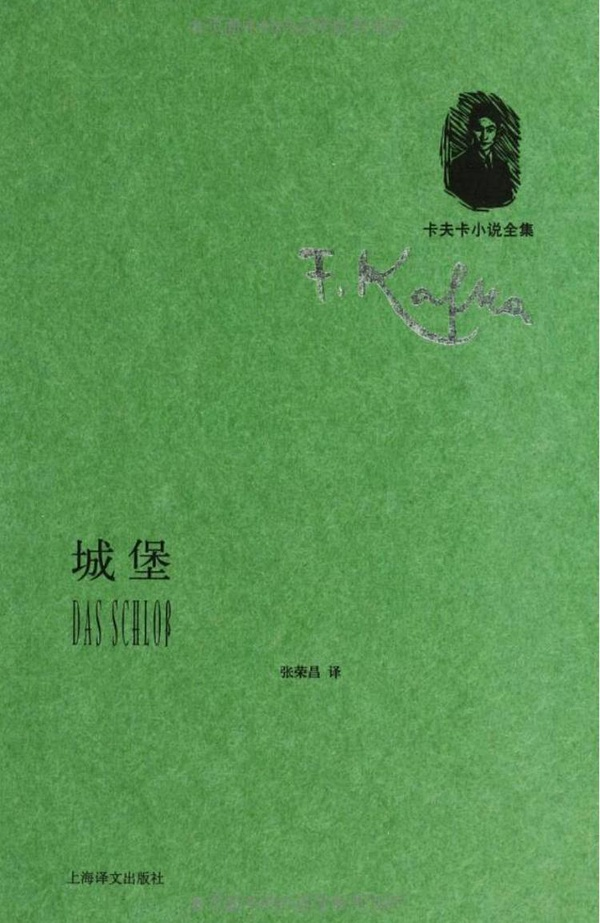

因此，官僚权力的强大，不仅在于它的自身，而且在于民的弱化。因为个人被剥夺了他的社会纽带。此时，倘若一个人不想进入命令/服从的权力体系，就只能成为一个原子式的孤立个体。所以，所有人都努力正式地或非正式地在这个权力体系中找到一个位置。只有与这部机器的关系，才直接相关于每个人的生存。与他人的关系不再是重要的，与这部机器的关系，才是唯一重要的。小心翼翼地面对着这部机器，谨言慎行，千万不要触犯它，甚至不要惊动它。每个人以此方式，维护着他的暂时的生存和安全。要使人成为原子式的，最好的方法莫过于使这个社会官僚化。

没有一个时代像今天这样，统治者的力量与被统治者的力量，相差如此悬殊。今天的官僚是专业技术人员，受过很好的教育，学历高，才能强，见识广，口才好。他们是精英，是贤能，很高端，很精致，他们进行统治，难道不是十足正当的吗？而普通人有什么？顶多是被视为作为软弱无能的托辞的好心和善良。差距那么大，而且官僚与普通人既无骨肉之亲——要摆脱一切人情——，其权力（任职）又跟普通人一点关系也没有。他凭什么要顾恤后者——那些相较于他的愚笨无能之辈，他有什么理由不把后者当作蝼蚁、当作草芥、当作废物呢？

何况，他还有庞大的组织，有有形无形的强力，有隐身帽，普通民众呢，在全面的、不留任何一点空隙的全面监控之下，是全透明的，被切断了任何实质的社会关系，不从属于家族、没有乡邻、没有共同生活的朋友——这种孤零零的、无法形成自己的共同体的生存状态，在古代特别是属于奴隶的——，随时随地可以不被说明地封杀所有声音，这样悬殊的力量对比，先前什么时代曾经出现过？有什么理由不使这些高端精英随心所欲地处置那些低端的人口？

在那些极端——但一点不例外——的事例中，我们看到，当无能的、可怜的人只能往自己身上泼汽油的时候，那些奉命执行的人，就这样看着，无所谓。因为他的本职工作就是执行。强者即正义，还有比这更好的解释吗？

官僚统治的社会，一切都向着使统治者获得最大安全的方向发展，只是他们的安全不是老百姓的安全。老百姓就像脱光了衣服、站在看守面前的犯人——他们甚至都看不到看守。一个是拥有了一切，一个随时随地可能被剥夺一切；一个是如此安全和强大，一个是如此软弱和无能。面对这样的局面，还能说什么？说了也等于不说，因为面对的是官僚权力。

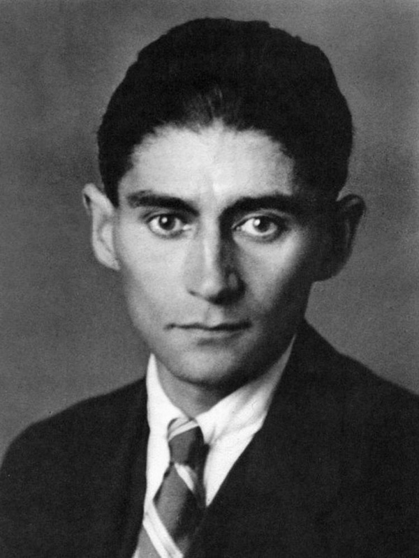

>**【3.政府不能把世俗社会看作它的异己力量，一种解决之道】**

**只剩一种声音，社会会失衡的**

**郭于华  清华大学社会学系教授**

改革开放都 40 年了，怎么还是计划经济的思路？这是一个根本性的问题。政府不能用这样的方式去做。等到后果都造成了，大家都已经是要不然没地儿居住、采暖冻得要死，要不然就是拆了一半，拆得大家都找不着北。然后到这个时候才出台这样的文件或者通知，然后说怎么样？不能影响百姓取暖，不能冷了百姓屋，寒了百姓心。你早干嘛了？是不是太晚了点？这些事你就应该想到。你到底以什么为本？

所以，我觉得其实是从一个根本上去解决这个问题。到今天，其实我觉得还是中国最根本性的问题——政府其实是一个权力， 那权力、市场和社会这三者之间到底什么关系？依法治国又体现在什么地方？这些问题都不是说某一个特别具体的问题。比如说就是采暖问题、城市建设问题、牌匾问题。这些问题背后的根本问题是这样一个结构性完全失衡的问题，是结构性的矛盾。也就是说，我老说一个社会，咱不说多发达的社会，就正常的社会——权力、市场、社会三者应该是一个相对比较均衡的关系，三者应该能够合作、配合，相辅相成，也能够形成一种制衡的关系。这社会才算比较正常。

现在等于是一家独大，权力掌管一切、支配一切。权力去干预市场，不给社会留任何空间。老百姓有了意见，有了不满，你也得让他有一个表达渠道，让他能有一个为自己声张和保护自己权利的一种方式。这些空间都不给留的话，社会的空间就挤压到没有。那这个时候，社会怎么可能好？怎么可能和谐？就剩一种声音，就剩一家独大的时候，这社会一定是严重失衡，是要出大问题的。但是，政府一直以来就是这个思路。你要说依法治国的话，政府在不在法下？党是不是在法下？这是一个基本关系。

你要是说依法治国的话，宪法、法律一定是最高准则。它应该是至上的。但是，现在宪法、法律都不是至上。那不是至上的话，这当中就要出问题。也就是说，它只管辖一部分人，管不了另外一部分人，管不了极少部分人。它只是变成极少部分人统治和制裁大多数人的工具。这个时候，你的合法性又在什么地方？所以它实际上涉及的是这么一个根本性问题。

这种管制的面，权力已经到了一个大到没有边界。权力是要有边界的。从根本上说，为什么要有政府？为什么要有统治者？以人为本也好，为人民服务也好，或者我们用学术话语说，为公众提供公共产品和公共服务也好，这是你存在的理由。要不是这个理由的话，你存在理由又在什么地方？

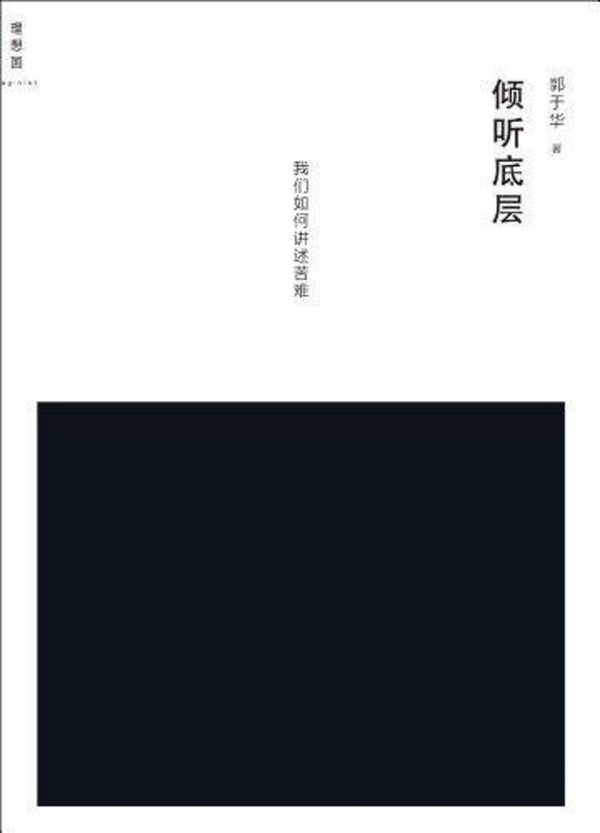

>**权力、市场、社会应该各司其职，政府应该克服社会恐惧症**

**郭于华  权力、市场、社会应该各司其职，政府应该克服社会恐惧症**

从根本上解决问题，你必须得有政府出面，必须得有国家出手。哪个组织再了不起，它做得再多，也做不到这一点。所以，我就觉得大爱清尘在这方面特别不容易，推动得算是比较好。但是其他组织呢？很难找到能做到这种程度的。他们也走过挺艰难的路，一开始的时候总是被打压，你们都别有用心似的。可是你捂着眼睛不看，这些问题就不存在吗？那些农民工就在那种极度的痛苦当中死去，一家一家地垮掉，你看不见吗？这难道不是你政府应该做的事吗？不是你的责任吗？你在干什么？

所以，其实道理我觉得特别简单。我以前说过一句话，天下乃是天下人的天下，城市乃是城市居住者的城市。如果没有百姓的话，何须政府？如果不顾民生的话，首都有什么用？这些根本问题不能颠倒。中国现在这些关系都没有把它理得很顺，很多都处在特别拧巴的状态。

权力、市场、社会三者应该是各司其职、各守本分，然后相互配合、相互合作，又能够相互制衡。这是比较正常的关系。比如说，市场有它自身运行的规律，这个时候政府不可以用行政方式去干预市场。但是，政府的职责是去保护一个比较完善的市场制度。政府不能既当裁判员，又当运动员。你得保证市场能够按照一个公平公正的方式去运行，大家去进行经济交换，经济活动。你保证一个制度。但现在没有这个制度，都不肯承认私有财产的合法性。这是一个很大的问题。然后社会也是，政府永远把社会看作它的异己力量。其实你看那些比较发达的国家，社会实际上应该说是一种非常积极有效，能够让大家生活得比较好的机制安排。

自发的，自组织，又能够自治的这样一个社会，是任何一个国家都需要的。而且社会是公民的一种自组织方式。它自组织起来，可以为自己谋得福利，保护自己的权利，有一个表达空间。这对于国家来说，其实都是正面的，都是好事。然后你非要把它看成完全异己的力量，它刚一冒头，你就给他掐下去，这就完全错了。

其实这话题我们说了都十年了。从特别早就开始说，一再说，我们当时提的命题就是要克服社会恐惧症。你把社会视成一种负面力量，一种反面，一种敌对，把它放在这么一个位置上，对它产生一种恐惧，好像这人一组织起来，就要跟你谋反，推翻你似的。其实不是这么回事，你跟它得形成一个良性互动。

现在市场不是完全市场经济，还是一个权力支配、权力主导的市场经济。社会也不是一个自发自主的社会，而是一个被限制、控制、压缩的社会，那就剩下政府一家独大了，你说这社会能和谐吗？

*（后续报道，陆续更新）*

**本篇报道涉及的采访人物：**

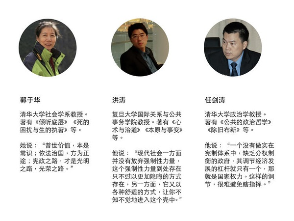
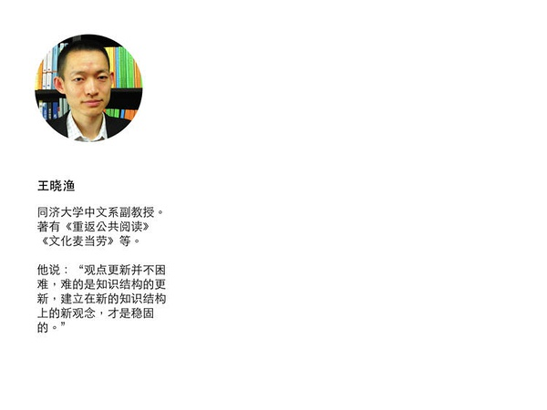

制图：冯秀霞

banner 图来自：[flickr](https://www.flickr.com/photos/66704508@N08/6065664907/)；长题图来自：[flickr](https://www.flickr.com/photos/66704508@N08/6065664907/)