#正视历史，接受批评，是人类得以进步的原因 | 我们如何与未来相处⑤#

 [好奇心日报](http://www.qdaily.com/)  2018-05-12 19:01:09

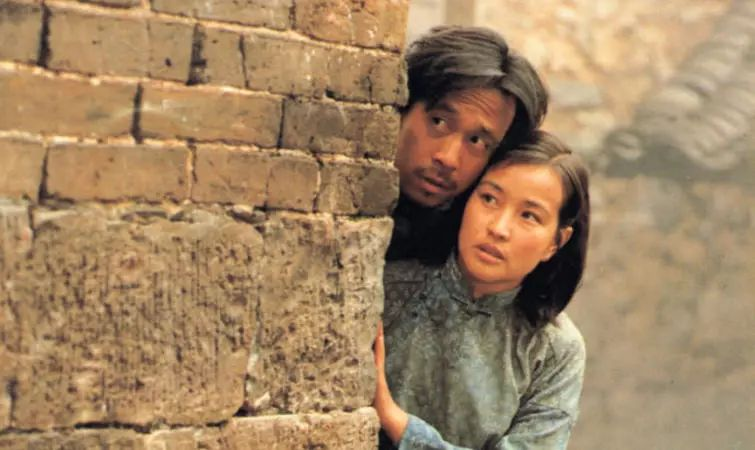

本文作者： 曾梦龙

>这一篇访谈中涉及一些我们如何审视一些历史上发生的具体的事件，但更多的是面对历史我们应该采取什么样的态度。

**“有时候，关键不是去改变世界，而是去解释世界。”**

**在某个关键时刻，关于如何解释这个世界，如何与未来相处，我们需要听听睿智、独立的声音。**

**我们邀请了经济学、法学、社会学、传播学等领域的 20 余位专业人士，回答了我们的问题。**

**问题纷繁而且复杂，但与年轻一代的未来生活息息相关。被访者希望，留给未来年轻一代的这个世界运转良好而且文明进步；在复杂而且迷茫的世界中，保持独立与理性。**

美国记者张彦曾经做过一个计划，记录普通中国人自己的历史。因为技术门槛的降低，很容易就可以做自己的纪录片，“以前要花很多很多钱，现在很多人可以做这个”。除了技术原因，张彦遇到的另一个问题是“也许有点被限制。看你报道的东西是什么，如果你要一直报道‘文革’、‘大跃进’方面的东西，会遇到问题。如果只是你村里的一些情况，还是有很多人做”。

《好奇心日报》也做过多个系列报道，比如“房子和中国人的生活”，同样是从个人历史着手来记录生活变迁。

我们遇到的更多的问题是，他们说的是什么？不论是从读者留言角度，还是我们记者在面对讲述者故事的时候，有些事情我们都是第一次听说，更多事情在于我们只知道概念，而并不了解前后的时间关系、逻辑关系。

费尔南·布罗代尔作为 20 世纪最著名的历史学家之一，曾经为法国的高中生写了一本《文明史》，他说：“我认为我们的年轻人必须在 18 岁，在准备从事不论何种职业前夕，要初步了解经济与社会的现时问题，初步了解世界的重大文化冲突，初步了解文明的多样性。他们要能够阅读严肃的新闻日报，理解读到的内容。”

这个于我们是缺失的。

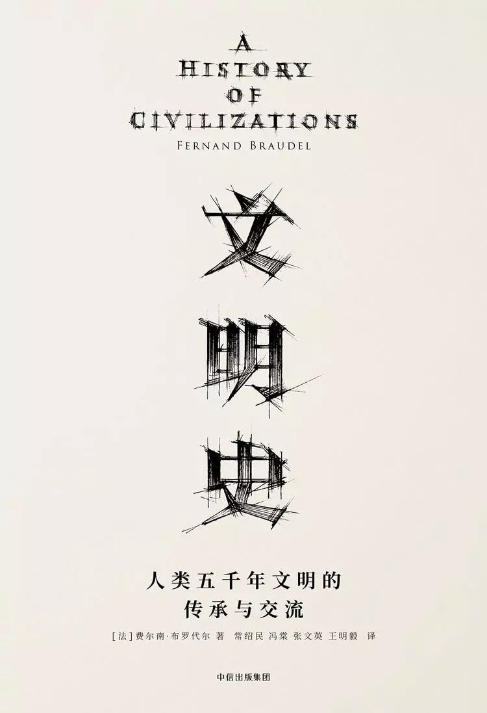

而且情况可能越来越糟糕。在关于高中历史教科书对文革内容做出修改之后，有广州中学生接受采访，“如果不去强调它的错误的话，历史可以更完美一些吧，没有说绝对的错误吧……”

贺卫方在接受我们采访时说：“一个心态健康的民族绝对不能回避自己的历史。一个总是掩饰过去这个民族所出现的灾难，所出现的荒唐的、疯狂的作为的民族，注定会重演这种悲剧。这就是面对历史的一个合理的态度。”

如何面对历史？他说：当然需要直面它。

这一篇访谈中涉及一些我们如何审视一些历史上发生的具体的事件，但更多的是面对历史我们应该采取什么样的态度，我们如何认识历史。

我们从那个著名的历史教科书事件说起。

>**1.我们如何面对历史？**

**“文革”对整个中国的冲击是空前的。我认为中国至少要花 100 年才能消化这么一个冲击**

**唐世平  复旦大学国际关系与公共事务学院教授**

我认为如果教育部真的这么做，那肯定是错的。我们天天告诉别人说，不要忘记历史，包括我们对日本或者是其他国家。这就要求我们自己不能涂改或者忘记自己的历史。事实上，我觉得，这个国家伤害最深重的运动其实是从“反右”开始。“反右”和“文革”其实是有相当强的内在联系。一个根本的共性就是摧毁中国平民以及中国领导人对知识的尊重以及对知识分子的尊重。没有一个国家能够完全抛开知识而活下来。现代社会更加如此。没有知识、科技的创新，那就不可能有国家的经济成长。

所以，我觉得如果教育部真的要把“文革”改掉，这是完全错误的。这不仅仅是因为我个人经历，而是“文革”对整个中国的冲击是空前的。我认为中国至少要花 100 年才能消化这么一个冲击。它使得人与人之间的信任（受到破坏）。另外一个，最重要的，使得对整个知识精英、知识界、知识体系的尊重被摧毁。我认为这是一个民族真正的血脉。这个血脉就是你对知识的传承。

一个传说说，可口可乐的总裁曾经说过，你们把可口可乐的厂烧掉了也没关系，我有一个配方就行了。说白了，知识的血脉就像一个配方。你没有这个了，你剩下的只是那些庙宇、殿堂。这不是真正关键，真正关键是知识的传承。特别强调，这并不是说中国传统所有东西都是对的。我是说，如果一个国家、一个社会，对于整个知识阶层、知识，没有根本意义上的尊重的话，这样的社会和国家是不大可能真正成功的。

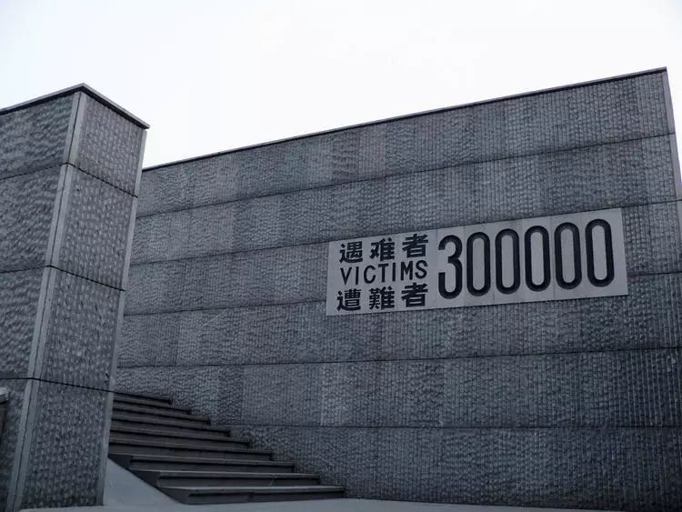

**面对伤疤，尊重历史，应该有更多的“文革”纪念馆**

**吴飞  浙江大学传媒与国际文化学院教授**

当时一看到那个东西，我觉得好像不可思议，怎么可能“文革”被删除？这么一个非常重大的创伤记忆，不是说你的历史教科书一抹就抹掉了。就像日本人不愿意谈南京大屠杀，不承认这个东西一样，但这个东西它就存在，怎么可能就抹得掉？当然最后我还没有看清楚，没有怎么去看，所以也不能够做出一个准确判断。

但是，我觉得如果说是谁有这样的想法，试图把这个东西给抹过去，那绝对是不可思议的事情。我觉得像“文革”这种类型的事情，实际上是可以去多谈，大谈。尽管它可能是一个创伤记忆，但至少让我们会觉得回到过去是不可能的。因为大家都不愿意，都是付出了很多痛苦和民族发展受挫，生命财产受到很大伤害这样一段痛苦的历史。它应该让我们铭记。我甚至觉得应该弄好多的“文革”纪念馆才行，让那些没有经历过的人知道“文革”到底是怎么回事。

当然，这是一个很大的文化事件。因为教材是对我们青少年培养最重要的一个东西。尽管它很不可思议，但是我也觉得，只要社会上还有其他的渠道（了解）关于“文革”的说法，你再不想让别人知道，他都有可能会知道。所以，从某种意义上讲，你想从教科书中删掉，也不可能删掉我们民众的记忆。因为档案就在那里，历史就在那里，你不承认不行。因为历史永远是后人来书写，所以我觉得明知不可为而为之，有的时候是挺愚蠢的。

你就要尊重历史，它是怎么样就是怎么样。何况这个东西本来就是一个重大的创伤事件。就像南京大屠杀一样，你说怎么能抹去呢？我们就要记住中国当年所受的那种屈辱，但是我们不一定要把它引到一种民族仇恨敌对的状态。我们要知道它本身是人类的灾难，或者甚至是人性的灾难。

那我们要防止这个东西是不是可能重新出现或者发生？比如日本的军国主义当年做出那么惨不忍睹的事情，未来是不是还有其它的军国主义同样也可能做呢？让我们去记住这种类型的历史是很重要的。“文革”也是一样。“文革”搞成那个样子，是怎么做的呢？所以，应该好好去总结，而不是试图去隐瞒，好像遮羞布一样，是不想揭开的伤疤。它既然是伤疤，是事实，是历史，就应该让它存在在那个地方。

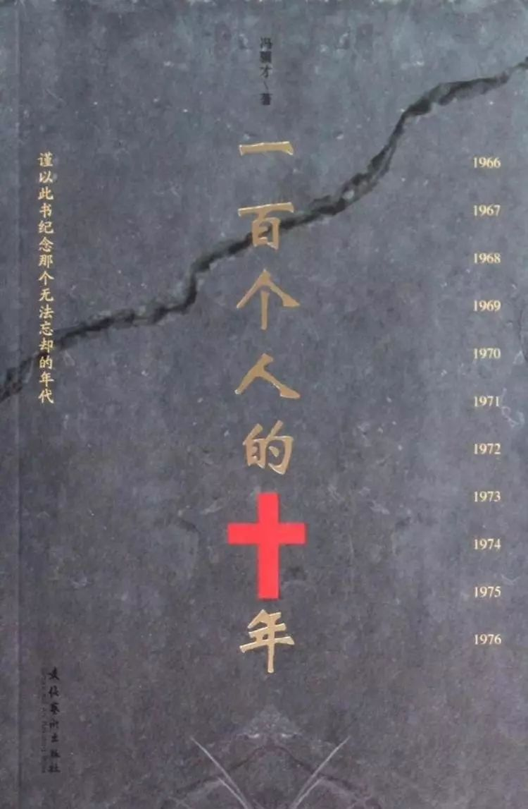

**我一点也不吃惊，我们从来没有认真反省过这个问题**

**洪涛  复旦大学国际关系与公共事务学院教授**

我在微信上看到过（修改教材这个消息），我一点不吃惊。哪怕它写“全面肯定‘文革’，‘文化大革命’就是好”，我也不吃惊。为什么？因为，某些类似的舆论已有很长时间了；因为，反思一下，多年来，我们有没有认真地、真正地反省过“文革”？我觉得问题的关键在这里。“文革”如果有对的地方，它到底对在哪里？有错的地方，又错在哪里？老百姓，尤其今天的年轻人，根本不了解、不清楚。只要不真正反省“文革”，就不可能真正清除“文革”之所以发生的土壤，它再来一遍就不是不可能的。

听说有几个学生，在那里读马克思的东西，被警察取缔了，要抓起来。这样做的结果是什么？所以，“文革”的爆发难道没有它的原因吗？不允许研究，不允许谈“文革”，禁锢的结果反而是，“文革”不知不觉又回来了。其实，在某种意义上它已经回来了，只是不在官府建制政治的层面，而是在日常政治的层面上。

对这个问题，我觉得不能再采取“鸵鸟政策”了。应该允许谈论、讨论和研究，让老百姓能够接触到“文革”文献，知道那个时候究竟发生了什么事情？历史学家要承担起责任，而政治家也要有历史意识。现在两种不同的说法都有，各执一词，彼此对立。一种是官方正统的说法，认为是内乱、是灾难，只是这话很长时间不讲了，不知是否还作数。另一种说法认为“文革”很好，或者不可能那么糟。多年前我就听一些年轻人讲，为什么“文革”不把知识分子都搞死，而有些年轻人则断然不信“文革”中所发生的许多事情是真实的，认为是编出来的。真理可能并不全然握在某一方的手里。但不管怎样，应该让大家有可能来了解曾经发生了什么。这是一个重大的历史事件，是无法回避的。对“文革”的判断直接关系到当下，关系到未来。这已经是很明显的了。

现在可怕的是，一方面，公开地，不管讲好讲坏，都不能提。另一方面，又在不知不觉地改变关于它的说法。据说，教材里以前写“毛泽东错误地认为”，现在把“错误地”删掉了。当时认为“错误地”，是他们自己的判断，现在，他们自然也有权认为这不是“错误地”，对此，老百姓是无从置喙的，中国老百姓的命就是受令。当然，老百姓只是希望这个“令”能够是显白的，让老百姓可以对自己的行为有一种正确的预期，不至于误陷入罗网中去。

所以，还是以讲明白比较好。要讲明白，首先就要弄明白。这样就要研究。现在不管哪一方，都能讲出一番道理。但是，首先要把事实弄清楚。的确，“文革”并非铁板一块。搞“文革”的，有领袖本人，有属于统治集团的，也有小民百姓；在“文革”中遭殃的，有属于统治集团的人，也有小民百姓。“文革”的十年，也不是同质的、一成不变的，其间有很大的变化。譬如，后来对“文革”的批评，不少说法本身就来自“文革”十年，而“文革”十年尤其是后期的一些做法，也未经反思地为后来所继承、发展。所以，“文革”有其多面性、复杂性，这是应该予以充分认识的。不管怎样，只有对这一历史事件本身、它的前因后果，等等，作深入地、全面地的探讨和研究，才能获得对不同立场、观点作出辨析和评判的基础。

认真对待“文革”，意味着认真面对“文革”中那些真正的死难者，意味着认真面对我们自己的现在和未来。这是对历史负责任的态度，也是对生命负责任的态度。

>**2.如果我们不能从历史当中学习，那么会发生什么**

**如果不能吸取历史当中的教训的话，它还会教训我们**

**王建勋  中国政法大学法学副教授**

这样做很糟糕了，毫无疑问的。因为“文革”是我们的一个灾难，如果不对它进行深刻的反思，不吸取教训，也就意味着我们无视它给我们带来的这种伤害，我们不想从中去吸取教训。我觉得这个是非常可怕的事情。因为人和其他动物的区别就在于我们能吸取教训。我们能从过去的错误当中来总结出来一些东西，然后进而超越，朝着一个更好的方向去。如果说我们把“文革”的东西给淡化了，也许还不是删除，或者说从公众视野当中稀释或者是抹去的话，那是非常可怕的事情。因为它给我们造成的这种灾难，无法无天的这种状况，那么多人遭到伤害，我们无动于衷，忽略它的结果就是历史的悲剧会重演，还会再来“文革”。我觉得这个是非常糟糕的事情，我们一定要抵制、抗议、反对这种做法。如果我们想避免再次发生“文革”，我们必须要得对这种做法说不。

（关于）“文革”（的研究）长期以来都是一个禁区，不是从现在才开始的。因为“文革”里面的一些资料、档案都是见不着的。按说早就应该被公开了，让大家去研究，去了解，去调查，但是恰恰相反。这表明其实我们并不想吸取“文革”的教训，某些人试图还要再发动“文革”，所以不想让人们了解“文革”。现在年轻一代很多人都不了解，不知道我们发生什么，或者你告诉他，他会说，怎么可能发生这种事呢？这是非常可怕的事情。如果我们不能从历史当中学习一些什么，不能吸取历史当中的教训的话，它还会教训我们。这个是非常关键的。

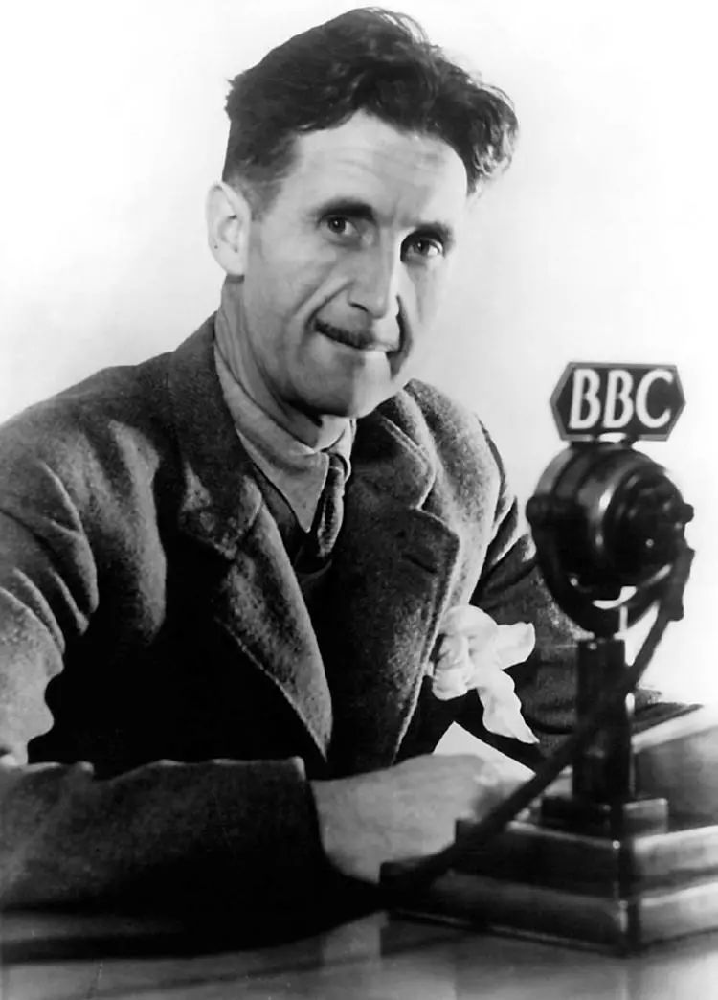

**人某一天真的变成机器，那《1984》绝对是可以实现的**

**王晓渔  同济大学中文系副教授**

我觉得问题关键在于公共空间是否释放。我们反过来想一想， 60 后小时候处在“文革”时期——现在 90 后接受教育再差，能有那个时候差吗——一旦公共空间稍微释放一些，到了 1980 年代，立即有万物复苏的景象。所以，个人的努力是非常重要的，但是否有一个开放的公共空间更为重要。在缺乏公共空间的情况下，说得残酷一点，个人能否形成自己的价值观是有偶然性的，比如父母或者老师的影响。

（经历“文革”的一代逐渐远去）这点我觉得并非记忆消失的最主要原因，我也没经历过“文革”“反右”，你也没经历过，但你我都了解。我是觉得，对“文革”等历史有所了解的人们，依然是一个并不那么少的群体，只是面临言说的困境。

如果回头去看《1984》的话，这种遗忘机制会有悖论。因为当你要求大家遗忘的时候，其实就在提醒大家。你看《1984》里面最有趣的，温斯顿自己是在什么部门工作？他自己恰恰是在要求遗忘的真理部工作。因为他要来做这个事情，反而等于是让他有记忆。某种意义上而言，人毕竟不是机器。人某一天真的变成机器的话，那《1984》绝对是可以实现的。但人毕竟有自己的血肉和欲望、精神和思想，所以历史是否会终结在《1984》，我倒没有那么悲观。

**对历史采取美化的态度，结果会丧失发现真正问题的能力**

**贺卫方  北京大学法学院教授**

官方在 1970 年代末期到 1980 年代初期，对十年浩劫、文化大革命进行了彻底否定，也大规模地平反了冤假错案，纠正了文化大革命许多极左的一些做法。但是，官方否定文化大革命的同时，也终止了、阻止了对文化大革命的深入研究和相关历史真相的一种揭示。

所以，我们后起的、年轻、新生代的一些国民，对文化大革命其实是非常陌生的。（我们）对政治运动到底给这个国家带来了怎样的一些影响、损失？大规模的人权灾难到底发生了多少？这些东西其实都没有容许再进行研究。现在关于文化大革命的研究的著作，在中国是很难出版的，基本上没有多少。倒是在海外还有少数的一些成果，但是其实由于档案资讯不公开，所以导致这种研究本身也是非常困难的。现在的情况就是说，改革开放本身固然让社会发生了很大的变化，但是其实由于政治体制改革的滞后，也导致了社会中间出现了许多弊端，一些问题，例如贫富差距，官商勾结、腐败大规模的蔓延，太多的问题，社会中间越来越不满，越来越愤怒。那么，这样一种不满和愤怒，有时候当我们不了解历史真相的时候，会美化过去。人们会想象毛泽东的时代，可能是一个更值得怀念的时代。那时候，有些人说没有腐败。那时候，老百姓可以造反，可以打倒走资本主义道路的当权派。这样的一种情形，其实在 2008 年、2009 年的重庆，已经是变成非常突出的一个现象，薄熙来、王立军他们在重庆所作所为，其实都是建立在这样一种（认识之上）。

老百姓或者说官方的某些人士，他们都愿意去通过美化一种不应该被美化、不应该被赞美的时代，给人们有一种希望解决社会的问题，通过那种方式解决社会的问题。

所以我想，我们今天可能，像 2017 年的邓相超事件也好，左春和事件也好，给我们带来了一个非常大的警醒。就是说，我们必须要认真地对待我们的历史，认真地对待我们教育中间对历史真相的一个揭示。包括出版自由、言论方面能否更加开放，让大家能够通过各种各样的研究，把历史真相揭露出来，不至于我们在现实面前产生一种由于对历史的无知所导致眩晕的一种感觉，会饮鸩止渴。这种是我个人觉得非常大的问题。

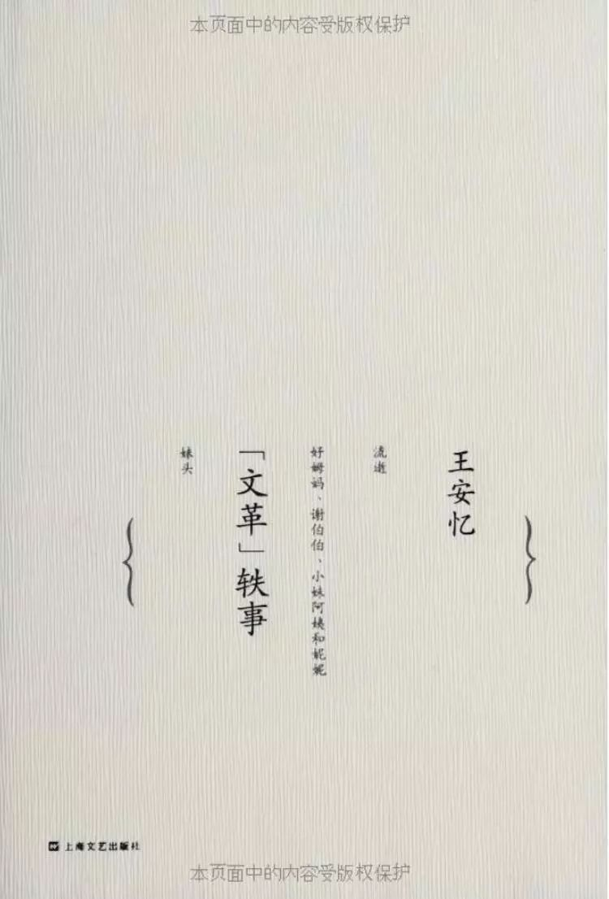

>**3.正视历史，才有接受批评的能力，人类因此才获得进步**

**“历史感”，可以帮助我们解释十月革命当年的号召力，私有制重新得到认可，以及为什么有的改良成功，有的实践失败**

**马勇  中国社会科学院近代史所研究员**

（关于十月革命 100 周年，）我有专门的演讲，在网上搜一搜，应该还能搜到。我的看法，可能和很多流行看法不一样。比如现在很流行的看法，就认为整个十月革命以来导致的国际共产主义运动就是人类的毁灭。我对这个看法基本上是不能认同的。因为我觉得这种看法是从今天的立场来看世界，而缺少一个历史感。缺少历史感是什么？工业革命之后，资本主义在它的早期阶段，确实像马克思和列宁所分析的那样，一直到中国的学者，像严复、陈独秀。这些分析就是从马克思以来对资本主义的批判，我们还得承认，从历史的观点来看，他们的批评是对的。早期的资本主义确实有很大的问题，就是列宁后来概括的这种贪婪、腐朽、财富的垄断。

总结一句话，到了 19 世纪晚期、 20 世纪早期的时候，可能就像中国学者梁启超、梁漱溟所意识到的，私有制是人类罪恶的根源。今天我们讲私有制可能还是社会存在的一个很重要的东西，但是是时代条件变化了。那么我对十月革命的看法，当时在那样一种状态下，在资本主义早期发展状态下，人类对私有财产的这种痛恨，可能是一个历史的存在，否则我们就没法解读他们那一代人都这么“混蛋了”，给我们今天造成这么大的问题，那就太“混”了。

我是做历史研究的，我还是愿意从一个历史的这种感觉去回溯，就当年追求十月革命的社会主义，应该有它的正当性和合理性。甚至还可以预言，人类未来可能还会沿着这条道路走，但是一定不是已经走过的这条路。因为这个也符合儒家的理想，儒家所讲的人类大同，实际上也就是社会主义、共产主义。这里面当然要解决的问题是，十月革命之后，社会主义、共产主义导致苏联、中国和其他国家运动中的社会主义确实都是失败的，但是不能否认这个理想本身代表人类的一个向往是对的。这是我讲的一个方面。

另外一个方面来讲的话，资本主义的改良，确实与马克思、列宁的批判有关。如果马克思别批评、列宁别批评，可能资本主义（现在已经）完蛋了。资本主义的改良，一方面是基于社会科学的进步，特别科学技术进步，使社会生产力大幅度提升。另外一个方面，我们也应该看到，从马克思以来，社会主义、共产主义者对资本主义的严厉批判。这个批判就等于他们看病，给它开出药方来了。特别是像孙中山讲的，马克思是个病理学家。我不仅是一个病理学家，我还是可以拿手术刀给它治病的人。

那么，资本主义的问题就在这一系列的批判当中获得了改善。当然还有一个科学技术的进步。毕竟社会财富的巨大增长，使改善成为一种可能。因此我们看到一战，特别是二战之后，资本主义的调整，就向一个社会主义方向调整，我们讲的福利资本主义实际上是在接受一种批判之后的调整。资本主义本身体系的开放性，可能也是我们要注意的问题。

那么反过来说，十月革命之后导致的运动中的社会主义为什么都归于失败？因为它根本不能接纳任何批判。从苏联一直到我们，任何批判都认为是就要颠覆我们，要妖魔化我们。实际上，批判是最大的帮助。没有马克思的批判，资本主义肯定早就玩完了。从马克思以来，包括毛泽东从 1949 年之后，一直在批判资本主义。我这个年龄赶上批资本主义的尾巴，批资本主义的苗头，在内心深处的资本主义倾向性都在批判，那么这种批判实际上对资本主义本身的走向更加健全，真的是功劳非常大。

现实中资本主义和社会主义的两种竞争。我们现在可以明显地看到，不管你怎么自信，你的自信说出来就不自信。从一个历史的观点来看，可以很正面地讲，资本主义这样一种勇于面对缺点、面对问题，接受来自任何方面善意的、恶意的批判，是资本主义得到完善的一个很重要的外部环境、外部条件。我想十月革命可能要从这个角度去来理解它。

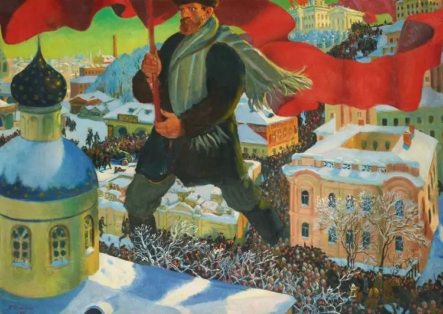

>**4.自己的历史和别人的历史，可以为我们提供更多借鉴**

**日本，委内瑞拉这些别人的历史可以提供什么借鉴？**

**雷颐  中国社会科学院近代史所研究员**

影响日本开始明治维新的因素很多，其中很重要的一个是当时中国的状况。包括中国人写的书在中国被禁，恰恰在他们那儿（指日本），是一个人人要读的书。所以，我当时觉得很遗憾，中国经验没有成为中国知识，反而中国经验成为日本知识。

我觉得现在还是要坚持一个开放，并且要把别人的教训作为自己的经验。这样就能够代价最少。比如说，我在微博发了好多次，我反复强调，比如说委内瑞拉现在的经济到这个样子，我们应该好好地总结，它为什么会到这样子？避免我们犯这样的错误。你不要自己犯错误到这种地步，你再改，那就损失太大了。它提供了一个很好的教训。你对别人做个案分析，自己不必去走这么一条弯路。

因为查韦斯上台是高度民意基础上台。比如说，他满足了那种民粹主义，开始是非常高的民意。直到现在，我都觉得，他的民意基础仍然在那里，已经到这种状况。马杜拉他们选举，他没有垮台。我们知道，都已经商店里经常是空空如也。所以要研究这个现象，我们就可以把别人的代价（吸取经验教训），不必付这个代价。那么，明治维新就是把中国前几十年，从 1840 年到 1868 年的状况，他们做了研究，觉得不能走中国晚清这一路，得走新路。他们就避免了中国晚清的那些曲折。

**俄罗斯历史博物馆开放了半边，那半边是 20 世纪，它就封存了**

**戴锦华  北京大学中文系教授**

我自己没有做够功课来在这具体讨论俄国革命的成败，或者俄国革命的意义。但是我大概不会认同俄国新史学或者说全球新史学对于俄国革命的那种论述，认为俄国革命是俄国的歧路，把俄国引向了灾难。这是一个标准的胜利者写历史的方式。我完全不能认同。

因为如果你从所谓的俄国历史自身，你会看到俄国始终处在横跨欧亚大陆的这样一个地理位置的限定之中，所以它一直有一个强烈的脱亚入欧的动力。曾经欧洲人认为欧洲就是整个世界，别的地方都是野蛮人居住的地方。俄国当然就处在这样一个位置上，它的亚洲部分好像是作为边陲蛮荒。所以从所谓的伊凡雷帝他们自己所书写的历史，它就有一个俄国巨大的对自身生存和世界地位的焦虑。

那么，从这个意义上说，俄国革命造就了苏联帝国。它毫无疑问是实现了俄国世世代代的这种梦想。你今天说那是一条歧路，你重新去思考列夫·托尔斯泰的思想所可能勾画出来的未来俄国的道路本身只能是一种历史假说。

也就是在这儿，我觉得它引申出了一个跟中国密切相关的一个命题，我们会说 20 世纪的社会主义革命全是在欠发达国家成功的。这本身不是一个否定，说这是假社会主义或者什么，本身就说明它在全球资本主义格局当中的意义。欠发达国家的社会主义革命成功，它本身始终是双重命题。其中一个很突出的命题就是现代化之路。欠发达国家怎么在发达国家已经发达了前提之下，来完成自己的现代化和工业化进程的问题？而另一重命题才是世界革命和共产主义历史的自我期许，或者历史的承诺。它都是在双重命题之下展开的。

今天我们思考俄国革命的意义，就在于我们说“十月革命的一声炮响，给我们送来了马克思主义”。这个表述自身已经包含了十月革命向我们展示了欠发达国家自强和立国的一条道路。这重意义其实始终包含在俄国革命对中国的启示当中。而今天的中国本身，我总是坚持这种（观点）。今天整个中国的一切仍然是革命红利，我们仍然在享有中国革命带来的红利。而中国革命包含了从民主革命一直到 1980~1990 年代中国大规模的变革。1980~1990 年代中国大规模变革的深度和广度相当于一场革命，因为它包含了社会财富的一个大规模重新分配。所以，革命实际造就了今天的中国。

所以，我觉得在这个意义上说，中国是个成功的例子，俄国是一个失败的例子。而所谓俄国作为一个失败的例子，是因为当苏联解体的时候，它整体地丧失了它的国际地位，丧失了它在国际的政治、经济、文化的言说权，所以才在俄国内部没有办法消化俄国革命的叙述。我之所以这样说，是因为我去俄国的时候真的被吓到了。俄国国家历史博物馆当中，历史到19 世纪就完了，20 世纪没有。我一起去的朋友打死不相信这件事，所以我们绕着国家历史博物馆狂奔了三圈，终于找到一个懂英文的人。问他，他就说没有。其实我们知道历史博物馆开放了半边，那半边是 20 世纪，它就封存了。因为它没有言说逻辑，没法消化这段历史,没有消化这段历史的现实基础。所以,我觉得这是一个今天我们去不能单纯否定俄国革命（的理由），尤其是在中国的历史和现实当中，我们必须意识到俄国革命对于世界曾经有过的，是不是继续有的那种启示意义?

第二个角度，我是觉得俄国革命的意义在于所谓列宁主义的出现。我现在也不是在讨论列宁主义自身，而是讨论列宁主义是在没有马克思主义的地方创造出了马克思主义的这个意义。换句话说，就是应对新的局面，提出新的解决方案这样的一种创造力。我觉得在这个意义上，它的启示作用毫无疑问仍然存在。因为整个世界发展到今天，我觉得大家都面临着没先例可援引的状态，所以这个时候是对想象力和创造力的挑战。

大概这两方面是我觉得今天我们面对俄国 100 年的时候的一个历史性回应。

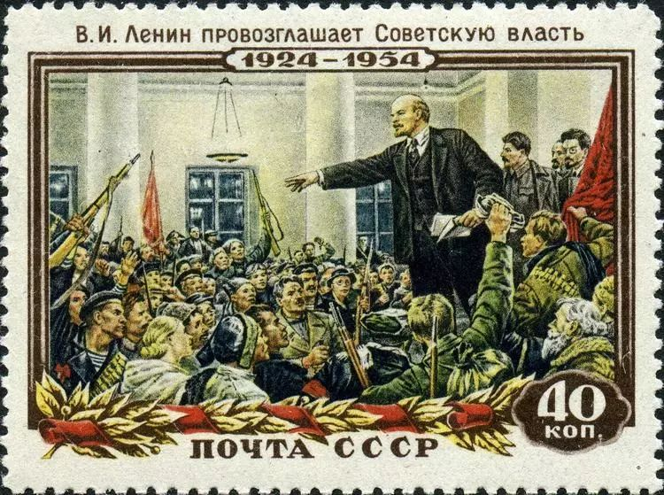

>**5.思考 20 世纪的灾难和活力，才能理解现今人类的伦理处境**

**我们从 20 世纪那么多事件里得到什么教训？**

**戴锦华  北京大学中文系教授**

19 世纪是欧洲出现所谓百年和平，而且工业革命全面开花结果的年代。到 19 世纪末的时候，分配制度（的问题）就变得非常突出，社会的极化、阶层的固化。所以，19 世纪末面临所有问题，在今天都已经出现，而且都变得非常极端。到了 19 世纪、20 世纪之交的时候，其实就已经变成了大家都已经预知了两种选项在迫近。一种是革命，一种是战争。而实际上，当时的世界或者说当时能够主导世界的人们，他们其实做出了选择——他们宁要战争，不要革命。

因为很明显， 20 世纪开始出现了国际共产主义运动兴起和法西斯主义兴起。而一战之后，很快形成了法西斯主义和共产主义对决的状况。可是这时候，自由世界事实上做出的选择是宁要法西斯主义，不要共产主义，结果使得法西斯主义在全球崛起，于是就陷入了二战。

所以某种意义上，你也可以说，二战的胜利也是偶然，我们人类完全可能无法战胜法西斯主义。如果不能战胜法西斯主义的话，毫无疑问是人类的大劫难。因为纳粹的种族净化是全球性的，所以我说，我们在战争之后得以幸存。而当时的绝大多数人们都意识到了两次世界大战的意义。

二战之后，一方面是出现冷战两大阵营的对峙。但另一方面，两大阵营有一个强烈的（共识），就是这个世界必须有结构性、本质性的改变，我们才能避免内在机制最终导向战争和毁灭。所以，20世纪的后半叶就是全球的动荡或者说是一场大的社会实验年代。那么，结果它是东方阵营自我解体，不战而败的方式来终结冷战。

但是，冷战终结的时候，很多人指出说，冷战终结了，（但）造成两次世界大战和冷战的所有问题都在。托马斯·皮凯蒂（Thomas Piketty）的《21世纪资本论》其实没有什么任何新的发现。它最有价值的是他的现状观察，通过他的数学模式所揭示出来今天世界经济局势——冷战终结20多年，世界整体格局就完全回到了19世纪，全面退回到“乘积性资本主义”。我喜欢网友的翻译，叫“比爹资本主义”。实际上，简单地在说一件事，就是阶级的固化和上升空间的封闭。而在全球化格局当中，它就会整体固化（某些）区域，某些区域永远没有机会和可能。

当然，另外一个情况就是麦克尔·哈特和安东尼奥·奈格里的《帝国》里面所说的，在世界范围之内，第二世界在弱化，第一世界和第三世界无所不在。在每一个社会当中，尤其发达社会当中，中产阶级在萎缩，另外两头在扩大。少数的顶层越来越富，底层迅速扩大，而中产阶级几乎很难稳固住他们曾经有的非常稳定的社会地位。

所以我觉得，内部、外部这样一个变化格局就是一个非常清晰的格局。在这个意义上说，你简单地把 20 世纪名之为极端的年代，或者说 20 世纪完全是一个失败的世纪，毫无意义。因为你今天又结构性地被放回到那个位置上，这种矛盾最终会导致一种劫难性现实的出现。而如果比如说，有人认为欧盟的出现避免了 21 世纪的世界大战。因为两场世界大战都是以欧洲为主战场，都是在英法德三个结构性相同的国家竞争当中才爆发。现在欧盟出现了，好像（能够）避免类似政治经济结构的国家竞争导致的战争。

而今天我就说，整个世界都处在告别革命的文化当中，所以孕育世界大变革的动能、愿望都不足。那么，没有革命，没有战争，那这种不可解决的矛盾会以什么方式发生？可能是骚乱，可能是崩溃，而在我看来，这些东西并不比革命和战争好一点点，可能更可怕。因为革命和战争最后都的结果都会造成结构性的改变，都会在某种程度上造成一个社会资源和社会财富地再分配，但是崩溃和骚乱是不倒向任何结果，它是绝对的破坏。

所以，在这个意义上，我真的觉得，如果我们不能够从 20 世纪当中获取有效的资源，汲取 20 世纪的（教训）或者叫清理 20 世纪的债务，来启动 20 世纪的遗产的话，那么我真的对整体的世界前途（不抱什么希望）。

**1960 年代为什么重要？**

**戴锦华  北京大学中文系教授**

对我来说，原本重访 1960 年代是想找到一个去触碰文革的不同参数。最早我还是从内部问题出发，因为我觉得，我们置身在这个历史的内部，而且对我来说，这是一段切肤之痛的历史。到今天，你触碰它，还是痛，剧痛。所以我觉得，我找不到一个可能性来处理这段历史。

当然，首先我第一步的认知，就知道这样一个中国的政治年代不是在中国内部发生的，不是在中国单纯的历史逻辑、权力逻辑当中发生的。它其实是全球 1960 年代的一部分。这是第一个认知。而第二个接着，我曾经想通过全球 1960 年代来获得一些不同的角度和进路去处理中国的 1960 年代。最初是这个想法，但是我没有想到，当我进入到 1960 年代研究的时候，我真是在国外的旧书店不知道淘了多少书。因为我想大量地淘回忆录和当时的出版物和历史文献，我希望能够去感知那个时代的那种氛围，那时代人们的生命状态。我觉得，某种意义上，有所收获，碰到那种状态。

然后在整个过程当中，我自己并不是一个有意识地追求当中的发现，是我发现 1960 年代，世界最大的变化就是历史在第三世界发生。1960 年代并不是像以前人们理解的是巴黎 1968、意大利“热秋”、美国的反战运动或者是“花孩”。所有的这些，都是对第三世界激变和崛起的一个被动回应。比如说整个从法国电影新浪潮一直到 1968 年 5 月，几乎倒阁、几乎成就的这样一场革命。它都是对整个欧洲丧失殖民地，对阿尔及利亚战争，对法农仇恨哲学的一种回应。而且实际上，你看一看，欧洲的，尤其是法国战后的重要思想家、文学家、理论家，他们很多人根本就是在殖民地出生、成长，在殖民地丧失的时候，才回到美国的。其他人也都有非常丰富的前殖民地经验。具体到 1960 年代，你会发现，当时英雄和偶像都来自第三世界，比如说甘地、切·格瓦拉、毛泽东、法农、萨尔瓦多·阿连德、胡志明。它是整个 1960 年代的动力源，这样一个发生在第三世界，反抗第一世界的这种斗争，然后它就变成了欧洲内部的危机。我觉得这是一个对我来说，不期然的发现。

后来，我就从这个思路（出发），尝试去处理，去碰触一些整个现代历史或者现代历史的发生。我觉得我找到了一种去观看历史的可能性。比如说我们现在都已经知道，康乾盛世，或者说中国对于整个欧洲的贸易剪刀差是鸦片战争最直接的动因。同时，欧洲故事的几个讲述方法，以文艺复兴为端点，或者以哥伦布发现美洲为端点。但其实你会看到，是哥伦布的故事在先，并不是资本的原始积累给现代历史提供了第一动力，而是哥伦布、麦哲伦所谓发现美洲、欧洲海盗对于拉丁美洲的掠夺才是第一桶金。而同时，比如说，你会看到文艺复兴是跟土耳其地区的变动和骚乱，然后使得长久生活在这个地区的希腊学学者逃往意大利，然后才把希腊学带回到意大利去，带回到欧洲内部去。你会发现，历史的动力到底在哪里？

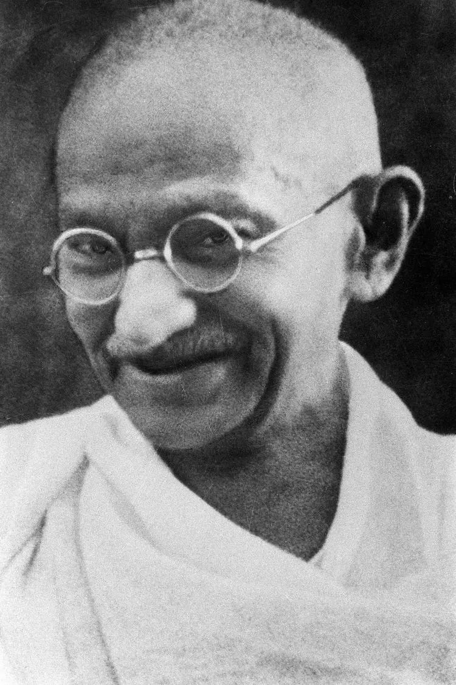

我做得还不够深了，但是我已经开始处理这些材料。我觉得非常有意思，比如说东印度公司某种意义上已经成了英国的外派政府，同时它甚至相当于一个独立政府，那么他们和荷兰争夺海洋的霸权的战争。事实上，到今天为止，我们很多重要的国际事务当中所包含的对海洋法的确认问题，仍然是那个时期他们争霸战的遗留。而英国人战胜了荷兰人，进而赶走了法国人。从某种意义上说，是法国大革命的外部触因。法国丧失了一个转移国内矛盾的海外殖民地的时候，使得法国革命以那种方式爆发和如此酷烈。然后东印度公司赶走法国人以后，它迅速地扩大它在印度半岛上的领土。然后其中对我们来说，非常重要的是它对今天斯里兰卡的占领。斯里兰卡最重要的经济作物就是罂粟。它占领了这块地方。它要把它商品化，找到出路，那是鸦片战争极端直接的一个起点。所以，在这个意义上说，当然还是所谓欧洲最早的殖民扩张在推进着世界历史变化或者世界历史发生。但是，从另外一个角度上，所有这些故事都不是在欧洲本土发生，欧洲本土只是对这些遥远世界的那些事实的一个反馈过程。

而且，我会发现，整体上，当我们今天讨论 20 世纪、21 世纪的时候，其实一个最重大的变化是我们对法国革命模式的否定。法国革命曾经提供了一个普遍的范式——我们思考社会变革的范式。而从法国内部修正主义学派到整个全世界重新的历史书写，都在进行一个将那场革命妖魔化和血腥化的过程。但是，所有这些讨论，好像没有人真的去处理法国大革命为什么是如此血腥？为什么会有此后会形成法德之间如此不同的思想脉络、文化传统和政治制度？最蹩脚的就是从民族性、历史传统（分析），高级一点就是从欧洲内部的政治结构（解释），而所有的人都没有去讨论那个殖民地、第三世界，那时候的第三世界不是第三世界，是世界中心，都没有去讨论中国的丝绸、瓷器，印度、波斯、伊朗的棉制品。它们对整个世界的经济和生存方式那种极大的掌控作用。它是怎样被这样一场肮脏战争所颠覆重建？

所以，1960 年代的研究，对我个人来说，最重要的收获在这儿——你发现了一个，你自作多情地以为自己也是欧洲人，把自己放在欧洲的那个位置上，用欧洲人的描述、思路去思考的时候，你不可能发现的历史。

那我也觉得，在这个意义上说，20 世纪一个最重要的东西就是，20 世纪曾经创造了一个人类历史上没有过的伦理。那个伦理就是我们对劳动者的尊重，我们对底层人的同理心。在这样一个情感结构当中，它出现了 20 世纪是一个背叛的年代，可是这个背叛是高阶级向低级的背叛，是有权势者向无权势者的皈依和认同。所以，我觉得这是一个非常宝贵和重要的遗产。因为整个现代世界在 19 世纪的发展趋势，它实际上就是既得利益集团把自己放在微弱羸软的状态上。它必须有 20 世纪所形成的一个强大的自我调节，包括企业责任制、强大的政府的经济干预、整个的通过非经济手段对利润分配的相对控制。它造成了整个战后繁荣、资本主义的全面上升。所以我觉得，这不是一个单纯站在某一个政治立场上的质认，而是说我们会思考 20 世纪的灾难，同时思考 20 世纪的活力。

*（后续报道，陆续更新）*

**本篇报道涉及的采访人物：**

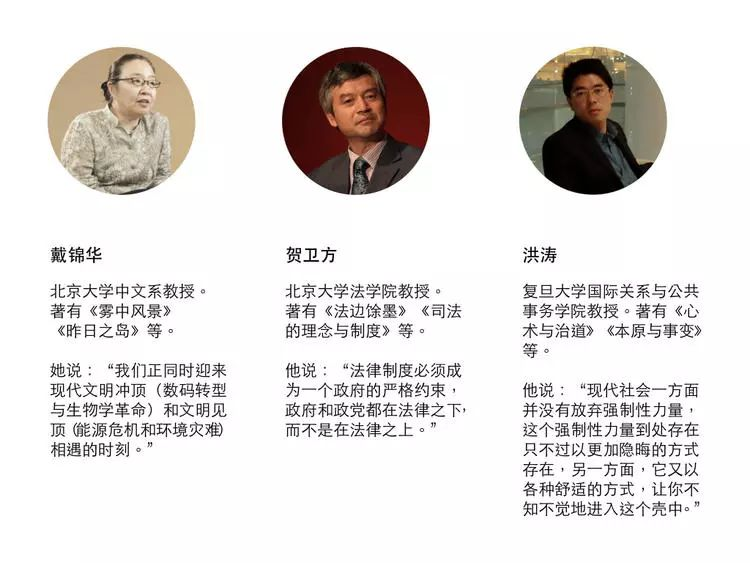
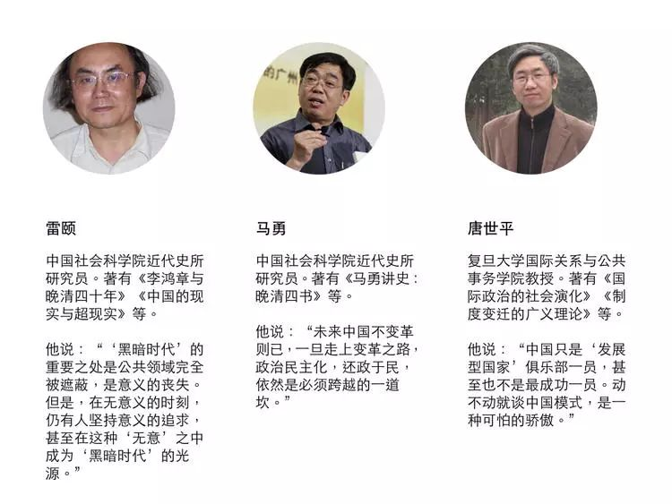
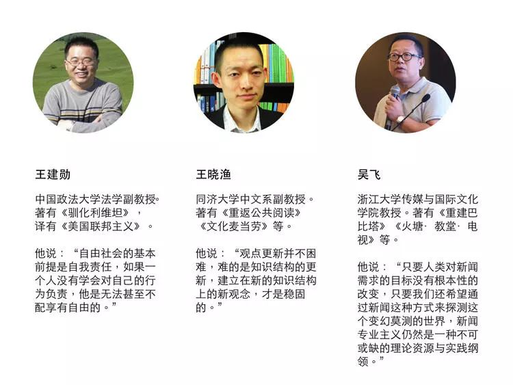
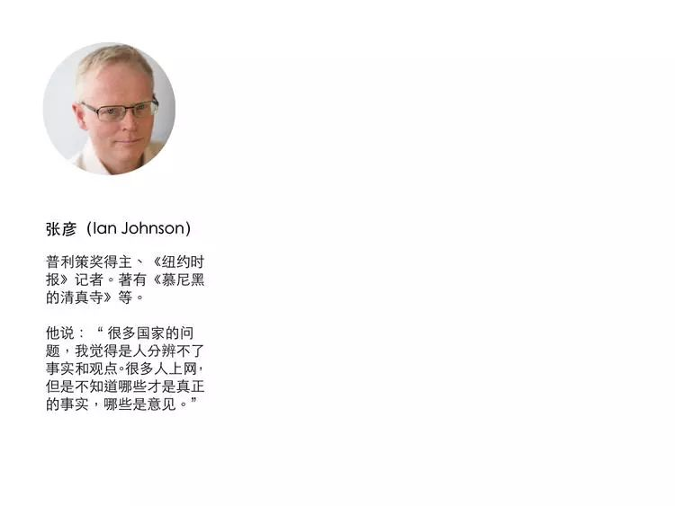

制图：冯秀霞

题图：unsplash