#城市出了什么问题，为什么有关城市的意见总是尖锐而不可调和（上） | 我们如何与未来相处⑥

 [好奇心日报](http://www.qdaily.com/)  2018-05-19 07:10:48

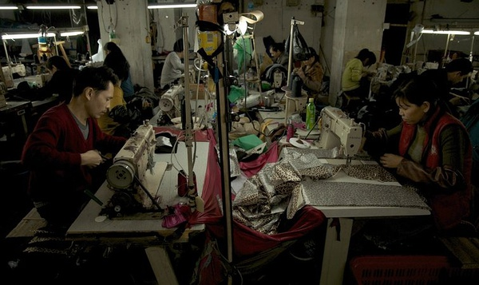

本文作者： 曾梦龙

**“有时候，关键不是去改变世界，而是去解释世界。”**

**在某个关键时刻，关于如何解释这个世界，如何与未来相处，我们需要听听睿智、独立的声音。**

**我们邀请了经济学、法学、社会学、传播学等领域的 20 余位专业人士，回答了我们的问题。**

**问题纷繁而且复杂，但与年轻一代的未来生活息息相关。被访者希望，留给未来年轻一代的这个世界运转良好而且文明进步；在复杂而且迷茫的世界中，保持独立与理性。**

中国的城市里有贫民窟吗？

城市的管理者会很关心这个问题，这关乎政绩与稳定；城市中的居民同样会对这个问题很敏感：脏，乱，安全与否，城市形象，房产价值……很多自身利益与此相关。

在更大范围之内，城市与城市之间的竞争，城市中“新 XX 人”和本地人口之间对资源、服务的争夺，农民工提供的服务、占有的资源、城市形象和定位之间的权衡——富人和穷人之间，户籍人口和非户籍人口之间——有着数不清的争议和矛盾。而引发这些争议的每一个政策、或者为这些争议而影响的每一个政策，它们的背后都有对城市理解的不同。

如何理解我们的城市，如何理解城市的管理，每个人的看法未必相同。这些不同，很容易从前面提到的这个贫民窟问题的不同解读开始。

唐世平认为，中国城市化过程中，可能因为政府强大，调控可能主动，可能比巴西印度要做得好——他说的是，我们的城市里可能不存在大规模的贫民窟现象。张千帆同意他的看法，但另一方面他也指出来，“比较一下中国和西方，尤其是美国。我们会发现，美国有贫民窟，尤其是大城市的市中心，往往就是贫民聚集比较多的地方。相比之下，中国这种现象不常见。我们常见的是什么？是城市和城市、城市和乡村之间巨大的落差，今后这种差距还会加大。”

戴锦华说，大城市经济发展周期起伏，城市贫民窟出现正常。

共识为张彦所点破，张彦来自既有高楼，又有贫民窟的纽约。他说：“你可以拆掉农村，盖很多高楼，但高楼能干什么？这是问题。有时候他们会搞开发区，但也找不到什么工作。所以，主要的工作还是去沿海的大城市，经济发展（好）。我能理解政府的目的，但（控制人口）是很难实现的。他们经常有流动人口的 image（图景）：下雨了，水流就往各个方向走，然后会有人说我们要四处去，不要都往北京跑。这样是不错的，但你怎么做这个？他们都住在保定，但那里有工作吗？”

人自由选择的机会是第一位的。追求幸福和美好生活的权利是第一位的。

萧瀚在一篇写给媒体的一篇文章中说，“在涉及基本人权以及民生问题上，再复杂的问题根本上都是简洁的，那就是把人当人。”

这与戴锦华在接受采访时所说的一致。她说，第一反应是，不管如何，站在弱势者一面。“在强势与弱势之间，在有权势者和无权势者之间，我觉得我不可能有别的选择。不可能有别的选择。”

从贫民窟开始的城市话题讨论将分为两个部分。

在第一部分中涉及城市本来应该如何；官方对城市有哪些理解上的错误；从中国古代城市的起源上看，为什么马克斯·韦伯会说中国没有城市。

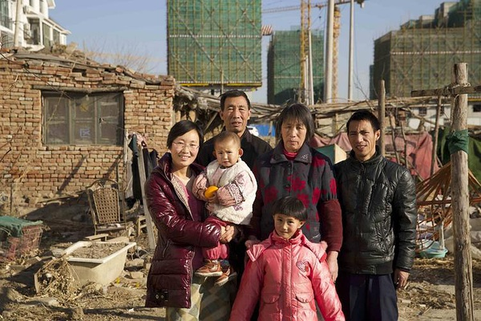

>**【城市的价值】**

**1）城市本身就是一个来自于各个层面、集体地在这儿生活的人组成，运行机制就这么自然形成**

**马勇  中国社会科学院近代史所研究员**

我认为（发生了）一系列很荒唐的事情。作为一个学者，（这些）其实和我生活毫无关系，不可能清理到我，我们也没什么广告牌被他拆，但是我认为这很荒唐。这完全是庸人自扰，是“黑”这个体制。你想，（这些）广告牌是历史形成的，而且都是合法广告牌。你说拆就拆，那你不是告诉说这个体制很混蛋吗？这个体制想干嘛就干嘛吗？这就是“黑”体制。

另外， XX 人口，你要把人家清理走，这是根本就不懂得现代城市的运行和形成的基本规律。城市本来就是一个工业化产物，就是现代社会的产物。城市本身就是一个来自于各个层面、集体地在这儿生活（的人组成），运行机制就这么自然形成。你都成为住到楼房里边的人，都成为一个每月都要付几千块钱房租的人，这是不可能的。

其实哪个（国家的）大城市都有这种棚户区，都有我们过去老上海的棚户区。我在北京，我们家用的小时工，他们只能去租正在拆迁的房子。哪儿在拆迁，他们就租到哪儿。没水没电，只要能栖身。我们一开始也不理解，跟他聊得多了，就理解了：如果是好的房子，他们挣的钱根本付不起，或者他们觉得，付这个钱太亏了。

那么，这种状况究竟怎么来处理？我觉得北京市最好的处理办法，就应该在三环里、二环里盖一些这种低档的（房子）给底层打工的人，低的房租能够租给他们。一方面可以解决他们真的有尊严的生活，不要老是（挤很长时间的地铁）。我有几次早上上班时候，偶然地经过，看一号线从通州过来，我挤你，你挤我。人挣再多的钱，连尊严都没有了。如果这一波人能够真正在他上班的地方，就近住下来，也解决这问题。另外，城市里边的整个秩序都会不一样。我讲这一点，大家可能都看到了。专门研究社会学的，肯定比我讲得要更清楚一些。因为这不是专业问题，我（只是）讲一点我的感想。

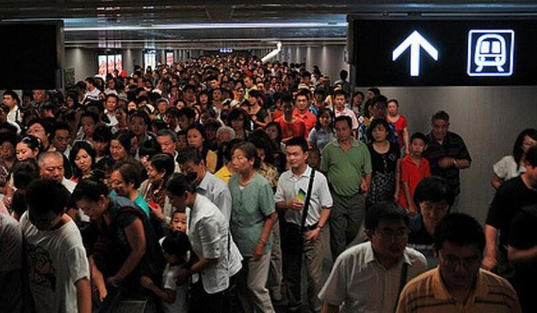

**2）高密度、多元化的城市带来更多学习机会和欲望，这是创新的来源**

**张斌  中国社会科学院世界经济与政治研究所研究员**

第一个，不要把城市改造跟逆城市化对立起来。北京确实需要改造。北京有大量的城中村。北京很多基础设施，硬件不错，但是软件服务很差。我先说城中村吧，北京的城市里面，土地资源利用是非常浪费的。很多地方，很好的位置，密度非常低。很多城中村长期在那儿，资源利用效率非常差，这不是好事，所以应该改。城市改造，改善基础设施，对于北京来说，还是非常需要的。

但是，你要知道为什么要做城市改造？做这些事，是为了让在北京生活的人更便利，更舒服，觉得城市更美好。所有在北京生活的人，不光是北京人，也应该是外地来北京的人，应该对所有的人都开放。改造城市是为了让这个城市更有吸引力，更美好。大家如果愿意来，在这儿生活得更好。要让它成为一个有吸引力的地方。

城市改造，我是非常认同，但是改造的方式，应该让人很好地接受。举两个例子，我家门口其实也在做城中村改造。北京最大的一片城中村，五六千户。我自己观察下来，整个过程还不错。提前很早就告诉大家要改造，有很多奖金。你只要早点走，就给你奖很多钱。你走得越晚，给你奖得越少。这个规矩定下来是不变的，不会因为你到最后，就向你妥协让步。给的补偿，大家也基本上都满意，签约率能达到 90% 多， 98% 、 99% 。整个过程我看下来，房子都拆了，人也都搬走了，结果还不错。

但是，你再去看郊区的城中村改造。那整个过程要几个月时间，半年吧，可能准备起来还更早一点。突然一下，就搞得那么大动静。我觉得方式、方法还是有问题。但这并不是说，那个地方脏乱差，资源利用效率低，不应该改造，还是应该改造。但改了之后，应该让别人在这里生活得更好。这个出发点你要搞清楚。

城市是不是有一个最优规模呢？你靠市场自发的力量，它就会有一个规模。因为城市首先有一个向心力、吸引力。为什么城市有规模经济？为什么大家愿意到大城市来？为什么凡是世界上伟大的国家，都有伟大的城市？因为城市首先是一个高密度的地方。高密度为什么重要？因为成本低了，你很容易可以从别人那里学到东西。第二，城市是一个多元化的地方。什么地方来的人都有，各种颜色的人都有。为什么多元化重要？因为我跟他不一样，你跟他不一样，我们都不一样，可以看到很多不一样的地方。这些不一样，其实带来了相互间的学习机会，也带来了更多的学习欲望。我愿意学习，觉得别人这个好，我也想做那么好。

为什么我一直强调这个学习功能？因为这种东西其实就是新知识，创新产生的来源，改变就是从这里来的。城市为什么重要呢？通过这种多元性、高密度，你是一个产生知识的源泉。而知识的外溢效应，对整个社会进步有最原始的推动力量。

但是，高密度是有代价的，密度太高了就成了拥挤。一旦城市过度的拥挤，它又会带来更高的成本。市场本身会有一个力量，让你这个城市的人口大概会在什么样的水平变化。这里面还有一个，多大的城市规模是不是卡住的呢？不一定。如果我的城市规划设计、城市服务很好，公共管理服务很好，那我能容纳更多的人。即便密度非常高了，但我管理得非常好，那我就可以多容纳人。反过来，我的管理一塌糊涂，我的服务一塌糊涂，我跟不上，我做不到。那你城市人口多了，到处都是拥堵、生活垃圾、污染，你就容纳不了那么多人。

我们现在的问题就是，为什么要限制人口？确实人口多的话，有很多的拥堵、很多的污染。那很多的拥堵完全是因为人口造成的吗？不能这么看。你要说密度，曼哈顿的密度比北京高十倍，世界上很多城市的密度都比北京高了很多很多，但它没这么多拥堵。这问题出在哪儿？我们的公共管理、服务不到位，达不到那样的高度，所以拥堵、污染，各种各样的城市病才那么突出，那你干脆就别来了，我管不好。

你可以看到，政府在说不让人来的时候，其实变相地在承认在公共管理服务上的无能。没有办法，那你就别来了。如果你能在公共管理服务、城市建设、基础设施方面能够取得很大进步的话，我相信城市是可以有更大的承载量的。

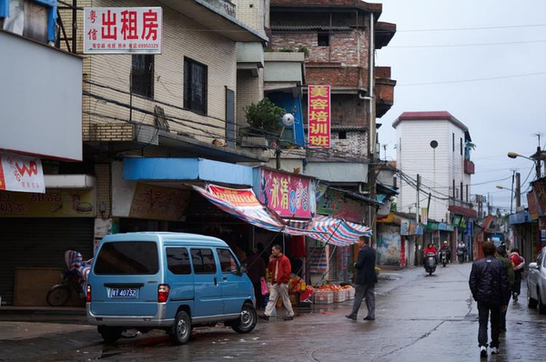

**3）城镇化是工业化的一个结果**

**韦森  复旦大学经济学院教授**

城市化我有一个不同的看法。如果大范围看人类社会的历史过程，你会发现，城镇化是工业化的一个结果。因为在工业化之前，没有城镇化。但是，工业化一来了，大家都来工厂打工了，然后城镇化就来了。我那时候就判断，经过 20 多年的经济增长，中国经济已经是完成了工业化过程。现在就是去产能，去库存，去杠杆，实际上是去工业化。但是，一去工业化，很大一部分人赶到服务业里面去了。餐馆多了，洗脚的多了，但是整个到城里就会慢下来，所以中国的城镇化会减少，不会加速。这是我的一个基本判断。

当然，城镇化还有一个观点是什么？有人说，中国真正城镇化率才 61% 左右。中国城市化要涨到 80% ，还有很大的空间。但是到城里，没有打工机会了，我来城里干嘛？所以在这种情况，我感觉城镇化没来，房地产就要出问题了。他盖了房子卖不出去，房地产一调整。中国经济还会下行。

另一个，当初蔡继明他们老多人都认为，中国的真正城市化人口，拿户口，拿社保，拿医保的只有 36% 。老多打工的，就在这儿赚个钱，我什么都没有。很多就是卖菜，扫大街，城市这些服务都是一些没有城镇户口的人在做。北京一清理XX人口以后，就回去这一批人。这批人他不是城市化的人，他来城市赚钱打工。

所以，周其仁讲一个观点，就是说你要扶贫，关键是你找到来城镇打工的。现在你把 XX 人口都赶走了，那他回到家，改种几亩地，那肯定永远贫困。到了城里，他比在家里收入多多少！农民工返乡，带着几万块钱回去。这才是真正中国农民收入增加的一个主要原因。中国的基尼系数，城乡差别之所以保证不是那么大，很大程度上是两亿多农民到城里打工。虽然和城市的这些工人比起来还低，比其他专业人员低，但是比他在本地种地的收入，还是高很多。那现在这一帮人要清理回去，中国的贫富差距也会拉大。没有这么做的。但是，我们说为了一个面子，为了一个城市市容或者其他原因。我是不赞成。

城市是一个自发过程。现在违背这个过程，得让它自然成长。每个人都进行经济计算，虽然我在乡村里可能还不错，但是到城市我就是打工的了。但是，单从个人收入来讲，我在城里打工不是很好，还是要比在农村种几亩地好，比县城打工要赚很多钱。中国农民收入增加主要是靠这个。我们现在说要建设农村大发展，等于说你别在这儿混了，你回家好好干，建设新农村，你们就富起来了。

还有医保、社保、孩子上学，等等（问题都没有解决）。城市这些低端的工作都是农民工在做。他什么都不拿，现在你把他们赶回去了。北京、上海，原来都很方便，至少在人大、北大，原来吃个大排档，现在都很少了。

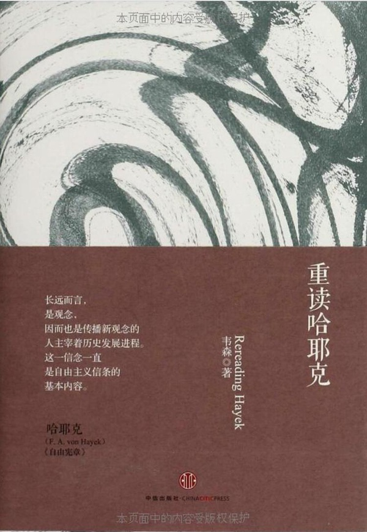

>**【官方对城市有哪些理解上的错误】**

**4）很多人脑子里的城市，是一个空白的城市，而不是一个住满人的城市**

**贺卫方  北京大学法学院教授**

当然中国的问题，一个很复杂的问题是城市土地不属于私有。所以，有时候你会发现，什么事情都是拍拍脑袋就可以决定的。你会发现许多规划人员脑子里边这个城市，不是住满人的城市，而是一张空白的城市。他们就可以拿尺子量，在这儿修一条路。这是一个巨大的城市广场。所以这加剧了政府的任性。

那么，我们在制定这样一种规范的时候，是否充分考虑到了行政法经常强调的比例原则？你采取这样相关措施的时候，你获得的收益是什么？这种收益对政府的收益是什么？对城市里边的市民，他们的收益是什么？对相关的企业或者机构，他们的收益是什么？我觉得做这样一种最基本的论证是特别有必要。因为你不论证的话，政府完全就变成了一种——谁的权力大，谁就可以任意塑造城市的面貌。这绝对是恣意的权力，是不受约束的权力，是不可以的。

另外就是说，相关的规范出台之前，是否需要某种听证？比方说人民代表大会对于这样的一个情况，到底是否必要？或者说，是否违反了上位法？比方说物权法。或者说其他一些保证公民流动的相关规范，人身自由不受侵犯的规范。是否违反了这些规范？我觉得需要基本的听证。哪怕激烈的争论，然后再通过电视直播、网络直播，让所有的市民都能看到，为什么要出台这样的规则？这种规则的合理性在哪儿？或者说，人们提出了哪些质疑？这是决策民主化、公开化一个最基本的要求。而北京市在出台这样规范的时候，从来没有听说过他们征求过市民的意见，从来没有听说过他们回答过北京市人大代表提出的相关的一些质询或者质疑。一个规则就这么匆匆地出台了，就这么执行了。然后许多人就被驱赶走了。驱赶走外地人，其实不仅仅损害的是那些外来人口的权利和利益，也损害了北京市民自己的利益。那些把房子出租给相关的商户的人，那些给我们市民生活带来很大便利的第三产业，各种服务业，快递小哥这些人。现在，让我们的物价整个都发生了提升。所以，我想我们没有进行任何一种论证就出台这样的规则，我认为这不是法治。尽管它制定的是一个什么规范，看上去像立法的一种行为，但其实这完全是长官意志的一个体现。

**5）真正意义上的城市化一定是农村人口转化为城市居民**

**郭于华  清华大学社会学系教授**

人口、天际线、环保问题， 2017 年底这三件事在我看来，基本上是一个问题。为什么说是一个问题？它都是围绕着城市发生的，然后围绕着政府的城市治理来进行的，所以我可以把它看作是三个事件三个不同面向，但实际上本质是相同的。思路基本上是一个思路，形式也是相同的形式。其实都是城市治理的问题，一种非常规式的治理、运动式的治理。背后其实还有更为根本的问题，就是国家治理好，城市治理也好，到底以什么为本的问题。其实是相通的。

第一个问题，在整个中国城市化进程当中，这就是一个悖论。什么叫城市化？到底是什么意义上的城市化？城市越来越大，房子越来越多，（只是表象）。真正意义上的城市化一定是农村人口转化为城市居民，而不是说你城市建得那么大，然后农民还是农民。户籍制度也好，区分本地人口和外来人口也好，区分城市户口和农村户口也好，都还是原来的那套体制。

在这种情况下，怎么叫城市化？在我看来，城市化就应该是人的城市化。城市建设、城市发展或者叫城市扩张，其实都应该是以人作为根本。所以我就觉得，其实中国城市化本身存在很大的悖论。对这些人来说，其实是一个目中无人的城市化。当城市建设需要的时候，就说你们来城市工作。他们就是人手、是劳动力。其实中国工业化也是这样。

他们就没把他们看作真正的人，或者跟所有的国民有着同样、同等国民待遇的人，而是人手。你缺劳动力了，你就把这些人手弄来，服务也好，工业也好，手工业什么也好，各种各样的服务。然后你觉得这个城市着火，好像是跟这些人的这种居住环境比较差，或者说消防措施不到位有关，就把他们驱赶出去。

我觉得这其实是个基本思路的问题。你用一种行政命令或者是一种一刀切的方式去做。拆除“违章”牌匾也是同样。什么叫违章？当时安的时候是合法的，肯定不是随便瞎安的，得经过报批，有各种安全措施。现在你是依什么法拆？你说是为了美观整齐。政府来定义什么是美观？什么是美？有这么定义的吗？怎么定义？你有什么权力来定义什么是美观？

然后，这个当中还有经济上的问题。人家那儿弄一这个是需要有成本的。你拆也是有成本的。你拆下来，还造成一大堆垃圾。当时弄上去的时候，人家不光是这个材料成本，很多比如说名人题字什么的，都是要花钱的。这本来就跟广告差不多，有商业、经济（利益）在里面的。等于说政府就用这样一种强制性的手段，直接干预人家生产、经营乃至生活的活动。弄得好多老百姓都找不到地在哪儿，真的造成很多不便，又是一种大一统的思路。

煤改气也是一样。北方，特别是农村地区，冬季取暖长久以来就是用煤取暖。（政府）说要煤改气了，（应该）有一系列的安排。这是一个系统工程。硬件到不到位？气足不足？能不能及时送达？能不能按量送达？这些东西都没有做好安排的时候，你就一刀切，还写着什么“谁烧煤就抓谁”、“谁卖煤就抓谁”。这完全是不讲道理，弄得很多人冬天没法取暖。

其实你看它的做法，实际上还是一个搞运动的方式。跟以往的运动一样，上面下一个命令，底下就层层推进。你这种运动的方式来做一个实际上是一个城市治理，是一个经济活动，是一个民生的事情。运动式的治理背后是有一个既定理念、思路。这个思路根本不是改革开放应该有的这种思路。

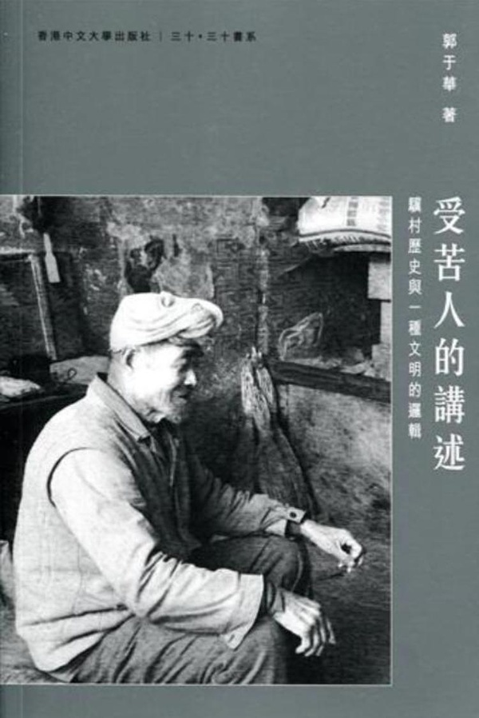

**6）政府没办法替人判断哪里适合生存，这是个人的判断**

**郭于华  清华大学社会学系教授**

城市靠什么来持续一个比较正常的城市生态？这个背后其实是一个根本性（问题）。为什么我刚才说这是市场经济思路和计划经济思路的根本区别。因为政府一直觉得它可以计划一切，它可以安排一切。

但是，其实全世界也有很多大大小小的城市，也有超大型的城市。那些城市其实还是相对自然形成的。大家觉得在这个地方能够生存下去，能够过一个比较正常的生活，可能就会在这儿生活。如果说这个地方他觉得不适合生存，他觉得不好，不合适，他就可能去别的地方去。但关键是得有一个能够自由流动的保证。因为中国一直以来， 1949 年以后，就限制人口的流动。把你固定在农村，或者固定在哪个地方哪一级的城市。这都是有一套计划来安排的，不让你自由流动。

还是计划经济的思路，所以他没有这样的选择。我觉得老有一种危言耸听，就说一旦开放，然后就“盲流”什么都来了。你怎么能事先设定农民就是“盲流”？农民如果说到城市生存不了，他就不在城市生存。农民又不傻。他到一个地方谋生，有经济生活、谋取生计的一个基本基础和逻辑——他在这儿生存不下去就走。前几年，大家说什么逃离北上广、逃回北上广。他为什么来回逃？他觉得适合他的生存。当然这个是跟整个国家制度和整个社会生态是有关的。

这个东西不是人为能够（决定的）。哪个聪明的大脑，再聪明再智慧，再有能力的政府，它能决定那么多成千上万的人，他们想要什么样的生活？他们想要怎么样谋取自己认为还幸福还有尊严的生活，他怎么能够决定？人民应该有选择的权利。当然，城市当中肯定需要有，比如说治安、消防、环卫、城市设施，各种各样的保证和安排。比如说这个地方，你说来好多犯罪的人。犯罪了，有法律。你就用法律去治理犯罪。你不能说我预先把你们想成“盲流”、“暴民”，你们来了，这城市就乱了。

我觉得任何一个国家、任何一个社会的民众，基本都是以生存为取向的。人家要生存，要能够追求幸福、有尊严的生活，追求好一点生活。这是最正当的人权了。老百姓只有生存不下去的时候，他才会出问题。不稳定也好，乱也好，它是有条件的。不是你不让他来，就不乱。你不让他来，他在哪儿生活不好，还是要出问题的，所以我觉得这其实跟刚才那个根本性问题也是联系在一起的。

权力不可以不受任何限制去干预任何事情。同时，权力也不可以不承担任何责任。现在，你看这个权力，很多时候是一级一级的权力，只对上面负责，不对下面负责。为什么对上负责？跟他的乌纱帽、政绩有关啊，所以政绩逻辑是一个很荒谬的逻辑。他只要上面一句话。不管这个东西是对还是不对，不管它的可操作性、现实性如何，他就要强力地推。

如果你完成、超额完成我的任务，我就会给你奖赏。如果你没完成，我不管你具体为什么没完成，我就要惩罚你。我就说这套逻辑是“楚王好细腰”逻辑，一定是“上有所好，下必甚焉”。因为如果做过头了，他不会受到惩罚。如果做得不足，他会受到惩罚。一级一级都不对下面负责，只对上面负责。这套我们叫它科层制也好，叫权力的一个体系也好，就是这么一个特点。所以这也是一个很根本性的问题。没有人拿老百姓当回事，没有人真正以人为本。

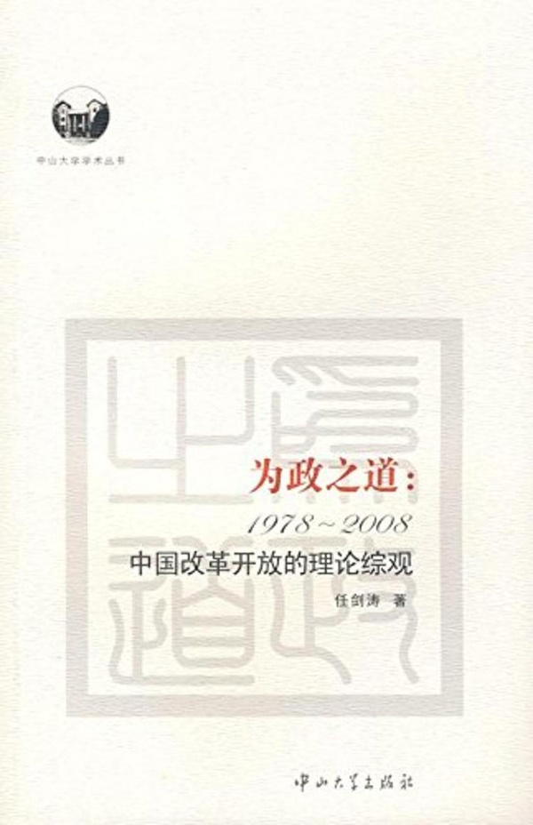

**7）把农村当作城市化一个可逆的蓄水池，这种高级工具化思维导致粗暴施政**

**任剑涛  清华大学政治学教授**

我们的城市，在城市化过程当中，一直以吸纳农村人口进入城市。但结果现在城市化发展纵深阶段的时候，城市开始淘汰多余的人口，等于城市从一个向农村开放，变成了向农村封闭的过程。所以，实际上不仅仅是清理“非首都功能”的问题，更关键地涉及到“农村城市化”这个社会大事件。作为一个影响中国千百万人的社会公共事件，它的一个流变的问题。那么，当然中间有很多重要的事件，比如说教育的发展，经济的转型，还有很多源自于地方事件而在全国层面引起关注的事务。

因为社会公共事件是与利益相关者和潜在相关者来定义的，所以在这个意义上，它有大社会公共事件，也小有社会公共事件。如果是在社会的一定的范围内来讲，小社会公共事件也不见得会引起人们的关注，但是小社会公共事件有时候也对人们的切身利益有帮助。同样是大城市，因为在清理城市秩序，比如北上广深，都在重新清理“开墙打洞”。这个问题与清理“低端人口”是城市发展引起社会公众关注的另一个重要事件。因为 80 年代搞市场经济开始，城市里，尤其是一般建筑“开墙打洞”，来作为商店激发全民营商，曾经是中国市场经济发展的一个最重要的做法。但是做到今天之后，就会发现这是低端的市场经济。因为它只能开墙打洞，办小商业，规模性的商业也办不了。那么，我们现在国家发展需要创新，那也无法满足。于是，我们现在要堵洞、堵门、堵墙。“开墙打洞”变成了重新要恢复原有建筑外貌的行动。那么，这实际上也影响了相当多的人的生计。

所以，在 2017 年，重大的政治公共事件和影响民生的社会公共事件之间，它有个交叠关系。在这个意义上来说， 2017 年可能是一个要被我们记住的年份。但是，记住是好的年份，或者还是有悲伤记忆的年份，可能还要交给历史逐渐去洗刷，才能呈现它真正的面目。

对中国的城市化来讲，首先要肯定城市化的总体进程不可逆转。由于中国经济发展，尤其从农商经济转变为工商经济，那么城市将成为这个经济发展体系当中的纽结。但是，城市化的进程有一个非常大的难题。世界各个国家的城市化进程都很难处理。

第一，城市化进程初创阶段的混乱无序。因为我们要开放城市，然后农村的剩余劳动力要进入城市。但是由于在政策的谋划，资源的供给，相应的新老居民的相互生活空间的区隔，以及相应的城市资源的配置上，都没有做好准备。因此城市化就变成了一个一拥而上、一拥而入的混乱过程。那么，城市化的发展到了真正关键阶段，就构成一个国家资源和制度配置的变革过程。所以，在某种意义上，城市化的进程也是一个国家现代化进程的标杆。

在关键时刻，城市化要求在资源和制度配置上，必须要与城市化的无序的进程做一个校正和匹配的时候，城市化真正的难题才出现。而我们国家的城市化，如果按阶段来说，处于混乱无序走向有序的第二个阶段。那么，这个时候就面临着两大挑战。第一，城市的容量已经饱和了。怎么解决饱和问题？就成了引出第二个问题的一个难题，那就是政策供给要跟上。我们现在由于长期的庸政、懒政，造成某种粗暴的施政。在城市资源配置上的问题，解决得简单而草率。“北上广深”无论是清理城市的资源，还是清理城市的人口，都采取了相对简单粗暴的办法。只不过北京因为是首都更引人关注，上海做得相对精细，而没有引起人们的愤慨。

但是，北上广深的基本做法都不是一种对城市化进程发展的纵深阶段，对国家的现代化布局有所回应的背景下，来做的城市发展的政策和资源布局。在某种意义上来讲，这跟我们没有想好城市应当怎么去发展？城市化的进程在国家现代化进程当中的地位和作用以及它的具体功能有密切关系。那么，这样一个密切关系连带着的制度上的反馈，其实就是长期以来，我们把农村当作只是一个可逆的城市化的一个蓄水池。

蓄水池的提法还是在 90 年代中期，搞“三农”研究的，一批对农村、农民、农业都很有想法的学者提出来的，但实际上，这不过是一个高级工具化思维。高级工具化思维和某种低级工具化思维是联系在一起。所谓高级工具化思维就是城里需要你们，就来；城里不需要你们，就回去。这个就叫做蓄水池理论。但没有料到农民根本就没有打算再回农村，而农村本身也已经无法再接纳被土地排斥出来的农民。他们已经成为城市新的一员。

因而城市怎么样去开源节流，吸纳这部分人，必须要有相应的政策谋划。而这个时候，政策谋划可能又导致了低级工具化思维。所谓低级工具化思维，是因为高级讲农村是城市的蓄水池，因此政策上没有跟进，导致政策制定者觉得农民进城是自发的，那么农民回农村也是自发的，使得我们政策回应上非常迟钝。一直到今天，我们还没有料到城市化的进程不可逆转。因而蓄水池的说法根本就是一个误导政策的说法。误导政策思维的结果就是我们根本没有城市化进程当中人流、物流和财流不可逆转流向的政策回馈。一旦没有政策回馈，我们就不知道我们怎么去布局城市。

由于在农商经济时代，改革开放前我们都是农商经济时代，我们基本上是通过我们的二元户籍制度，把城乡完全区隔开。那么，区隔的结果就是，我们实际上在相当长一段时间里是剥夺农村、农业和农民。这样造成的结果，那就是根本没有长期的农业政策，甚至连城市发展到一定阶段，我们无法让城市成为一个自足的经济社会和政治空间的时候，我们采取了让城市人口回流农村的做法。这是大家最熟悉的“知识青年上山下乡运动”。

所以，在缺少稳定持衡和相互匹配的城市政策的时候，我们就把城市变成一个上层生活空间，农村变成一个下层生活空间。某种意义上，我们能够在政策上做出的回应就是，我们把这种歧视政策，通过二元户籍制度，把它相对固定下来。但没料到改革开放以来，户籍制度的现实政治效应已经完完全全丧失。那么，在完完全全丧失二元户籍制度效应的时候，人们即使受户籍控制，但不受户籍迁移，大量农村人口和中小城市人口涌向了大城市。

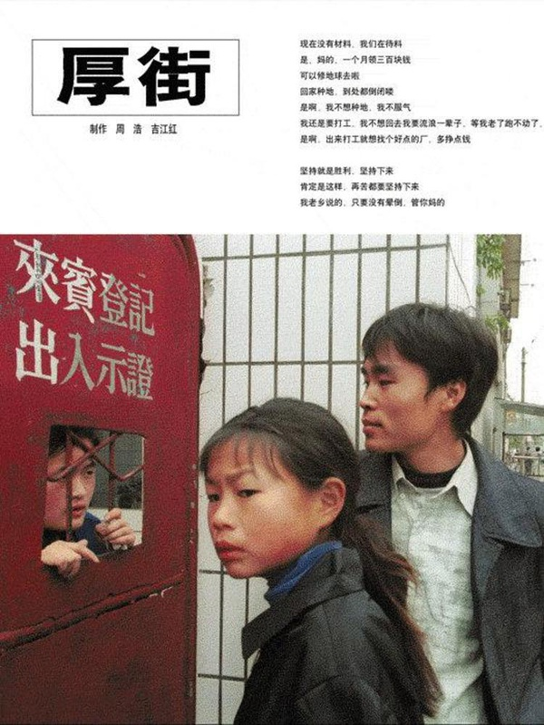

>**【从中国古代城市的起源来看如今存在的种种弊端】**

**8）“中国初期的城市，不是经济起飞的产物，而是政治领域中的工具。”**

**萧瀚  中国政法大学法学院副教授**

“在比较中西城市差异时，韦伯将城市居民的政治地位置于首要地位；他甚至因为中国古代城市的统治与统治者扩权属性而否认中国存在过城市；因为他认为只有市民拥有政治权利的城市才能称之为城市。”

“普天之下，莫非王土;率土之滨，莫非王臣。”《诗经》里的这 16 个字很大程度上概括了中国国史，可谓“国史大纲”。这 16 个字成为中国成为独异于世界其他地方的官僚帝国，其基本特征就是以天子或皇帝为代表的官僚权力恣意妄为，至少在有信史可征的近 3000 年里，普通国人的命运通常是处于被奴役的风雨飘摇状态。在这条历史的长河里，帝国面前的个人命运，无论显隐贫富贵贱， 都是微不足道的。在帝王及其官僚们的眼里，人并不是一个个的，而是像蒿草一样一丛丛的。强制移民就是个很具有典型性的现象。 

秦并六国后，秦始皇为了建立一个庞大的法家官僚帝国，需要营建新都咸阳，于是他发明新政策，“徙天下豪富於咸 阳十二万户。”(《史记·秦始皇本纪》)

随着官僚帝国的结构越来越精致，这种需要强大权力机构支持的暴政逐渐成为体系，此后帝王随意大规模迁徙人民实在是家常便饭，不仅为了充实首都人口，还为了便于控制，并且加强经济实力。“至西汉，’强干弱末’不仅是移民政策， 也成为基本国策。此后从三国时的魏灭蜀、西晋灭吴，直到北宋初灭五代各国， 凡是一个政权被另一政权所灭，无不随之进行一次规模不等的移民，亡国君主(如还在的话)及其家属、臣僚、都城百姓，甚至某一重要地区的主要人口，都会被迁至战胜国的首都或某一指定的地点，人数少则数十百户，多则数万至十余万户。”除了这种政治性的强制移民外，还有刑罚性的强制移民，如“秦始皇将贾人(商人)、赘婿迁往边疆，人数有数十万。历代一些大案往往会产生数万流放对象。朱元璋将江南富户迁往故乡凤阳、首都应天(今南京)，实行严格的管制。……华岌(汉族)对周边人口的迁移往往会以民族为单位，如西汉时迁越人于江淮之间及迁匈奴降人于西北边区，东汉迁南匈奴于塞内，东汉及魏晋迁羌、氐等族人口于关中，十六国期间后赵、前秦等政权将各族人口迁至都城附近，唐朝将突厥等各族降人迁至长安一带，将高丽民户迁于中原各地，辽将勃海人内迁，明初内迁蒙古降人等。由于大都是集中迁移，数量不少，有时甚至超过百万。”

理解中国自古及今特有的挟官僚政治而来东方专制性，才能理解独特的中华帝国问题。虽然魏特夫《东方专制主义》一书的中国专制起源于治水说尚未得到学术界公认，但是他在书中所展示的中国强专制特性则是毋庸置疑的，这有中国历代史籍为证。中国在 3000 年前就已逐 渐形成以官僚网络作为社会主导的组织力量几乎是不争的事实，官僚网络成为王权和皇权的左膀右臂，并且成为社会的决定性力量，从而造就了政治、经济、文 化、思想、艺术等国家与社会生活所有领域几乎都由官僚阶层主导的官僚帝国， 并且绵延数千年。作为最早提出官僚政治问题的经济学家王亚南先生，在其名著 《中国官僚政治研究》一书中，对中国古代官僚政治的后果有着深刻的揭示: “惟其中国专制的官僚的政治，自始就动员了或利用了各种社会文化的因素，以扩大其影响，故官僚政治的支配的、贯彻的作用，就逐渐把它自己造成为一种思想生活上的天罗地网，使全体生息在这种政治局面下的官吏与人民、支配者与被支配者，都不知不觉的把这种政治形态看为最自然、最合理的。”

王亚南说出了中国古代官僚帝国几乎具备一种催眠性的奴役力量，使得深陷其中的国人很难在完全没有外力协助下挣脱桎梏，无论是制度的桎梏，还是观念上的牢狱。上述历代帝王迁移人民的随意性，正是一个官僚帝国奴役性能力的展示。官僚帝国这一历史现象，也在很大程度上印证了历史学家张光直先生的中国城市起源论，即“中国初期的城市，不是经济起飞的产物，而是政治领域中的工具，但与其说它是用来压迫被统治阶级的工具，不如说它是统治阶级用以获取和维护政治权力的工具。”张先生的这一观点，主要在于说明中国城市在起源上不是经济的，而是来自于统治的需要。这一观点的背后有着与西方城市起源相比较的明显含义，即后者是起源于经济原因。这一见解很大程度上与经济史学家傅筑夫先生之前的相关论断能够相互印证。傅先生虽然在关于封建概念的使用上存在因袭旧说因而不准确的问题，而且认为中西城市同源而起亦存不辨前说之嫌， 但他对中国古代城市功能和作用的看法依然是精当的，例如，他的《中国古代城 市在国民经济中的地位和作用》一文就有以下论述:

“中国封建制度的最大特点之一，是城市的性质及其发展道路，与欧洲封建时代的城市完全不同，因而中国古代城市在整个封建经济结构中所处的地位及 其对经济发展所起的作用，亦完全不问。”“欧洲中世纪的城市，是一个工商业中心，是独立于封建领主直接控制之外的一种自由的城市。每一个城市都各自成为一个经济单位，各自有其自治的行政 和司法机构，甚至各自有其自卫的武力，各自铸造自由的货币，各自规定自用的度置衡。......在中国长达三千年左右的封建社会中，所有人民的政治、经济和社会生活，自始至终一直是在封建制度的直接统制和干涉之下, 并且很早就形成了一整套严密复杂的、无所不包的封建规范——‘王制’，作为实施统制和干涉的理论根据三千年来一脉相承，成为人人必须遵行而不能稍有逾越或违犯的传统。 在这种传统势力控制之下，没有任何人或任何事能置身于这个约束之外，而各行其是。”上述两位学人的观点已得到史学界越来越多人的支持，傅筑夫先生的论述也从中西城市的比较研究中，印证了中国古代官僚帝国的特征。研究历史与空间关系的厦门大学历史学教授鲁西奇在 2014 年出版的论文集《中国历史的空间结构》 一书中也持有类似观点，他在支持张光直先生的论断同时，更加明确地提出中国古代的城市就是起源于权力，并且是出于合法性宣示的需要，他写道:

“中国历代王朝都动用大量的人力物力，营建以都城为中心的各层级中心城市，固然有很多具体的考虑，但最基本的动因则仍主要是借此以宣示王朝的合法性或正统性权威、突显凌驾于臣民之上的国家权力，并在更大空间范围和社会范围内攫取更多的权力。”鲁先生关于中国古代城市起源的精彩论断，也印证了顾准先生在《资本的原始积累和资本主义发展》一文中关于中西城市比较的见解，他说:

“中国从来没有产生过商业本位的政治实体，而且也不可能产生出这样的政 治实体。中国城市发达得很早，航海技术发达得也很早。......中国从不缺少商业。......但是，中国的城市、市井、市肆，却从来是在皇朝控制之下，是皇朝的摇钱树，皇朝决不会允许商业本位的城市、城邦的产生。”也就是说，中国古代城市从其起源到后来的演变，其功能一直没有发生大的变化，这种几乎停滞性的城市功能很大程度上决定了近现代甚至当代中国城市的基本特征，与西方产生了城邦政治的城市起源上的这一差异，标示着中西方政治经济的巨大分野。这在百年前即已引起伟大的社会学家马克斯·韦伯的关注，他在比较中西城市差异时，精准地将城市居民的政治地位置于首要地位；他甚至因为中国古代城市的统治与统治者扩权属性而否认中国存在过城市；因为他认为只有市民拥有政治权利的城市才能称之为城市，城市的功能必须是政治性的——即亚里士多德处理公共事务意义上的政治，而非统治权谋意义的政治。他说:

“和西方根本不同的是，中国城市以及所有的东方城市形态，都不具有城市的特性。东方的城市一点儿也不像(西方)古代那样的‘城邦’(polis)，也没有任何中世纪时那样的‘城市法’，因为它并不是个自有其政治特权的‘共同体’(Gemeinde)。”韦伯的这一论断直接关涉中国城市是否拥有法治，城市居民是否拥有政治自由和政治权利。虽然这些中西学人就中国城市的功能与作用上表述各异，但都指向同一个问题，即中国古代城市起源并受制于暴力性的恣意权力，举凡经济、文化、军事、贸易、人员流动等所有领域的事务，简而言之，城市的一切，都在这种恣意权力的控制、捶楚乃至生死予夺之下。这正是官僚帝国显而易见的特征。而西方自古希腊以来的城市-城邦，是基于贸易和自发的共同体生活形成的，北非、希腊半岛、亚平宁半岛诸多城邦，其中包括迦太基、雅典、斯巴达、罗马以及小亚细亚诸城邦，其形成与发展都与贸易、航海存在最紧密的关联，即使如斯巴达这样最初源于农业的城邦也因农业产出不敷生存而转向商业，城邦的治理者并不是城邦的创建者，即使罗马王政时代或帝国时代的国王也不具有任何堪与中 华官僚帝国的王与皇帝相匹敌的暴力性权威。据普鲁塔克的传记，王政罗马的第二任国王奴马正是因为第一任国王罗慕洛过于暴虐而推翻他的，并且在推翻罗慕 洛之后，他就立刻尝试更为平民化地执政，试图重新获得人民的信任。而推翻王政建立罗马共和国的普布利科拉(拉丁语“Poplicola”，意为“爱民如子者”)， 更是为了获取人民的信任而将自己原有的并非从权力腐败中获得的豪宅夷为平地，目的仅仅是为了让人民觉得他跟大家没什么差异。雅典的民主政治，罗马的法治与宪政，都与其城邦起源之间存在着密切的关联，这些文化传统并且在后来的欧洲一直得到不绝如缕地继承。中世纪封建时代的欧洲城市，文艺复兴以来的威尼斯、佛罗伦萨等商业城邦共和国，以及低地国家的宪政革命，都是绝好的例证。所谓“城市的空气让人自由”，便是很好地说出了欧洲中世纪的城市氛围， 虽然时常被打断，也没有彻底湮灭，即使在 17 世纪兴起了绝对主义王权之后也没有遭受灭顶之灾。托克维尔在《旧制度与大革命》里就提到过，14 世纪时， “无纳税人同意不得征税”已是英法国家的街谈巷议之语，这就是拜自古希腊罗马以来欧洲的城市传统所赐。而这在当代中国许多地方都可能还是闻所未闻之语。原因何在?城市起源不同，最初的功能和目的不同，发展走向不同，结果也 就不同。如韦伯所言，中国从未形成过“拥有政治权利的共同体”意义上的城市， 它一直而且迄今依然是统治者奴役性统治与权力扩张的工具，无论是政治意义上的稳定功能，还是经济意义上的财政功能。 

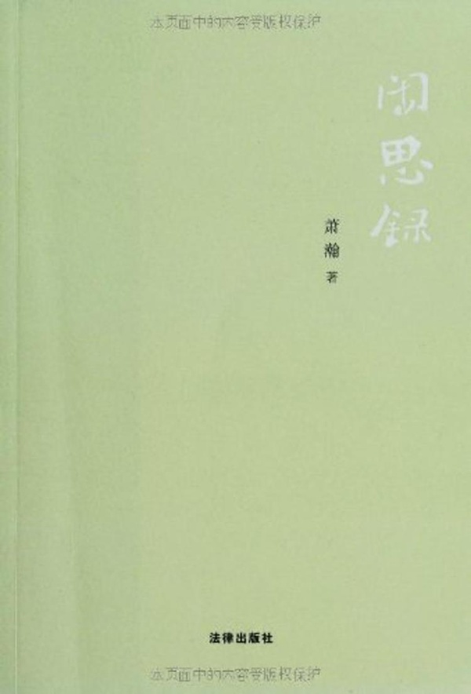

**9）延续至今，城市定位和功能对于现在的影响**

**萧瀚  中国政法大学法学院副教授**

正是由于这样的差异，导致中国历代的农村只是城市的附件，统治者除了从城市中收割工商业税收，同样重要的是依靠不同等级的城市对城市周边的乡村征税与统治。因此，作为官僚帝国的古代中国的城乡关系，不但根本不可能形成像英格兰那样城市与乡村相当平等的政治经济空间结构传统，甚至也无法像封建制的中世纪欧陆那样形成“契约的城市”与“身份的乡村”这样的二元政治经济空间结构，而只是黑格尔说的皇帝之下平等的奴役状态——城市与乡村并无法权意义上的根本性分别。 

正是官僚帝国这样的政治经济文化空间结构，导致了一切从属于统治，由权力而生发的一切现象，对其他一切社会性事务产生虹吸效应，欲将农业人口钉死在土地上从而成为身份绑带的户籍制，并不能阻止远离各级权力中心的人们为了谋生而涌向城市，因为任何一个城市在被统治者选中之后，无论是新建的城市，还是已经建好的城市，其基于权力的政治经济文化等一系列活动将产生巨大的资源整合效应，举凡日常的行政开销、帝国权贵的普通生活、正常的工商贸易、达官贵人的奢靡生活等都会提供不少就业机会，从而将附近生存艰难甚至破产的帝国臣民吸引过来——离开原籍为生存而奔波的人群，在古代就叫“流民”。 

也许，了解这个背景之后，才能理解邓小平改革开放以来的中国人，特别是中国农民群体，所焕发的巨大工作热情和极度的勤劳——虽然如经济学家陈志武先生说的，由于制度的原因，勤劳并没有使他们致富。这是求生的本能、不安全的经验、以及新生的希望与喜悦合力之下的产物。于是，城市，再次像历史上任何时代，像世界上所有国家，成为国人改变自己生活处境的流向选择，城市化进程因而被自然地推动。 经济学家周其仁先生在其名著《城乡中国》中，以一个十分简洁的公式概括了这一现象，即经济聚集甚于人口聚集就是城市化的动力机制，“经济密度高于人口密度，必定吸引更多的人口聚集。”

不过，城市化在被人的本能和经济规律自然驱动是一回事，一个社会、一个国家的制度是否为它做好准备则是另一回事。城市化进程需要韦伯所谓“自有其政治特权的共同体”的基础制度，此处“政治特权”并非等级制意义的特权，而是指人身自由、迁徙自由、产权保障、以及教育、医疗、社保、司法公正等现代意义上的基本人权。换句话说，城市是一个人际平等的契约存在，而不是等级制意义上的身份存在，而人身自由、迁徙自由、产权保障、司法公正等就是契约的前提。然而，户籍制下没有迁徙自由的进城谋生农民，其实并没有可以自由缔结契约的现代公民地位——从这个意义上说，与历史上“流民”地位相比并未有显著提高。这是理解城市外来人口不稳定命运的基础，城市对他们毫无人身自由保障的羞辱性驱逐，对他们财产的破坏性对待，统统都是基于这样的事实。

从这个意义上，也就能理解为什么会有那么多限制流动、收容遣送相关的法律法规——到 2002 年就有 30 多个专就收容遣送制度立法的地方性法规，而涉及到收容遣送制度的地方性法规到 2002 年 12 月底则共有 199 个。这个局面的改变受益于 2003 年的孙志刚案。在强大的民意推动下，也在新一届政府较为开明的一定程度反思之下，收容遣送制度于当年 6 月 24 日被国务院明令废止，将收容所改为救助站， 并且规定救助必须以被救助人主动要求为前提。 

收容遣送制度的废除是一项进步，对城市外来人口的人身自由不再可以肆意剥夺，即使在后来依旧时常陆续发生的强力驱逐外来人口前提下，非法剥夺人身自由现象已明显大大减少。 

虽然已有不少城市取消了本市的户籍限制，允许周边农村人口进城落户，但北上广深这样的超级城市，户籍限制依然十分严格，对于外来务工者来说，大城市并非久居之地，无恒产者无恒心，上升通道不畅，一切都处于敷衍状态，以便能够攒积钱财返回老家。 

由此，在经济活动最活跃的巨型城市和大城市，一方面，公共服务既无意愿为外来底层居住者创造更好的生活条件，也确实无实际行动;另一方面，外来的底层居住者既无意愿也没有能力为自己创造更好的生活条件。两厢夹击的结果，就是外来者在为城市创造财富的同时，也让统治者感到城市规模无限扩张，并且难以控制，教育、医疗、住房、治安、交通等无数压力，难以应对。虽然用正常的治理手段难以控制，但对强制力量的路径依赖，让这种歧视性、运动性的打击还是不断出现。 

（萧瀚的访谈来自于他专为媒体写的一篇文章，《好奇心日报》摘引过程中做了一些修改）

*（后续报道，陆续更新）*

**本篇报道涉及访谈对象：**

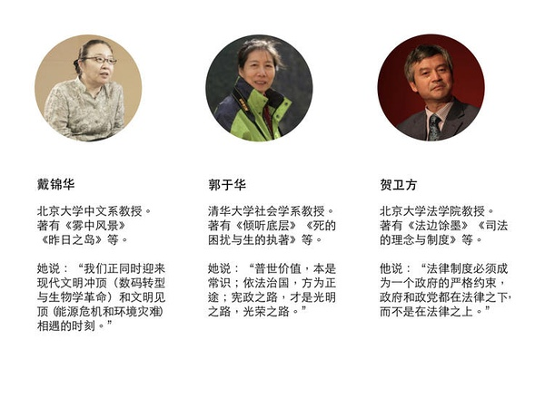
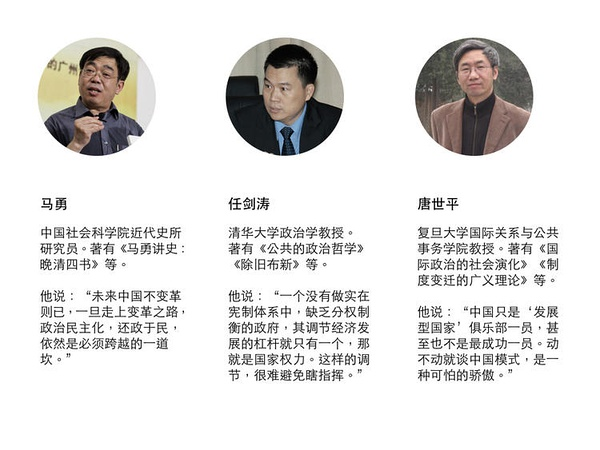
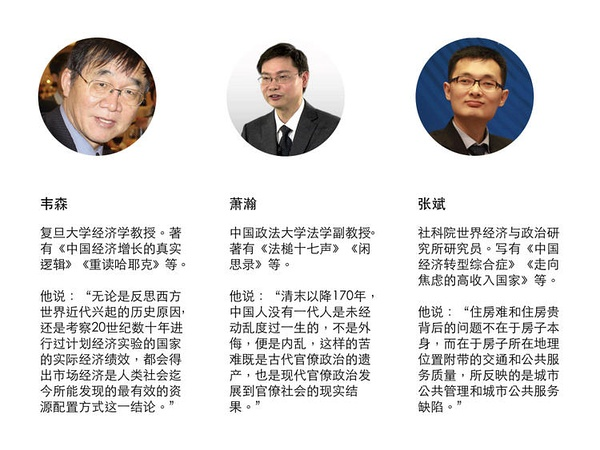
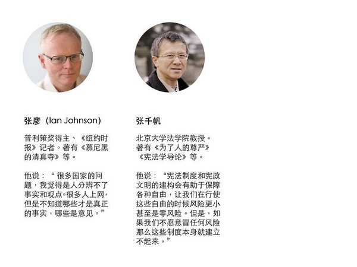

制图：冯秀霞

题图及长题图为纪录片《归途列车》剧照，来自：豆瓣