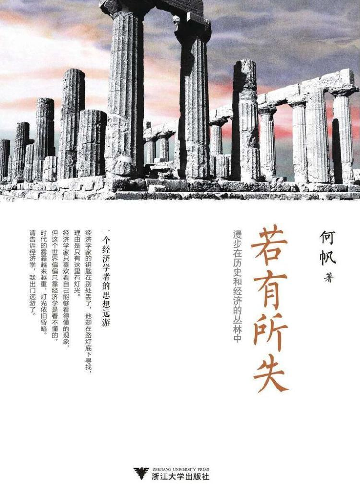
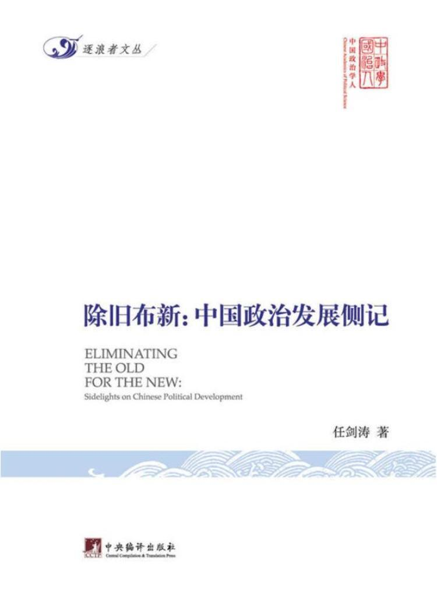
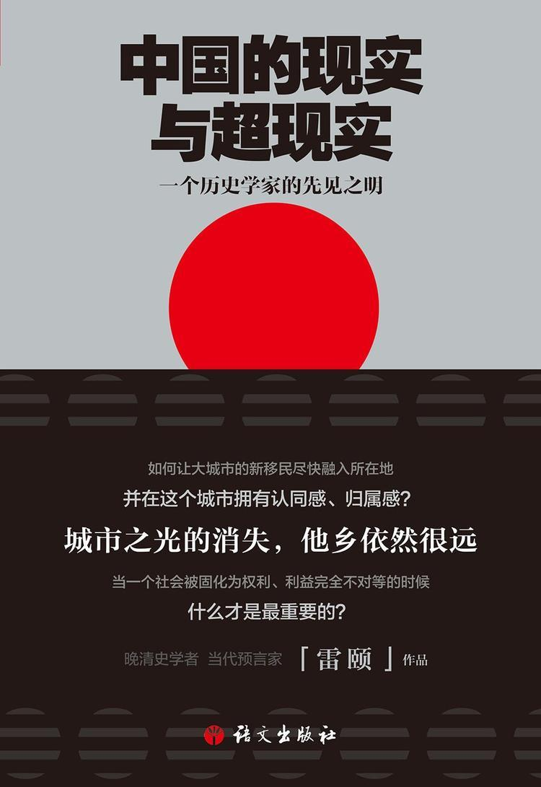
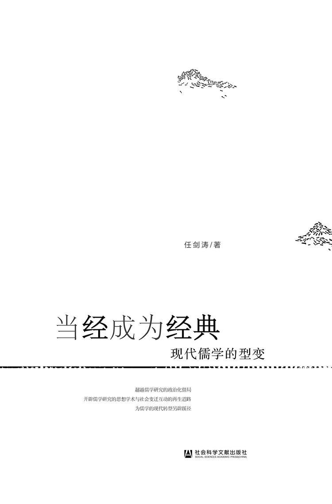
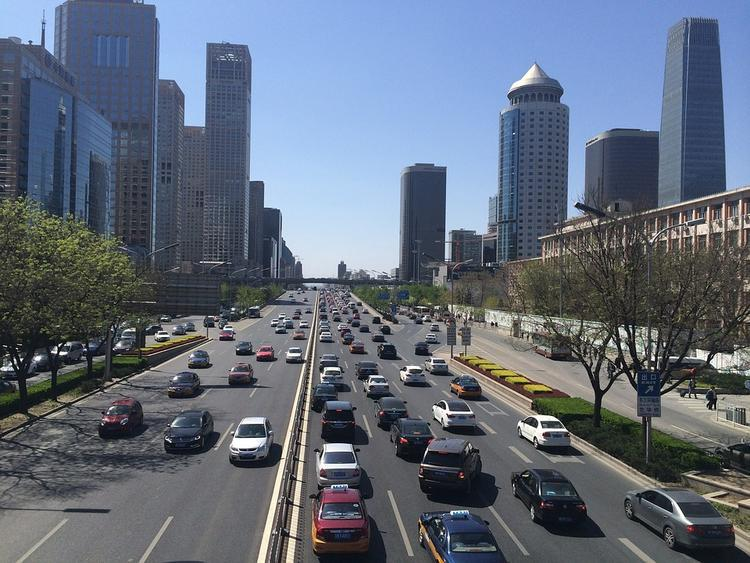
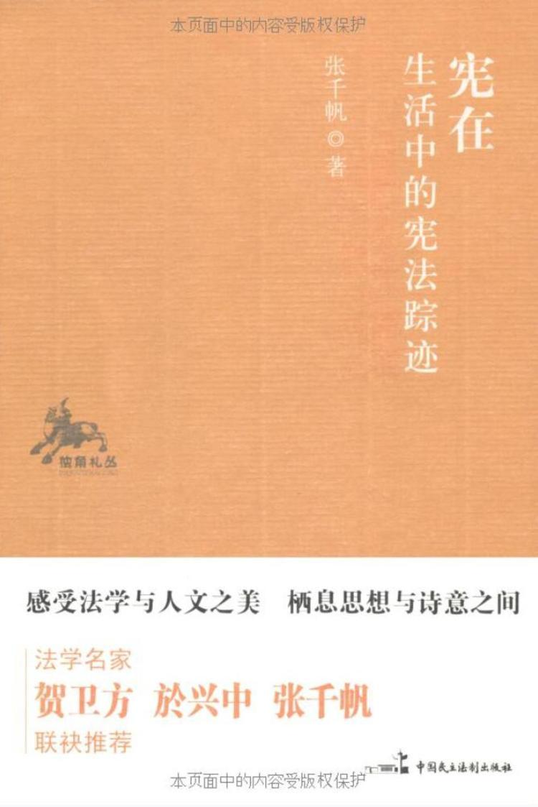
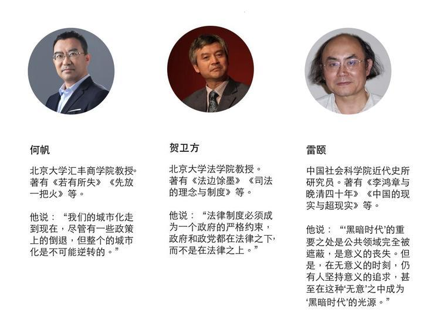
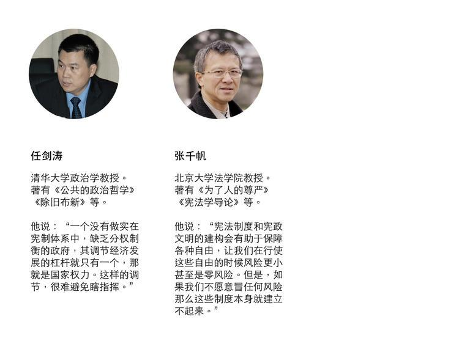

#城市出了什么问题，为什么有关城市的意见总是尖锐而不可调和（下） 我们如何与未来相处⑦#

 [好奇心日报](http://www.qdaily.com/)  2018-05-26 07:33

本文作者： 曾梦龙

**“有时候，关键不是去改变世界，而是去解释世界。”**

**在某个关键时刻，关于如何解释这个世界，如何与未来相处，我们需要听听睿智、独立的声音。**

**我们邀请了经济学、法学、社会学、传播学等领域的 20 余位专业人士，回答了我们的问题。**

**问题纷繁而且复杂，但与年轻一代的未来生活息息相关。被访者希望，留给未来年轻一代的这个世界运转良好而且文明进步；在复杂而且迷茫的世界中，保持独立与理性。**

人自由选择的机会是第一位的。追求幸福和美好生活的权利是第一位的。从贫民窟开始的城市话题讨论将分为两个部分。第一部分中，我们探讨的话题涉及城市本来应该如何；官方对城市有哪些理解上的错误；从中国古代城市的起源上看，为什么马克斯·韦伯会说中国没有城市。这是第二部分，关于中国城市现在出现的问题是由什么所引发；以及，关于中国最重要的城市——北京，究竟应该是什么样一个定位。

中国城市现在存在的问题

**10）公共服务分配不均，是中国一线城市偏少，规模偏大的原因**

**何帆  北京大学汇丰商学院教授**

从经济学上讲比较简单，经济学一直强调，城市的规模必须要做大。因为大了之后，才有规模效应。但是这里有政府的烦恼。因为中国所谓的一线城市太少，现在也就北上广深，杭州都只能算是 1.5 线。对于中国这么大一个国家来讲，这是很不正常的。你要出现均衡地增长，一定至少要有十几个这种一线城市，然后每个地区都要有比较均匀地分布，这样才能够有地区增长极。

另外一个现实就是公共服务分配得不平衡。如果你有了钱之后，首先想到的就是我要享受更好的公共服务。小镇的人要到省城，省城的人要到首都，要到一线城市。现在阻止人口流动，实际上并没有解决真问题，反而带来了新的矛盾。

那么，如果去看发达国家，它的一线城市发展水平可能还不如北京、上海，但是它的特点就是，各个地区之间发展不均衡比较小。到日本的农村，你会发现它的基础设施也很好。到美国很偏僻的地方，你会发现大体上它的基础设施也都是可以的。所以中国最大的问题就是公共服务分配不平均。

中国随着二线城市的发展，如果在这个过程中，我们不仅仅看到房价上涨，还能够借此机会，把公共服务改善（这个空间是有的，因为你去看二线城市，它过去都有很好的学校，也都有很好的医院，也都有一些大学，交通位置也都很便利，只是原来大家没有重视这些二线城市的发展）。如果全国的公共服务水准更加平均之后，我觉得才能够从根本上解决北京、上海的问题。

以后你会看到，北京、上海的吸引力就没有那么大。一线城市原来非常富有活力，现在去看，你会发现，一线城市的活力其实已经不像原来。这时候，大家可能就会被更有活力的那些城市吸引，生活质量更高的城市吸引，所以这是一个好消息。

**11）城市化挫折最大的隐患是农民工被逼回农村之后**

**何帆  北京大学汇丰商学院教授**

农村现在的问题非常麻烦，已经基本上凋敝。现在还有一个，我们这种没有完全完成的城市化带来了一个风险，就是城市很难容纳已经变老的农民工一代。

你现在去看，农村应届初中和高中毕业生，他肯定是要流入到城市，不会待在农村，但是 40 岁、 50 岁这个年龄的农民工一代，他已经干不动了，都是体力活。干不动了，又没有办法待在城市里头，那就只能回到农村了。可是我们过去的经济发展是建立在我们把劳动力从农村转入到城市，把劳动力从第一产业转到第二产业、第三产业。这些人回去之后，种地他也不会种了，然后又没有养老金，怎么办？我们在去年已经出现流入到城市（的人口），就净流入人口已经大幅度下降。那就意味着，城市化的好处可能也在大幅度下降，所以这是一个问题。如果不解决农村这个问题，城市也很难非常好地发展。

**12）你领导的意愿再好，你无法支配市场**

**任剑涛  清华大学政治学教授**

在某种意义上，我们政府的根本观念可以说跟市场经济的迅速发展一直就不相匹配。原因在于整个官僚系统的本质性规定给他带来一个，希望通过行政指挥棒、计划经济的布局方式，来运动式地、群众化地、快速地、根本地、彻底地解决所有问题（的愿望）。这个愿望我们也不想去批评他。愿望可以说是好的，但是事实上，作为一个市场化的复杂社会和一个靠简单行政命令，甚至靠政党政治意志统一起来的国家指挥系统，它们俩是脱节的。所以，官员们也许有越好的计划经济思维，我们今天不说计划经济思维，更多说是宏观布局能力，这实际上是计划经济思维的另一种表述。我们能够去迅速解决问题，使得我们党和政府的权威性能够有充分的体现，在动机上我们也没有什么批评的理由。“当官不为民做主，不如回家卖红薯”，这是中国千百年来为官的基本理念。

但事实上，作为一个市场经济兴起以后的复杂多元社会，它的流向应该是服从市场的信号，远胜于服从领导的政治意志。因此，你领导的意愿再好，你无法支配市场。就像我们想通过金融市场的计划调拨，能够让证券市场作为市场经济的资源蓄水池，结果前年的股灾就可以看得很明显——你如此良好的政治政策和领导愿望，最后造成了股市崩盘，至少是造成股市重大危机，以至于国家不得不通过迅雷不及掩耳之势的新一步行政行动来压制住股市的危险。

所以，在这个意义上来说，我们现在要理解的一个核心问题就是，“市场化”究竟意味着什么？第一，不是像经济学家那样，说市场可以调动一切，价格可以成功地实现一切。所谓“市场化”是以国家宏观的经济布局，也就是对市场的高度尊重来布局政策。这个跟张维迎谈的“市场化”不是一回事情，他就只有价格机制，而林毅夫又只谈到了政府指挥棒。其实市场化最重要的东西就是国家的党政权力，我们不仅谈到行政权力，因为中国党政体制高度连贯的运作体制，所以它一定要有市场和党政体制之间的平衡互动。这个是最重要的“市场化”含义。

第二个“市场化”的含义才分别是林毅夫和张维迎所指的两个方面。第一，面对市场，不是不做一个有为政府就行了，而是面对市场，政府怎么有为？不是我政府主观上想有为，然后我对市场不尊重，我来指挥市场，调节市场。因为反市场经济理论在我们中国根深蒂固。反市场经济理论一个最重要的、僵化性的、具有定势的思路思路就是，市场失败一定要通过政府来调节。这就假设政府的天然正当性。其实错误，政府也会失灵，市场失灵，政府失败。所以面对市场的时候，政府只要去尊重市场，来确定自己的政策。这个可以说林毅夫强调的“有为政府”，一定要面向市场的政府是关键。比如政府面向市场，对我们今天讨论的问题来说：第一，城市化大趋势不可逆。第二，农村人口向城市的转移不可逆。你的二元户籍政策为什么改变如此之缓？你还有一个身份化的管理办法，来应对进入城市已经三代，所谓歧视性称呼的“农民工”。这些都是政策太过迟缓，换言之，也是政府没有能够面对市场变化所导致的政策停滞、僵化。

第三步要强调什么？市场自身的市场组织健全性。市场行动者并不是受价格指引的盲目行动。中国人说：“无商不奸，无奸不商。”奸商奸商，就证明他完全无法自主。其实错误的，市场信号对市场的行动者，尤其在市场微观领域里头，它发出了强烈信号，显示出高度有序性。市场本身高度有序性再通过市场行为者如何组织起来跟市场匹配的两个社会空间，这是非常关键的。第一，市场的行业组织空间。行业组织空间不是捍卫行业利益就算了，我们中国千百年来都有农商经济时代的行会组织，但行会组织要干的事情，不是自我约束，而是坚决捍卫自己行业利益。这就变成了其他行业对它的排斥和社会公众对它的不信任，所以我们中国人充满对商业的不信任感。这就是不健全的市场所导致的。第二，在健全的行业行为之外，要成立公民自身的社会自治组织。公民的社会自治组织，它既能够解决他自身在社会流变当中互助的问题，又能够去解决在国家不能监控市场的真空地带。它去让市场规范化和让公民行为规范化的余留问题。只有这些东西相互匹配，中国所谓市场化的难题和与市场化脱节的政府计划经济的刚性思维，才真正有一个进入良性互动的可能。

**13）现在的城市矛盾还是计划经济资源分配的结果**

**雷颐  中国社会科学院近代史所研究员**

改革开放 40 年，其中最重要意义就是人员可以自由流动，包括人的自由度扩大。这是改革开放前十年，绝对不会有，也是制度性不可能的现象。实行计划经济，你一切都要实行计划。每个人每月吃多少斤粮食是固定的。全国统一，你是根据性别、年龄来规定的。比如今年给北京供应，前一年就做好了北京有多少人口，要用多少粮食，吃多少油乃至吃多少花生米，多少粉丝，都是给你固定的，计划得好好的。如果人员能流动，你怎么计划？就没有计划。所以，计划经济第一条首先要做到把农村人口和城市人口固定化，或者用现在的计算机术语：格式化。从前因为没有这种制度的时候，城乡之间可以自由流动，通过市场来解决配置问题。

所以，第一步必须把农村人口控制起来，把农村、城市人口固定化。固定起来才可以禁止流动，才可以计划。那么，紧紧固定，把城市人口固定，北京人可以到上海吗？上海人可以自由到北京吗？因为采取地方粮票制，所以哪怕你是北京人，城里的人，也不能够自由流动。

另外一个，刚才讲农村和城市固定化之后，通过户籍制，一个吃商品粮，一个吃非商品粮——农业粮。从前是没有的， 53 年以后才开始这样规定。农民自己生产队的粮食，留一点作为自己口粮，其他都是上交国家。那国家拿着这些粮食去卖，按照固定的配给给城里人。卖的价格也很低，实际上长期形成了一个巨大的城乡之间巨大剪刀差。你们这一代人恐怕已经体会不是那么深刻了，当年城乡差别非常大。我是下过乡的，我是作为一个城市知青下乡才切身地感觉到城乡差距之大。但是，农民没有粮票。当时哪怕到城里，就算你有钱，你没办法生活。你买个馒头、买碗粥，除了用钱以外，还要交二两粮票，那你怎么办？所以农民就不能进城。城里也是一个萝卜一个坑，每个岗位上，人多了就容纳不下。

改革开放，取消了粮票，农民可以自由地买卖自己的农产品，可以进城打工。这是第一波， 1978 年开始。那时候，第一批农民工的待遇是最差的，干最苦的活，拿根据性别、年龄相对城里人最低的工资。（但）当时他们对改革开放是感恩戴德。因为他们是跟在农村比，他们觉得我们就比你们城里吃商品粮的从人格上要低。我在农村，能吃饱肚子；在城里，我打工，给我点钱，我还能买白面馒头。从前在农村，尤其北方的，都是吃杂粮。一年到头，春节能吃几天白面。所以，他们是感恩戴德，但是由于体制，城乡之间的结构调整，恐怕要一个比较长的过程。

因为我们知道资源各方面都集中，城市享有绝对的优势。这个方面要改就特别地难，结果这几十年了。我为什么关注这个问题？我下过乡。我关注从前我下乡地方那些第一代农民工进城，他们待遇最差，但是他们最满意。我跟我农村比，觉得已经天上地下。后来经过这几十年，他们越来越多的青年农民工，包括第一代农民工在城里生下了孩子，或者现在年轻一代农民工。我就注意到，他们还是这种待遇的时候，他们是不满意的。

我跟他们采访的时候，他明确地说，我们爹妈满意，因为他们是跟他们的过去比，我们是跟城里人比。都是一样的人，凭什么我们各方面待遇要低？但是，这个结构性问题又确实不是一下子能够解决。所以，这就形成了城市要有活力，经济要发展，必须要有外来人口，要农民工，并且这是一个基本的公民的权利。我们从价值上应该认识到这一点。

但在现实中，确实，比如说教育口资源的分配，它是计划经济的。你从前在一个四川或者在很多偏远的地方，你的教育经费就没有拨到北京、上海、苏州。你的孩子在这怎么上学？那就是说，要不然不许你在这上，会挤占你所在城市流入地的资源。所以，这些地方就采取了一个措施，你要上可以，你给我多交费。这是一个制度性的障碍。所以，在这个过程中，产生了一些混乱，也是现在面临的一个矛盾。怎么样迅速地、有步骤的、一点一点地解决这些问题？

我觉得作为改革开放一个大方向，人口的流动，自由的流动，最终要消灭城乡二元化的身份制，这是没有问题的。但这个过程，有快有慢，不同的地区、不同的城市面临的问题不同，解决方法也不同，但最终都要解决 。

我有一本书叫《中国的现实与超现实》。当时出版社的老总很敏感，他出我这本书，是突然发现现在讨论的问题都是我十几年甚至 20 年前讨论过的，当时没有引起特别多的注重，现在觉得这是问题。

因为我在 20 年前就反复讨论农民工和他们子女的教育问题。我认为这是中国今后必须解决的，或者也是最难解决的一个大问题。而且这个问题会越来越严重。最难解决的不是比如有贪官，你打他（就好了）。这是整个城市人口和整个农村人口之间的一个利益上的博弈。这就很难了。它不是说少数贪官或者少数某几个特权干什么，你要是废除这个会得到全民的拥护。而这个，比如说北京就发生过，农民工的子女在这，他们要求享受和北京市民同样的教育，不用交钱上学。他们到北京市有关单位去游行示威，那么，北京市民有的就觉得很愤怒。你挤占了我孩子的资源，他们也去和他们对起来了。你要说打一个贪官，打得再怎么着，贪官的家属什么不敢去闹。

当然要放长一点的历史来看，现在这个状况比从前还是要好得多，城里人和农村人的待遇。包括我跟一些来自农村的青年学生讲，他们对这个已经不是特别的感触很深。我记得前些年，考大学要填一个户籍，城市和农村。但是我听说北京好像不要填了，这个就是在淡化。

**14）社会资源要重新配置**

**任剑涛  清华大学政治学教授**

这个政策当然围绕我们刚才说的比如说政治流、政策流、资源流、人才流有关，分别可以说有四个方面的对应政策。

从政治上面来说，我们应当秉持改革开放40年来集权和分权动态平衡和协调的总体方针。要让核心城市以外，就是我们今天所讲到的一线城市之外，二线、三四线城市都各自有自己的城市政策资源政策支持。要让小城市、中等城市的人才能够稳得住，资源能够留得下，然后在整个城市运转上面能够顺畅地开展起来。这个就要求我们在城市结构上的分权制度要到位。分权制度并不是天女散花一样把权力撒出去，这是我们中国的一般的误解，而是要在集权和分权之间既要有制度弹性，更要有保证基层社会活力的通盘考虑。要让中央有权威，地方有资源，这个政策布局的分权原则要搞清楚。不能让地方政府，尤其基层政府只变成中央政府指挥棒下的一个机械行动者。因为它没有政策支持，没有政治资源，相应它也就没有经济资源和人力资源，所以城市就变成一个畸形的体系。

第二个就是政策流方面，一定要改变我们通过目前的税收吸纳体制，抽空基层社会。在我们整个国家的经济一盘棋当中，我们成为政策杠杆的经济政策，40年来，这是政策核心，就是围绕经济指挥棒在转。那么，基本上你看全国一盘棋当中， 2016 年就只有 6 个省市能够做到财政的自负盈亏，其他 25 个省市都只能靠中央政府的财政转移支付。这样就造成一个资源配置的计划经济格局。中央政府通过资源调拨，把这 6 个省的资源拿上来，通过财政转移支付再分下去，当然有利于维护中央的政治权威，但是不利于维护中央的效率权威。因为通过财政转移支付，支付下去的经济资源，究竟运作效率高不高就成了问题。而即使经济最发达的地区被调拨出来资源过多，对那个省的经济发展，从战略上、全局上、长期上来看，是不是有利也需要评估。比如说一个广东省，省级政府被调拨的财政资源有 9300 亿，副省级机构深圳又调拨出来资金有 3000 多亿。一个省被调出来 12000 多亿，实际上相当于一个中等省份全年的 GDP 。那么，这一部分钱究竟能不能合理使用？这是一个政策上的疑问。因为没有相关数据的进一步公布，我们也不知道这一部分钱通过财政转移支付的杠杆拨向了哪里？

所以，在经济政策上来说，一定要改变我们分税制之下造成的地方财税资源不足，导致对土地财政的依赖。另一方面使得中央非常富裕，省级财政相对收支平衡，地市级以下财政就已经严重亏空，而到县域财政，据十年前的数据就已经知道有85%的县域财政是要靠转移支付。当年据我所知，最富裕的广东，我以为是县域财政转移支付相对较少。结果有关方面的人士告诉我，广东的县域财政转移支付达 90% ，超过全国的平均水平。这证明我们的分税体系已经造成了一个政策资源的严重畸变，使得基层社会和基层政府已经无资源可用。

第三个是社会人才流的问题。像我自己可以做一个标本来对待，我已经在广东生活到了将近 50 岁——因为我调北京 47 岁——我还要调北京进来。基本上因为我研究政治学，作为中国地方政府来说，政治学没有任何意义，所以现在各个省市的政治学研究基本上就变成了地方政府研究。那么，对于中央高层或者国家层面的政治，没人关心。所以我做政治研究，我觉得还是到北京来，有事业有资源，有政治支持，有政策需求，所以只有北京有中央眼光，而全国都没有中央眼光。这就造成某些专业的人士必须要到北京来发展的人才流流向，那么，相应在基层资源抽空的时候，政治上的安排又没有跟进的情况下，高中低级人才也得跟着人才流，流向大都市。低级人才就是冒险型人才或者生活服务性人才。

所以，在这个意义上来说，对于今天中国的发展，社会资源的配置应当有一个精细区分、合理计算。这样才足以保证我们地域如此广袤，人口如此众多，经济发展又如此不平衡的城市体系能够有一个既面向现代化，又能够面向公共政策的均衡机制，来促使国家城市化的健康发展。

**关于北京应该是个什么样的城市**

**15）北京到底应该是一个什么样的首都定位**

**贺卫方  北京大学法学院教授**

实际上（ 2017 年底）这个事情在整个进展过程中间，我个人也一直关注。因为这是我生活的一个城市，同时这是国家的首都。首都，首善之区，当地的政府、官员是否真正能够严格地依照法律，尊重公民的权利，去行使政府的权力？这是极其重要的。这是对全国有极大示范作用的一个地方。同时这也关系到我自己的生活环境，自己在这个城市里边生活已经是 36 年时间了。我应该是 1982 年来的。 36 年的时间里边，自己跟这个城市是有非常深切的感情的。城市面貌的变化绝对不仅仅是一个客观事实方面的变化，而且牵动着所有处在城市里边人的一种情感。

所以，我想，的确从去年 11 月份，不，可能从前年开始，这个城市所发生的不少变化，其实显示了一种组合拳的一个效应。（整治）开墙打洞这个情况在前年（ 2016 年）就开始在许多地方治理。有一些朋友告诉我说，他们在街口，就在一个很偏远的胡同里边开个小店，最后都被强制封堵。那么，有不少老的书店也被所要求把门脸用墙砖给堵死，然后从里边开门脸。这对于他们商业经济来说，其实影响很大的。然后到了 11 月份，根据新修改的北京市牌匾设置规范那样一个所谓的文件，其实是北京市城市管理委员会所下发的文件。那么，这个文件其实是一个 2007 年版本的修订版，十年以后的修订版。就开始了对于北京市的各个单位机构的牌匾以及广告牌进行治理。另外，与此同时，也开始对于所谓“低X人口”，要打引号的一个词汇，驱离北京。另外还有范围更广泛的，对于郊区以及河北省等地那些农村进行煤改气。

我自己的想法，我想首先这体现了决策者对北京市这个城市作为首都，同时也是北京市民所生活的一个大都市，它到底是怎样的一个定位？ 其实我认为某些人可能头脑中出现了问题。也就是说，他们居然想象可以把北京市变成一个单纯的政治首都，然后一切所有的事情都要服务于政治首都这样一个功能，保证首都的安全，保证首都的政府决策、中央决策所需要的空间非常顺畅。比方说交通各个方面都要服务于政治决策的需求，而北京市数以千万计的市民，他们的生活需求就变成了很次要的，可以被牺牲掉的。

我想，这是特别让我感到不可思议的一个决策。其实严格地说，可能有三种类型的首都。一种类型的首都是属于只是一个首都，通常不会在一个很大的城市里边。比方说巴西利亚、堪培拉、华盛顿。这种首都往往真的是比较纯粹的政治首都。另外一种首都是都市化首都，伦敦、巴黎、东京、首尔，还有北京。这种首都通常都是巨大的城市，像墨西哥城，差不多墨西哥国民一大半都在首都里边。那么另外一种类型首都当然是一个很特殊类型的，它是分都制的。把财政首都放在一个城市，政治首都放在一个城市，司法首都放在一个城市。德国就是一个特别典型的这种设置。我想，似乎现在的决策是想把北京市变成一个像堪培拉、巴西利亚或者华盛顿似的首都，而不是保持北京这样一个伦敦、巴黎状态。

其他要被疏散。好像跟政治没关联的人都要离开这个地方，不要在我眼前晃。其实这是违反中国一千多年的都城传统。都城传统在唐朝和唐朝之前，叫里坊制。现在都叫邻里街坊。其实里坊制首都就是一个政治和军事功能的空间。空间里边被高大的城墙严密包裹起来。每天到早晨才开城门，晚上到一定的时候，就把城门紧紧地关上，保持安全。城市里边也有少量的商业的设施、商户，但是这种商业设施和商户都是服务于首都这个职能的。过去像唐和唐以前，我们的长安、洛阳这些首都都是以这样的风格来建设，甚至早期日本奈良和京都建都的时候，也是按照这样的里坊制模式来建立的。但是后来，其实到了北宋，开封就已经非常不一样。开封就是一个商业非常繁荣的大都市，而不再是一个把首都功能、政治功能看得那么重要的一个地方。所以，我想，北京市未来的发展，首先要考虑到的是生活在这个城市里边几千万的人民。他们是这个地方的主人，而不是那些中央层次的官员们，他们来主导这个城市的风格、建设。

我想可能更好的一种办法，不是把非首都功能疏散出北京，而是把首都功能疏散出北京。比方说让他们到北京的远郊或者最好将来首都整体迁到雄安。然后把北京市这样一个空间归还给北京市市民。我认为这可能是一个比较有意思的思路。所以，现在我看，他们完全是走相反的道路，这是我感到特别忧虑的一点。当然这和法律没有太多的关系，但这涉及到可能很具体的决策，一些法律上的决策，到底怎么去理解的问题？将来怎么去走的问题？

那么第二个方面问题就是说，无论是牌匾设置方面的规范，还是外地人口这样的决策，它本身的合法性依据到底在哪儿？这是我特别认为需要去关注的一个方面。北京市政府下属的城市管理委员会，这样的一个层次的机构，是否可以制定一部，可以说是整个管理北京市范围内的所有机构？他是一个北京市的机构，你像北京大学就不属于北京市。当然中央机关不属于北京市。 301 医院不属于北京市。所以他们就可以出台这样一个规则来去约束。他的管辖依据是什么？我们当然住在这个地方，本地的地方政府肯定有一定的权力去规范本地的整个空间，但是相关的规则如果涉及到的是一个非常大，涉及到驱离外地人口，还有包括财产问题。你想一个标牌其实是一个财产，这些东西都是很重大的事情，你是否有管辖权？这样的规则是否应该是全国人大？比方说常委会汇同北京市人大来联合制定一个规则，对于北京整个的一种规划、相关的规范进行一种设置，而不能是北京市以下管上。这是非常有意思的一个事情。这是宪法的问题。

**16）北京这种“以邻为壑”的发展策略已经上升到“国家战略”高度，其它城市很可能纷纷效仿**

**张千帆  北京大学法学院教授**

过去 40 年也不是一个简单的直线开放过程，它总归会有这样或那样的“回流”。比如说北京、上海、深圳这些大城市需要承办一些国际性活动的时候，就会赶人。当然，这不是系统的，一般是比较短暂的，但是结束之后也未必完全恢复常态。譬如北京开奥运的时候，对车辆进行单双号限行，奥运结束并没有完全取消限行，而是仍然实行每周一天限行，奥运相当于开启了限行的管制模式。但是总的来讲，事件过后，即会放宽。然而，现在看这个国家已经在沿着另一个方向走。原先以为计划经济似乎是一去不复返了，尽管我们的市场经济也并非真正的市场经济，但是总的来讲，好像市场的元素总会越来越多。这次让我们看到，这个过程并不是这么乐观，有可能计划经济还会再回潮，也许在一个更高的层次上。原来是很原始的层次上简单搞计划，现在则通过各种宏观以及微观的调控，国家会以更高超的方式、更复杂的技术、更全面的信息干预社会和经济。从最近这些事件可以看出，国家的能力仍然是超强的。随着经济、工业等各方面的发展，它的能力比以前还要强得多。它想要做到什么事情，不管这事情对还是错，它都能够做得到。去年底一系列事件就让我们看到，一些明显违法和侵犯人权的措施可以在一夜之间大行其道。

从北京“驱低”事件可以看到，如果人民没有选票，或者投票没有意义、价值就是零的话，那么这个国家的所有问题都得不到解决。即便你有言论自由，也得不到解决。你可以骂，可以抗议。比如说驱低事件，很多的“公知”也都发声了，发声可能会带来一些变化，比如北京市委新书记关心了一下。但是能不能根本上解决问题？我觉得是不可能的。也不可能转变国家的某些大方向，比如说是要把北京发展成一个高大上的首都，要把这些低端企业和就业人口统统给清理出去，只不过未必要在大冬天急着做这事儿。

中国不仅城乡不平等，而且城市之间也不平等。当然，城市内部也不平等，但问题似乎没有那么严重。比较一下中国和西方，尤其是美国。我们会发现，美国有贫民窟，尤其是大城市的市中心，往往就是贫民聚集比较多的地方。相比之下，中国这种现象不常见。我们常见的是什么？是城市和城市、城市和乡村之间巨大的落差，今后这种差距还会加大。

北京市“驱低”事件其实不仅是一个事件，而是代表了一种趋势。从十八大开始，我不去定是三中全会还是从更早，从发表的发展规划就能够看到端倪了，大规模的计划式发展又回来了，大都市重新调整了功能定位，把不需要或不受欢迎的功能抛给其它地区。原来的改革开放主要特征是自由流动，好的不好的都往你这里流动，这就是市场经济；现在这种流动变成单向度的，我只接受高大上的，低端的我不仅不要，还要往外赶。这种“以邻为壑”的发展策略已经上升到“国家战略”高度，其它城市很可能纷纷效仿。在我们看来，这种发展至少长期来讲对这个国家是没有好处的，但是没办法改变。为什么？你没有选票。政府凭什么听你？光靠你发声？发声的话，它觉得影响不好，可能稍微收敛一点，对不对？无非就是大冬天把人赶上大街，影响太坏，顶多稍微等一等，等到天气暖和一点再赶，就不会产生这么大的公共影响，但是“驱低”照样会发生。不仅是在北京发生，各地都在搞，甚至北京的郊区也在搞。所以说，我们的问题是一个体制性的问题。

**17）北京像黑洞一样吸附了各地资源，各省会城市吸附省内资源**

**任剑涛  清华大学政治学教授**

本来在政策回馈上，应当从三个方面着手去解决它就很好办。第一，不要让政策和社会资源流从农村到小城市，从小城市到中等城市，从中等城市到大城市。如果是这样一个逆转的资源流产生了，那么它一定就是恶性的城市化，而需要有大中小城市和农村基层各有其资源份额。虽然从农村流出的剩余劳动力人口必定要进入大中小各种城市，但农村也有相应的资源，而不是被剥夺干净，那么农村不会被抽空。小城市也不会因为财政转移支付的体制使小城市和中等城市的资源基本被抽空。而整个国家的资源由于政策的导向性问题，高度集中在大城市和超大城市。这是一个政策布局需要矫正的问题，资源流的政策引导。

第二个，不要把所有的城市化过程当作一个倾向于大都市制定的政策倾斜过程。我们的城市体系基本上是北京一城独大，那么最重要的原因就是因为中央政府在此。所以，在整个国家城市化过程当中，从 80 年代开始，当时还可以说整个国家有双子星座城市体系——北京和上海。 80 年代，上海人并没有想到要一定到北京生活。而且在 80 年代的文化讨论当中，上海基本上和北京可以平分天下。在当时的《读书》杂志上，你看掀起文化讨论的时候，都首先是从上海造势，才回到北京。那么，基本上 89 年之后，尤其整个 90 年代，我们的资源高度集中于京城。所以，所有重要的政治资源、经济资源、文化资源、教育资源都被北京垄断。因为即使上海在 90 年代中后期之后，也已经丧失了文化半边天的城市功能。因此在这样的情况下，政策上要如何去跟进它？就需要把中央政府跟地方政府回过头去看 80 年代——今年是纪念改革开放 40 年——城市体系资源和政策分流的那种状态。要让我们的城市体系里头，多点开花、各担功能、相对均衡，不至于使得从农村到大中小城市的逆转型资源配置，在政策上被僵固下来。

“跑部钱进”是我们最熟悉的中国城市里头的经济资源的牵引棒。“跑部钱进”，那当然都跑北京了，所以北京一下在城市资源上高度具有吸纳性、垄断性，像黑洞一样。那么，相应地说，地方权力资源集中的地方，省城也迅速集中。比如说四川成都也是非常迅速地集中，基本上都把四川本省的中等城市的资源给吸纳干净。那么，中等城市的资源像小城市倾斜，它又去吸纳小城市的资源。小城市和乡镇又吸纳农村的资源，基本上一级一级再吸干下一级城市的资源，因而使得政策导向变成了一个单纯支持汪洋中的小舟。大都市就是中国城市汪洋中的小舟，但是它们变成了吸纳资源的黑洞。而我们没有致力于从政策上去调整，比如说北京和地方政府如何分权？我们依然在坚持一个北京的中央权力的高度集中和地方权力的地方性集中。因而这就使得大中城市变成了中国广袤社会的孤岛，就造成人们畸形地向大中城市拥挤。然后基本的人才流，资源流、现金流，都从农村到小城市，中等城市、大城市、超大城市。

因而这个时候，“北上广深”突然发现，它们已经担负不了原有城市的基本功能。所以，习总书记上任之后就特别强调清理北京的“非首都功能”。“非首都功能”重不重要？当然是重要的。它是城市功能的其中一部分。但“非首都功能”要不要清理？也要清理。原因在于城市的“非首都功能”一旦多了，那么这个城市的大麻烦就来了。因为人们都涌向了这个城市，北京的实际居住人口可能应该是超过 3000 万，早就超过了 21 世纪中期北京城市规划的极限，而上海、广州、深圳同样也超过了这个城市所期待的 2030 年前的城市保护极限。因此在我看来，要解决这个城市的问题，采取有力的政策作为调整杠杆，现在已经变得刻不容缓。

*（后续报道，陆续更新）*

**本篇报道涉及访谈对象：**

制图：冯秀霞

题图来自：maxpixel；长题图来自：pixabay