#如何解释中产的焦虑和对中产的误读？ | 我们如何与未来相处⑧#

 [好奇心日报](http://www.qdaily.com/)  2018-06-09 07:21:43

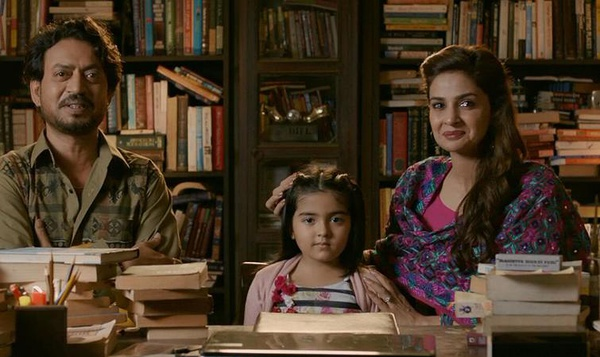

本文作者： 曾梦龙

**“有时候，关键不是去改变世界，而是去解释世界。”**

**在某个关键时刻，关于如何解释这个世界，如何与未来相处，我们需要听听睿智、独立的声音。**

**我们邀请了经济学、法学、社会学、传播学等领域的 20 余位专业人士，回答了我们的问题。**

**问题纷繁而且复杂，但与年轻一代的未来生活息息相关。被访者希望，留给未来年轻一代的这个世界运转良好而且文明进步；在复杂而且迷茫的世界中，保持独立与理性。**

十年之后你会在什么地方？十年之后你会达到什么目标？

经济学家何帆提出来的这个问题，可能是关于现阶段关于“中产焦虑”的本质所在。

我们的问题是从普遍的焦虑开始的，不论是中产阶层，还是普通的刚刚步入社会甚至还在求学阶段的年轻人，都感觉特别焦虑。很大程度上，它是由一些显性的问题组成的：因为住房、教育和医疗等公共服务和社会保障让人觉得很心累，也没有多少安全感，担心自己收入和财富缩水，孩子输在起跑线上……

为什么会有这样的结果？

长期关注香港问题的严飞，他发现香港相对于内地来说，焦虑更有形一些：中位收入从 20 年前 1997 年的 1.9 万港币，降到 2017 年的 1.7 万，降幅达到了 15% ，而同时期的房价从 1996 年的平均 100 万左右上涨到了 540 万，增加了 5 倍。再加上关于香港政体变化的不确定性——香港人的焦虑是确实的，“看不到前路，看不到未来”。而内地的焦虑建立在财富高速增长的阶段，收入起伏和房价高涨这些与香港接近，但更多的则是一种情绪或者心态，它的不确定性是更多元的。

对于洪涛和张斌来说，他们则对比了 1980 年代，甚至是 1990 年代，同样是充满不确定性和迅速变化，但焦虑并没有成为整个社会的底色。

为什么我们现在会有这种担忧？

围绕中国的社会中坚阶层有三个命题是值得关注的。其中第一层面来自于自身处境——比如被称作三座大山的“住房、孩子上学、老人看病”这样的现实焦虑；第二个层面则来自于这个中坚阶层是否可以扩大，也就是他们向下流动的危险和更多的人口上升为中产阶层的可能性——前者是他们焦虑的根本，后者是从 2016 年开始探讨越来越多的阶层固化问题；第三个是更广泛意义上，他们是否能成为现代化转型的中坚力量——如亨廷顿所说，当经济增长社会产生大量中产阶级，它会推动整个社会的民主化转型。

未来，不论是中产阶层自己还是他们的子女一代，生活在什么样的社会里。

社会中坚阶层是官方的一个提法，我们的访谈对象有时会以“中间阶层”“中产阶级”等约定俗成的名词所替代。严格意义上，它们不能互相替代。如任剑涛所说，中产不是一个财富概念，而是一个权益概念。也是在这一点上，“中产阶级”还远没有达到一个被赋予更多使命的地步——它很难成为政治学者亨廷顿所探讨的“中产阶级”的意义。在亨廷顿的假说中，他强调“如果你想要造就民主，就请促进经济增长”。虽然，我们和我们的访谈对象不同程度上谈到了这种可能性。

不管怎么样，焦虑，尤其是这个社会中坚阶层的焦虑可以视为一种推动我们更多思考的力量，借由关乎于此的思考，我们可以希望最终它能成为推动社会进步的力量。

比如，在我们一位受访者的语境中，他会提及如何通过更多的政治参与来化解社会弥漫的焦虑情绪，“我觉得一个国家到了一定程度的时候，这个焦虑可能有某种必然性。我倒也不觉得一切都是不正常的。但是，国家需要让大家能够有一个宣泄的通道。其实新闻自由、议会政治，在相当大程度上让大家能够把自己的焦虑、愤怒、不满能够表达出来”。

经济学家韦森则指出了更多人焦虑背后的那个“房间里的大象”：“既然人类历史几千年证明了，只有市场经济才是一个能够造成经济增长的制度。我们应该发展市场经济不动摇，建立法治化道路，沿着这个往前走。要是这个都动摇了，我回去搞计划经济……说消灭私有制，那我们今天干吗？”

焦虑的核心，还是那个历史三峡有关的存在恒久的问题，中国到底会走向一个什么样的未来。

这一部分会涉及中产阶层的焦虑、社会阶层流动与固化等问题。这一篇我们从中产焦虑和对中产的误读开始。

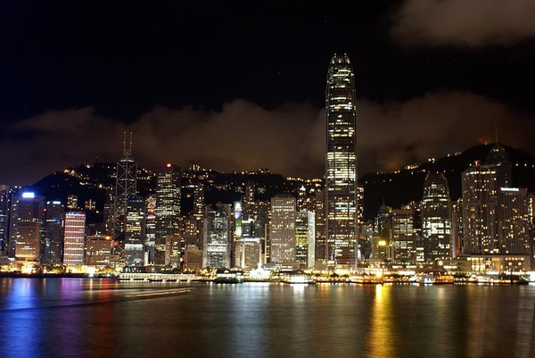

>**【1）中产不只是一个财富概念，还是一个权益概念】**

**任剑涛  清华大学政治学教授**

所谓中产阶级，首先是承认公民私产正当性的制度，就是公民私产神圣不可侵犯。这样的制度下面，才会出现真正维护社会稳定的中产阶级。

对于中国来说，党和国家政策现在也特别强调致力建构社会中间阶层。他不说中产阶级。因为橄榄型的社会是个最稳定的社会。中产阶级的生活状况和特性，是致力于维护社会稳定的。

但是，挪用亨廷顿的说法，有一些基本问题首先要澄清。第一个，所谓中产阶级，首先是承认公民私产正当性的制度，就是公民私产神圣不可侵犯。这样的制度下面，才会出现真正维护社会稳定的中产阶级。所以，中产阶级不是一个随意可以挪用的一个概念。在对公民私产肯定附加太多条件的情况下，不存在严格意义上的中产阶级，所以我对国内社会学界在中产阶级的名义下做出的很多研究，我是表示不太认可。

那么第二个，所谓中产阶级，不只是一个资产状态，还是一个社会政治状态。中产阶级在财产观念得到尊重的情况下，第一，他强调社会的良序发展，因而他能够从中产有可能升上资产。社会向上流动的空间是敞开的。他畏惧的是因为政策的不稳定和发展不可预期，他从中产变成无产。因而对于中产阶级来说，他有双重压力，向上流动，有资产的压力，而往下衰变，又变成无产。因此，扶持中产阶级的社会政治效果，对于规范的现代国家来说，它是一个非常微妙的社会政治政策。所谓整个国家的福利化建构，要解决的问题就是，抑制大资产，扶持无产，建构中产或者强化中产。

但是大的问题在哪里？就是国家有没有理由，去通过剥夺资产而来扶持中产？或者是剥夺资产，去施加无产以国家福利？在这个意义上，亨廷顿没有考虑到这么仔细。因为亨廷顿考虑的问题，只是在美国这种中产阶级已经承担了稳定的社会政治功能的情况下，来横移解决整个新兴民主社会建构的稳定性。但他没有料到，在新兴民主社会，一个最重要的问题就是中产产业自身的不稳定和不合法。因为对他的产业或者对他的资产的法律保障，是附加了很多政治条件。

所以对中国今天来讲，如果我们要挪用亨廷顿的理论，可能首先要解决的问题是个人财产权利进一步的宪法强化，尤其是通过中国在制定当中的民法细则，（进行）强有力的保护。包括顾雏军案和相应的五大财产纠纷案，都证明了中国的资产权利尚不能保障，何况中产？因此对于中国来说，财产的保护可能是我们培育中产阶级，首先要做的制度改进的一个关键环节。这是最重要的。简而言之，财产的法律保护还要明显强化。

>**【2）中产的稳定性还来自于他们自身对稳定的需求和法律的保障】**

**任剑涛  清华大学政治学教授**

如果社会安全感没有保证，他噤若寒蝉，一言不发，中产阶级就丧失了社会政治功能。

第二，就是对中产的社会政治功能，我们要承认，不要以为只是因为中产阶级多了，我们社会就稳定了，不存在这么简单的一个直通关系。中产阶级首先是有社会关注热情。延续我们前面的话题来说，就是中产阶级是最关注社会公共事务的一群人。因而，中产不仅仅是一个财产观念，财产观念受到法律保护的同时，他们的公共关注是表明中产的社会性质最重要的一个标志。那么，要保护他们社会公共事务关注的积极性，中产他们畏惧降低到无产，又希望发展到资产，这个时候，他们对社会的公平正义，这个第一主题，最为关注。所谓中产维护社会国家的稳定，就在于他们对这个社会的，比如十八届四中全会特别讲的法治，他是最看重。能不能够法治的自我超越，法治的有效管理？通过法治使中产获得社会安全感。

前者通过法律的保护，获得财产的法律安全感。这通过参与，获得的是社会安全感。因此，他们会积极去维护既定的社会机制。这个在非正义、非法治的社会中，中产是发挥不了这种社会功能。我们一定要清楚，不能像社会学家那样，只是横移中产的概念，然后就来统计我们中产有多少人？中产有什么社会功能？这是个静态的研究或者是功能性的研究。如果是一个动态研究，中产的身份是变化的。如果通过结构的研究，他的法律地位和社会政治地位有没有得到保障？能够保障橄榄型社会中间那一部分真正能够不断地做大。因为如果社会安全感没有保证，他噤若寒蝉，一言不发，中产阶级就丧失了社会政治功能。丧失社会政治功能，权力有可能逼近，对他财产的法律保护掉以轻心，可能有宪法原则，但是没有部门法跟进。可能有部分法跟进，但是没有民事诉讼和刑事诉讼的跟进。

那么，法律程序没跟进的话，第二个功能又发挥不了。

>**【3）宁静、理性，中产还是一种社会心态】**

**任剑涛  清华大学政治学教授**

多少“自干五”的革命情节无比强烈。这个实际上是有害于我们政权的稳定。但是政权有些高层人士是不懂这个政治学常识，对“自干五”脱帽加冕，加以政治豁免。他们随便怎么谩骂都是有道理的，只要他们在爱国，但没有料到他们是做爱国生意。

那么第三个就是，中产更重要的是一种生活习性。对我们中国发展到今天来说，社会比较躁动，中产的社会习性是比较宁静的。所谓社会躁动，大家都要发财，于是变成了中产最强硬的一个物质杠杆。这个也没什么错误。但问题在于，大家只想发财的时候，他就很难进入中产的心理。我是躁动的，只要能赚到别人的钱，我干啥坏事都可以干，（这不是中产心态）。所以国家那么重视食品、药品安全，结果食品、药品安全并没有根本性改善。原因在于哪里？就是大家为了赚钱在所不计。他就没有中产的心态。中产还是一种社会心态——宁静、理性、追求和平改良。我们不想去革命。我们多少“自干五”的革命情节无比强烈。这个实际上是有害于我们政权的稳定。但是政权有些高层人士是不懂这个政治学常识，对“自干五”脱帽加冕，加以政治豁免。他们随便怎么谩骂都是有道理的，只要他们在爱国，但没有料到他们是做爱国生意。这个是对中产社会心态的极大伤害，这种不理性，不宁静，不追求改良，而想通过暴力革命解决一切社会问题，瞬间进入理想状态，这是绝不可能的事情。所以中产还是一种社会心态，这个一定要强调。在某种意义上，亨廷顿的理论有指引性，但是不能直接挪用。中国的社会科学界，尤其社会学界的朋友，可能要注意区分其中一些细微的差异。

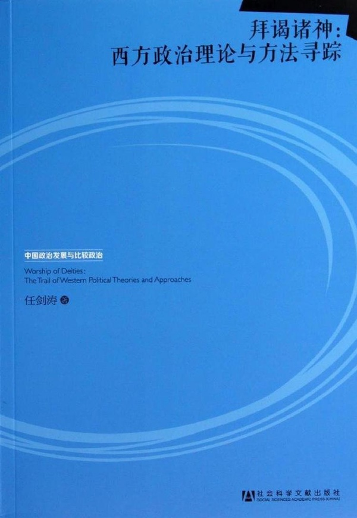

>**【4）什么是中产，他们有什么特征】**

**何帆  北京大学汇丰商学院教授**

不是说我是个公民，我就有参与公共决策的能力。没有的，跟你游泳、跟你骑自行车一样，都是你要去练的。

我们原来社科院曾经出过一份关于中国各个阶层的报告，那里头有一些比较有意思的观点。一个观点就是说，中产阶级到底是谁？如果单从经济收入来看，你甄别出来的中产阶级和他的自我认同是不匹配的。因为有一些人收入中等，但他认为自己不是中等，比如说在外资里头的底层；有一些其实收入没那么高，但他自己认为自己是中等收入。但是，如果你把其他的社会资源，像福利这些都算进去，这时候大概就比较匹配了。你占有的经济和社会资源与你的自我定位就匹配起来了。但是，经典的社会学理论认为，中产阶级都是保守的力量——基本上是有家有室，意识形态上也都很保守，星期天都是去教堂，过着枯燥乏味的中产阶级生活。但在中国，你会发现，从思想意识形态的维度、光谱去看，在道德上、政治上比较保守的其实是底层，然后在意识形态上比较激进的，恰恰是中产阶级，所以它跟传统的理论不一样。

中国我觉得最大的问题是我们缺少参与公共事务的经验。因为改善治理不能只靠政府，它必须得有政府和民众之间的互动。这不仅对公民社会有好处，对政府本身也有好处。因为你知道跟谁去交流。如果政府直接面对的是一群大众，它很难交流。因为大众很难控制，但如果有一些社会组织，你能够通过这个渠道跟大众沟通，有很多风险能够降低。这就使得大家要去学习我如何参与公共事务。但是，我们现在害怕一切非政府的社会（组织），没有这种机会，所以它会使得（民众）参与公共事务的能力很低，潜在暴力倾向很高。因为你不知道怎么去沟通和交流。你观察比如说城市里面有很多小区维权能够发现：它在第一阶段的时候基本上是人人参与，使用的语言都是“文革”语言，打倒奸商啥的。然后你会发现到第二个阶段就比较理性，有一些在政府工作过，或者有一些做律师的人，他慢慢就会成为领袖人物。因为他们知道如何去沟通、去谈判。这个过程其实是一个教育过程。

我们每个人现在都是政治治理、社会治理的小学生，你得有学习的机会。不是说我是个公民，我就有参与公共决策的能力。没有的，跟你游泳、跟你骑自行车一样，都是你要去练的。我们其实没有这个能力，以后你怎么样才能够培养更多的这种能力？

>**【5）预期锚定在未来，焦虑可能会减少】**

**何帆  北京大学汇丰商学院教授**

我们现在，从上到下关注的都是短期，关注的都是今年 GDP （增长率）是 6.5% 还是 6.7% ，那有什么意义？

中产阶级的焦虑，可能还不在于是说对流动性，因为中产阶级已经流到这个水平了，所以从中产阶级再往上走，相对来说，通道还是比较开放的。社会流动性丧失主要是底层的这些人，原来你可以通过参军、考学、婚姻，改变自己社会阶层属性。现在来看，参军越来越少；大学你又不去读了，读不起了；原来的婚姻其实有很多是跨阶层的婚姻，现在的婚姻都是门当户对，你找不到不在你这个社会阶层的结婚对象。所以这个时候，等于各条通道都被封死了。

中产阶级的焦虑，我觉得主要是说，缺乏对未来长期的预期。我们现在有很多未来的事情你想不清楚，你说他焦虑在哪儿？第一，我养老到底需要多少钱？在一些比较成熟的经济体里，交了养老金、交了税之后，就可以把钱全花掉了。因为你觉得没啥问题。你在这儿，为什么你挣了那么多的钱，你心里还不安全？你也不知道等到我老的时候，我需要多少钱？没有一个很完善的养老保险制度。你靠你交的养老金，最后肯定是不行的，然后只能靠自己，可是靠自己需要多少钱？这是个无底洞。然后你又没有很好的公共医疗和医疗保险制度。到时候，万一我生了病，需要多少钱？他也没有这种非常稳定的预期。孩子的教育，我觉得更像军备竞赛，别人都很焦虑，你就也很焦虑。这没办法，囚徒困境。

但主要的问题，我觉得还是说，没有一个特别长远的预期。这跟我们政策现在变化非常快有关系。所以，为了长期的增长，必须需要长期的投资。为了长期的投资，必须需要让大家形成长期稳定的预期。从这个意义上来讲，现在的政策一定要给大家一个锚定在未来，让大家有一个长期稳定的预期，所以可能一两年做不了这件事情，但是一定要告诉大家，这是我们以后要去走的。十年之后会在什么地方？十年之后我们会达到什么目标？把它预期锚定在十年以后。如果我认为十年之后确实会走到那儿，那我就可以按照十年的视野来布局。我们现在，从上到下关注的都是短期，关注的都是今年 GDP （增长率）是 6.5% 还是 6.7% ，那有什么意义？没什么意义。如果能够把预期锚定在未来，那可能大家的焦虑感就会减少。

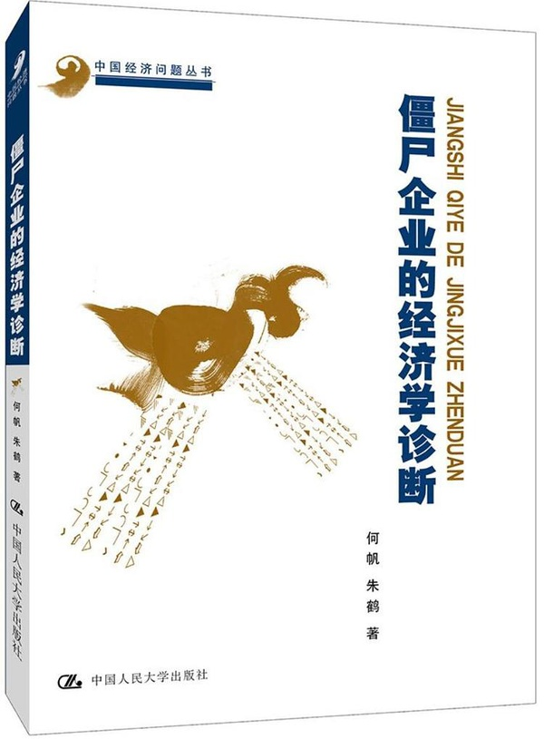

>**【6）现代化本身就是一个让人焦虑的过程】**

**吴飞  浙江大学传媒与国际文化学院教授**

当年德国不就是因为普遍的焦虑才培养出来一个纳粹吗？希特勒就是在德国的焦虑之下的一个产物。

焦虑其实是多个面向的。第一个，现代化本身就让人产生焦虑。因为现代化强调效率和速度，是看后果，所以这种类型的方式它不会追求（慢）。我觉得这是整个现代性推进过程中间带来的一个普遍性效应。像我们以前讲公务员上班，一杯茶、一张报纸看半天，不用紧张，慢悠悠的一种生活。尽管他的财富不够，速度和效率都不高，但是你发现对自然和环境的索取比较少。它处于一种相对平衡状态。那个时候的焦虑会相对比较少一点点。但今天不同，别人都在进步，别人都在索取财富，别人都在快速增长。这是现代性带来的一个很重要的变化。

其实在齐美尔他们那个年代的时候，西方也有普遍焦虑的过程。其实今天也一样，西方社会也仍然是很焦虑的，所以我觉得这是第一个大变向。它是一个现代性所带来的结果。因为现代性的本身，它是一个工作理性所导向的，是看效果的，而不是一个（价值理性所导向的）。这是我们要注意的这样一个大的普遍现象。

另外一个焦虑可能来自于我们对自己的生活的不确定性。我们不知道我们生活的环境是不是安全的？我也不知道我们明天到底是什么样子？这种类型的焦虑是第二个层面的东西。我们的安全受到很多层面的挑战——恐怖主义、食品安全、环境、水、污染，所有的东西都（可能有问题）。你没有安全感，你一定是会有焦虑的。

第一个层面可能是会导致你要处在一种竞争的环境之下，你怕赶不上。第二种是安全受到影响。所以在这两个大的环境背景之下，你心理上的焦虑就显得比较正常了。我觉得这个是不能解决的问题。

但是焦虑本身也有好的一面。你就要去寻求安全，找到安全庇护的可能性。不管是完善一个体制，还是要追求执照的保障，你都要寻求这个东西。对人类社会来讲，慢慢会找到一个比较好的治理的方式。包括中国共产党提出来的“人类命运共同体”，其实也是一个人类的普遍焦虑里面，要寻求一个共同体意识。就像当年基督教所要强调的“四海皆兄弟”一样，我们都是上帝的子民。其实这是一种安慰的可能，（就是普世价值）。所以，我觉得焦虑不可避免，但人毕竟是一种非常有调适能力的动物。这也是人到目前为止还是万物灵长的一个很重要的地方。尽管焦虑，我们从焦虑中间找到一个目标和突进的可能，找到适当调试的可能。也许未来有一天，我们会找一种不同的生活方式，但是今天不知道。

现在有很多人开始去练太极、练瑜伽，试图去放慢自己的生活节奏，有更多的人开始吃素、信仰上帝或者佛教，他也总是要找一种寄托。所以我要讲的焦虑的第三个层面其实就是信仰的相对缺失。像马克思当年说的，所有传统的东西都已经被击碎掉了，所有新的价值都没有建立起来。在这样一种类型的情况之下，精神的相对空虚所导致的一个结果，就像我们的政府报告里面说，现在很多官员没有信仰，就只是追求金钱和美女去了。这就是一样的

我讲的，基于整个现代性、基于安全，以及基于信仰的缺失，三重的结果都可能会导致一种焦虑。那我们既然发现这个问题，就会有不同的应对和调试方式，所以我对这块倒不是特别悲观。当然，也许会出现一个可能，就是当我们焦虑积到一定程度时候，就会变成一种毁灭。它是一个毁灭的力量。对大自然来讲，它一定会找到一个平衡方式。它可能是战争，可能是瘟疫，可能是大规模的疾病，反正它总会找到一个东西来平衡。

所以自然法则，冥冥之中会有一个绝对的力量在那里平衡这种类型的东西，你不清楚。所以有些人最后发神经病了，可能会无缘无故去砍杀别人，他都是一种发泄。当然，作为一个社会管理者，要关注到这些负面发泄的可能。当年德国不就是因为普遍的焦虑才培养出来一个纳粹吗？希特勒就是在德国的焦虑之下的一个产物。当年毛泽东搞文化大革命其实也是一种焦虑。他希望在极短的时间之内赶超英美，才会有大跃进，才会有别人批评他这些做法（尤其是彭德怀的批评）过后，来发动文化大革命。这也是一种焦虑。所以这是一个挺复杂的东西。

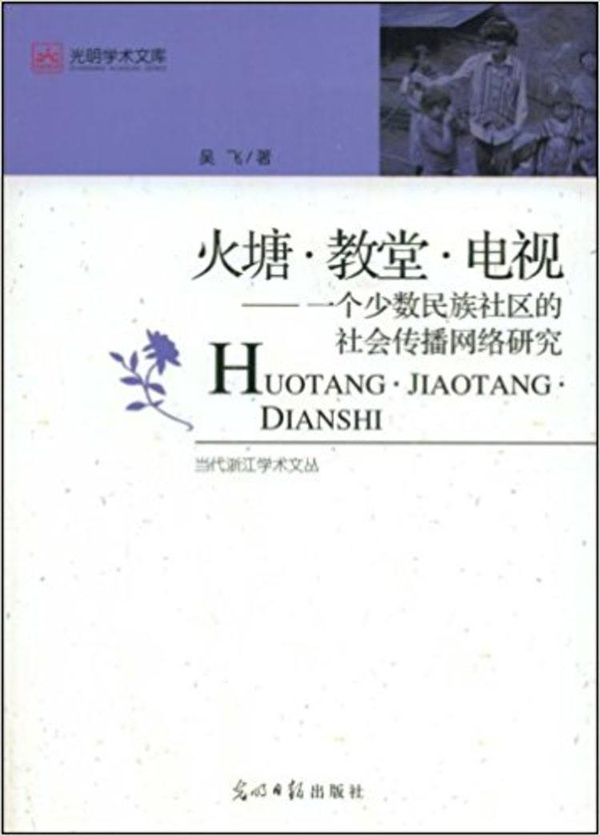

>**【7）“往下流动”是一个始终存在的对未来的最大担忧】**

**王晓渔  同济大学中文系副教授**

“富不过三代”，说明个人财产始终处于高度不稳定的状况。

我们遇到的不仅是阶层固化，更是阶层往下流动的问题。哪怕今天你是所谓中产阶级或者精英，子女甚至自己在未来处于什么阶层也具有很大的不确定性。你可以住在千万豪宅（很快千万元的住宅在中心城市也不算是豪宅了）里，你的子女能进学费昂贵的幼儿园，已经属于前 0.1% 甚至 0.01% 的阶层，但依然可能遭遇火灾却未能获得及时救助，遭遇虐童事件要举国关注才能获得回应。说得残酷一点，一些最基本的权利都未必有那么大保障。在这种情况下，跨阶层、跨地域、跨年龄段的焦虑感就会产生，以至于戾气盛行。移民成为热门话题，也说明了人们的普遍焦虑。

封闭式的阶层固化是有问题的，阶层需要具有开放性但同时又需要有一定的稳定性，才能给人们以希望和安全感，“有恒产者有恒心”。有个说法叫“富不过三代”，仔细想想这个现象隐藏着很多问题和危机。当然要批评过度的世袭化，但是“富不过三代”，说明个人财产始终处于高度不稳定的状况。如果你的私权得到保障，如果没有发生各种灾难性事件，怎么会“富不过三代”呢？

“富不过三代”，但“贵族是三代才能养成的”，这就意味着没有贵族。从各国的历史来看，贵族或者精英阶层的作用是很重要的。在很长一段时间里，贵族常被视为贬义词，被等同为特权阶层，似乎与庶民成为水火不容的两极。但贵族被打倒，并不等于特权阶层不存在，恰恰是特权阶层垂直凌驾于庶民之上，反而阶层更为固化。

孟子说，“无恒产而有恒心，惟士为能”。从历史经验来看，“无恒产而有恒心”，对于士这一阶层来说也是很艰难的，绝大多数做不到。

现在看下来，好像除了跳广场舞的老人们有着幸福感，其他阶层都有焦虑感，其中一个显著现象是“全民中年化，中年油腻化”。“中年”这个词已经有很多年不太常见了，取而代之的是不断延长的“青年”。在公众中广泛流传这么一个说法，联合国世卫组织将青年定义为 18 岁到 65 岁（以及把中年定义为 66 岁至 79 岁）。这个说法传播太广，以至于联合国新浪官方微博在 2016 年“五四青年节”时明确辟谣：“联合国对于’青年’的定义是年龄介于 15 岁与 24 岁之间的群体。”

也就是近一两年，“中年”这个词重新恢复了。最意外的是， 90 后也匆匆加入这一行列，常常自嘲陷入“中年危机”，手拿泡着枸杞的保温杯。“丧文化”到处弥漫，与 80 年代全民处于一种青春期，期望“减去十岁”截然不同。这种集体心理的差别，有很多原因，其中一点或许就是和对未来的预期有关。当各个阶层都面临往下流动的可能，相信明天会更好的心理就会发生变化，取而代之的自然是集体焦虑。不同阶层之间应该互相流动，但各个阶层都有着强烈的“往下流动”的预期，这就会面临比“中年危机”还要严重的心理危机了。

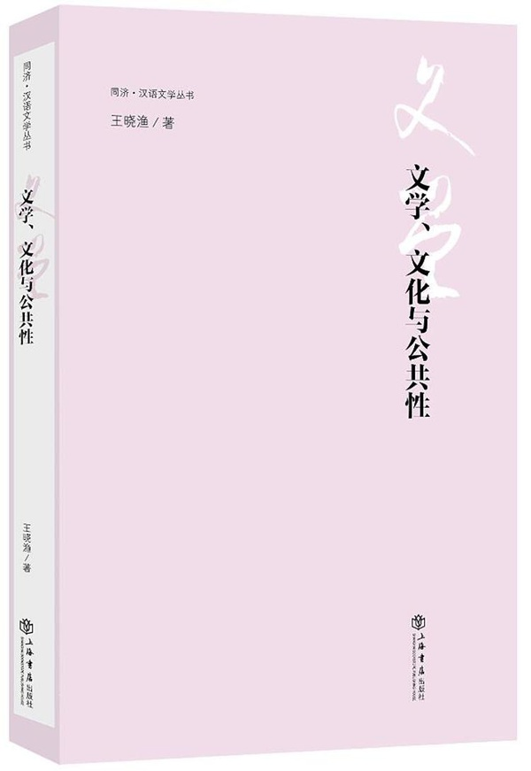

>**【8）焦虑更多的来自于价值观的冲突】**

**张斌  中国社会科学院世界经济与政治研究所研究员**

中国在高速增长时期，那时候整个社会氛围感觉还不是焦虑，是有点疯疯癫癫的感觉。1980 年代给人感觉不是焦虑，那时候觉得这个世界可以是无限可能。

其实人力资本的提高，跟人口年龄结构有很大的关系。计划生育政策，二胎三胎政策，这些应该尽快全面取消，以后应该采取鼓励生育的政策，而不是限制生育。现在每个家庭多出来孩子之后，不光是生的问题，还有养的问题、教育的问题（幼儿园的问题、孩子上学的问题），城市公共服务如果能够改善，后续的问题如果能好好解决的话，我相信会有更多的家庭愿意要二胎，愿意生。现在这种环境，大家要不起，不敢要啊。要出来，也不能够对孩子更好负责任。所以，不单单是放开二胎的问题，幼儿园怎么办？小孩上学怎么办？这些都要配套解决，让大家不要对养孩子有那么多顾虑。

为什么会焦虑？ 你这么看焦虑吧，你特别穷的时候，焦虑吗？中国在高速增长时期，那时候整个社会氛围感觉还不是焦虑，是有点疯疯癫癫的感觉。 1980 年代给人感觉不是焦虑，那时候觉得这个世界可以是无限可能，干事的手段也是无限可能，疯疯癫癫的。现在给人感觉，焦虑更多一点。我觉得这种焦虑更多来自于刚才讲的两种价值观的冲突。这个社会的发展越来越跟你信奉的那种价值观不一样了。

比如说大家经常看微信。看微信的时候，你能够看到很多情绪表达。大部分微信，与其说它传递的是一种信息，不如说它传递的是一种情绪。这种情绪其实是表达一种观念的不认同。有些人时时刻刻都在担心会发生危机，一直觉得中国一定要完蛋，一直觉得人民币一定要贬值，一直觉得房地产价值有巨大的泡沫。这个东西根深蒂固。因为他其实对经济发展，对中国观察，对未来一直没有信心，他觉得有一种不安全感。因为这些所谓的很多变化跟他想象的、应该那样的秩序是不一样的。他觉得秩序应该是这样的，但现实中的发展跟他想象的不一样。因为这种不一样，使他对结果非常悲观。

是现实中的那种规则变化一定不对吗？我觉得未必。未必你想象的那种规则就是最适应的。你可能是一个终极目标，但在走向那个目标的过程当中，变化形态很多，甚至个别时候有偏离。每个人可能都强烈感受到，他觉得好的、想要的东西，跟他看到的东西不一致，所以他就会担心那个结果发生，担心结果不好。

为什么这么多焦虑？就是越来越多的人觉得社会的变化跟他认可的那种观念不一样。而且这种焦虑很受经济波动的影响。经济差的时候焦虑就（会更严重）。 2015 、 2016 年，焦虑更严重， 2017 年好一点。因为有时候人其实很情绪化，焦虑本身就是一种情绪。利润在增长、就业在好转，焦虑就没那么严重，那这些指标要是不好的话，焦虑就会比较严重，而且会放大。

我觉得结构转型带来的观念上转型，焦虑本来就会多。如果这种焦虑情绪再碰上一个经济低潮期，就会放大。

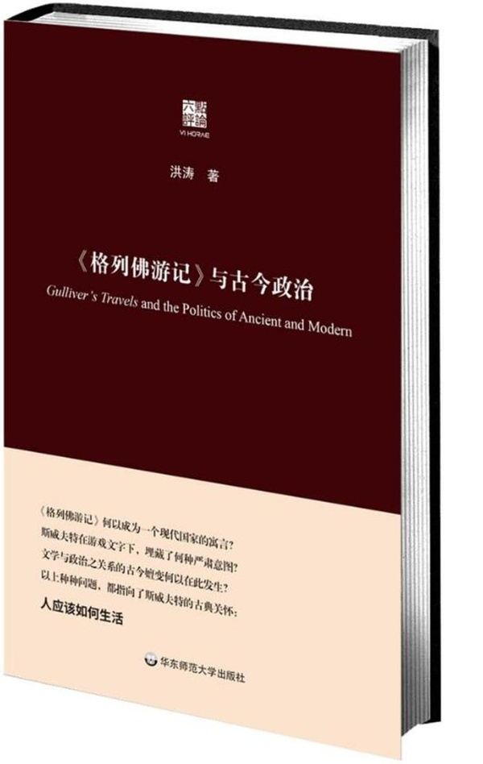

**洪涛  复旦大学国际关系与公共事务学院教授**

希望来自这样一种信念：努力能够改变自己或者周围的世界；无望则来自这样一种感受：周围世界永远无法撼动，甚至对自己都完全无能为力，因为，“我”只能是被他人所规定的对象。以前的人更有希望，因为这个世界多少还有自由的空间，现在的人觉得无望，因为这个世界完全被操控了。

我是 1960 年代出生的，亲历了中国这半个世纪的变迁。无论住房、教育、医疗，现在都比以前要好得多。上海人以前的住房你可能听说过，三代人住一个十来平方米的房间。为什么今天的人更焦虑？我想，以前的人，大概还有希望。现在的人，更多的是无望。有没有希望，很不一样。有希望，现状即便不好，却总觉得会变好。无望就是无法改变，不管是对世界，还是对自我。“我”完全无法自我决定，只能被决定。

这变化怎么会发生的？这问题很复杂。可能与经济发展的不同阶段有关，改革开放直到 21 世纪，整个中国社会都在飞速变迁，进入 21 世纪之后，一切都在冷却，在凝固，在收缩。经济权力、政治权力、文化权力越来越集中，越来越集聚到少数人手里。普通人创造了这个世界，但是，他们自己创造出来的这个世界却与他们敌对，日益强大，难以撼动。今天，除了极少数权力精英外，大多数人处于“三座大山”的重压之下：住房、医疗、教育。以我今天的收入，买我现有住房，不吃不喝至少得干 25 年。人一生，能工作多少年？看一个小毛病，排了 3 小时队，看了 5 分钟，很正常。教育方面我体会不多，但知道教育资源不平衡，有些地方教师吵着要薪。总的来说现在中国老百姓不大会吵了，不知道是文明程度提升了的缘故，还是觉得吵了也没用，改变不了什么。

中国的国家太强势，社会太弱势。国家可以发射飞船，造航空母舰，但不大愿意投资医疗、教育，欠账很多。据说(最近在网络上看到，清华某位知名教授说）我国的综合国力已经超过了美国。但是，美国，还有我们早已超过的日本、欧洲的社会福利怎样，医疗怎样，教育怎样？ 我们超过他们了吗？

中国现在很厉害，所以，到处说“厉害了，我的国”，但是，其实，真正应该做的是，“厉害了，我的民”，否则，怎么体现中国是社会主义国家呢？怎么体现中国共产党是奉行马克思主义的呢？言行一致，知行合一，总不至于只是对老百姓说的吧。“民”想变得好一点，强一点，就牙齿咬得咯咯咯，不败坏不足以平君愤，只有民弱、民坏才行。这不是社会主义，是法家。

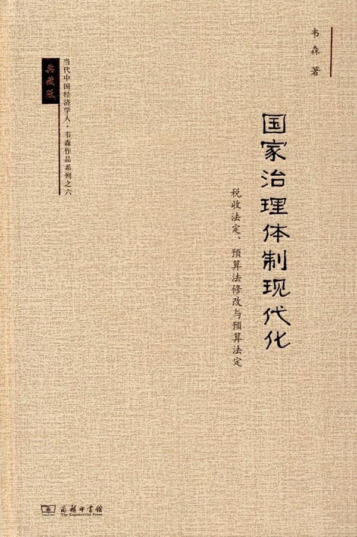

>**【9）最大的焦虑是大方向、改革不明】**

**韦森  复旦大学经济学院教授**

要是这个都动摇了，我回去搞计划经济，像人大的周新城，说消灭私有制，那我们今天干吗？

关键是我们不知道国家向何处去。这是大方向。你到底是走社会主义道路还是资本主义道路？人大的周新城说，不忘初心就是要消灭私有制。那消灭私有制了，再走计划经济道路，那我干什么企业？搞什么投资？有一天，我还打土豪分田地，还发展什么？这个焦虑牵扯到每个人。如果说我们再回到计划经济，资产、房产、企业全都变成了（公有）。这个比什么都焦虑。关键就是中国大方向，改革不明。

中国人的经商精神非常强，不亚于以色列、韩国、日本，也不亚于任何一个民族。中国的企业家精神几乎像黄山上的松树。你给它一点水，它就长成大树。你看融资难、融资贵、税收重、劳动成本在上升、人民币在升值，企业做得很难。但是，这些企业家还总是挣扎着来进行技术创新，扩大企业，还在往前走。这是中国经济的健康方面。

我到德国去，发现我们中国人既有以色列人或者是东亚的经商精神，做东西也很心灵手巧。我们的手机做得很好，小家电也做得很好，不亚于德国人。这两个东西，中国都具备。做不好，关键还是大方向。你看看 1980 年代、 1990 年代，知识分子乐观，大家都满心热情出主意，想办法，想哪方面突破，哪怕改革？现在谁还这个样子？都是说，我不当出头鸟，不积极作为，安生为好。

关键一句话：既然人类历史几千年证明了，只有市场经济才是一个能够造成经济增长的制度。我们应该发展市场经济不动摇，建立法治化道路，沿着这个往前走。要是这个都动摇了，我回去搞计划经济，像人大的周新城，说消灭私有制，那我们今天干吗？

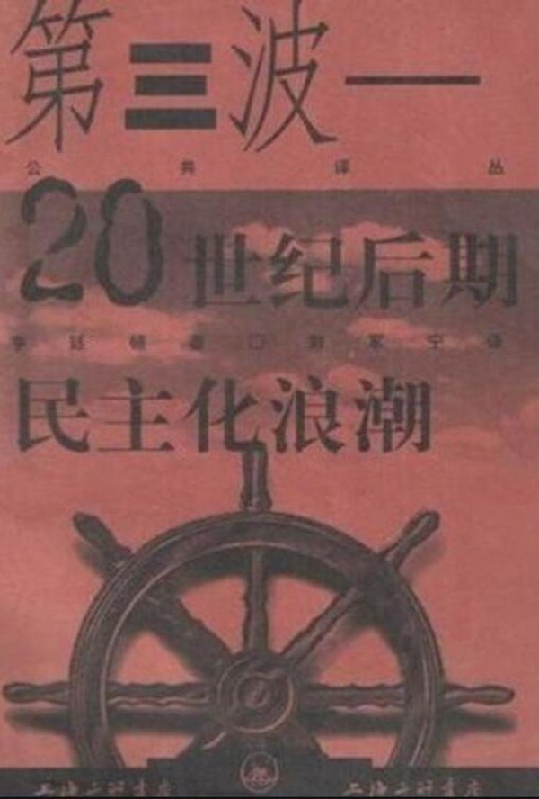

>**【附：关于亨廷顿在《第三波》中提及的中产阶级假说】**

经济发展需要高度的城市化、识字率和教育水平。它也带来就业结构的变化，导致农民在规模和重要性上的下降，以及中产阶级和城市工人阶级的发展。后两个群体会不断要求在影响他们的政策上享有发言权和影响力。

随着教育程度的提高，他们能够组织工会、政党和公民团体来促进他们的利益。

其次，经济发展产生了更多的公共资源和私人资源可供在各个团体中分配。政治变得越来越不是你死我活的零和游戏。因此，妥协和宽容都得到提倡。

第三，经济增长造就了一个更为复杂的经济体系。这样的经济越来越难以受到国家的控制。正如我们在计划经济的例子中所看到的，国家对经济的控制只有靠付出经济停滞的代价才能得到维持。

第四，国家对经济控制的放松导致独立的权力中心的产生和成长。而这些权力中心恰恰立足于对资本、技术和通讯的私人控制。那些握有这些财产的资产阶级要求有一个他们能够对其施加影响的政治制度，一个不被军人政变集团、政治局或独裁者及其亲信完全支配的政治体制。

最后，尽管经济增长在短期内常常加剧收入不平等，从长期看，它将导致更加平等的收入分配。民主与彻底的经济平等是不相容的。这种平等只有在一个压迫性的独裁政权之下才可能实现。但是，民主政治与财富和收入的巨大不平等也是不相容的。经济增长最终会降低这些不平等，因此，也将促进民主的出现。

*（后续报道，陆续更新）*

**本篇报道涉及访谈对象：**

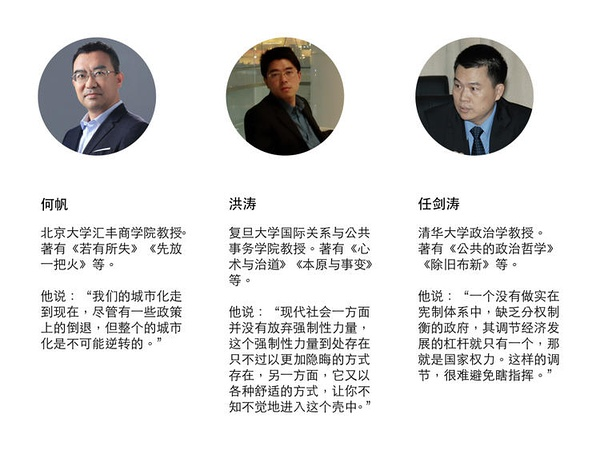
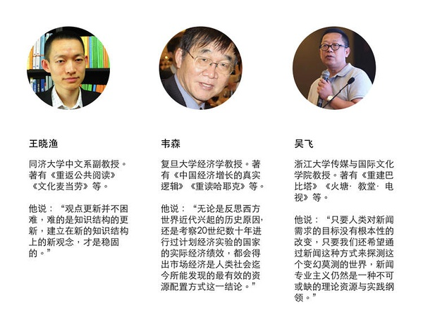
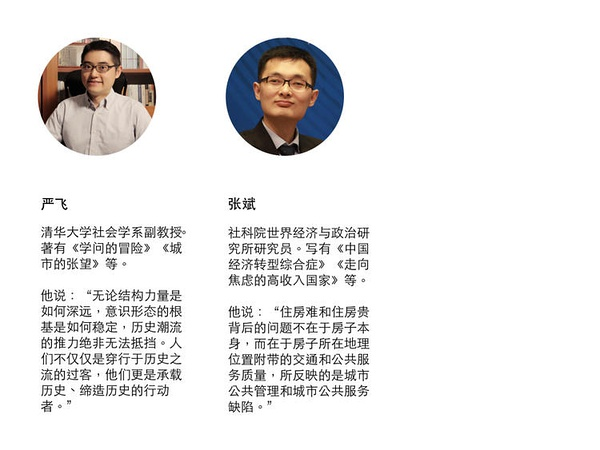

制图：冯秀霞

题图为电影《起跑线》剧照，来自：豆瓣