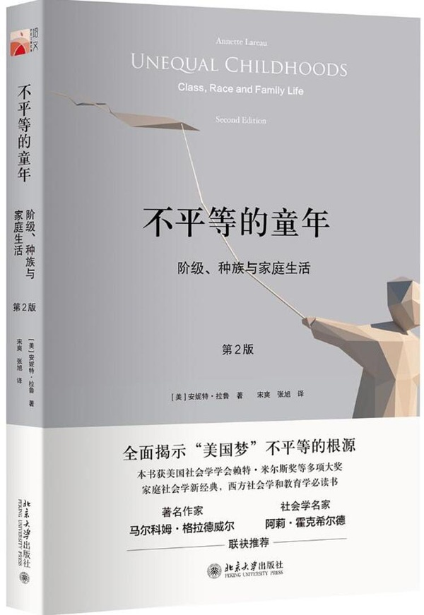
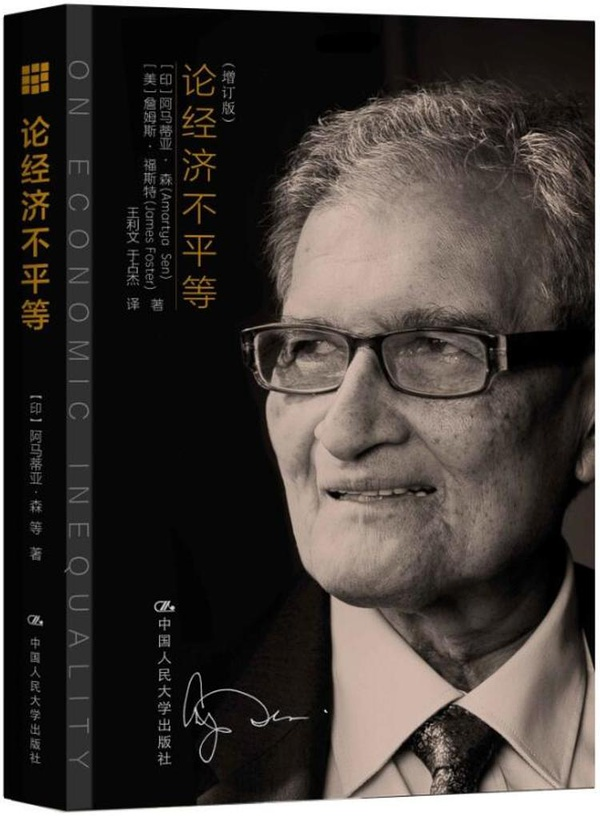
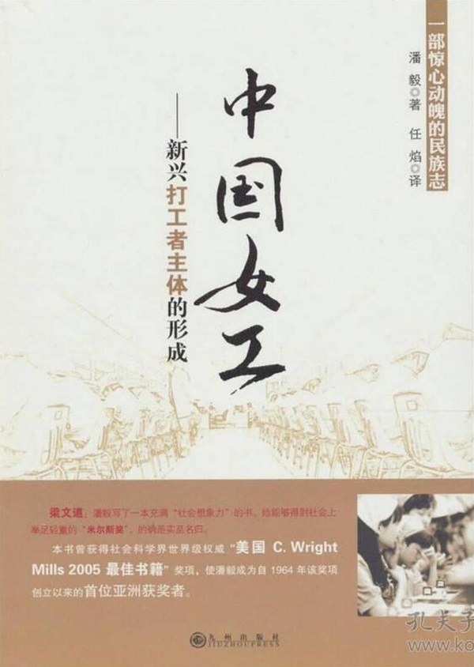
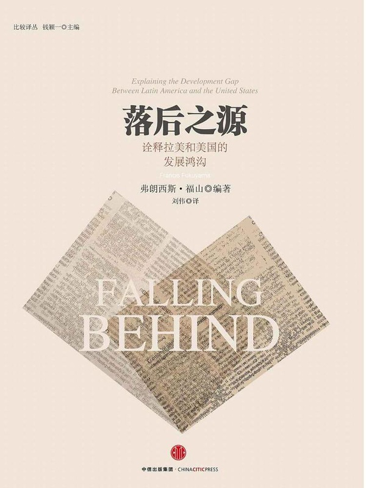
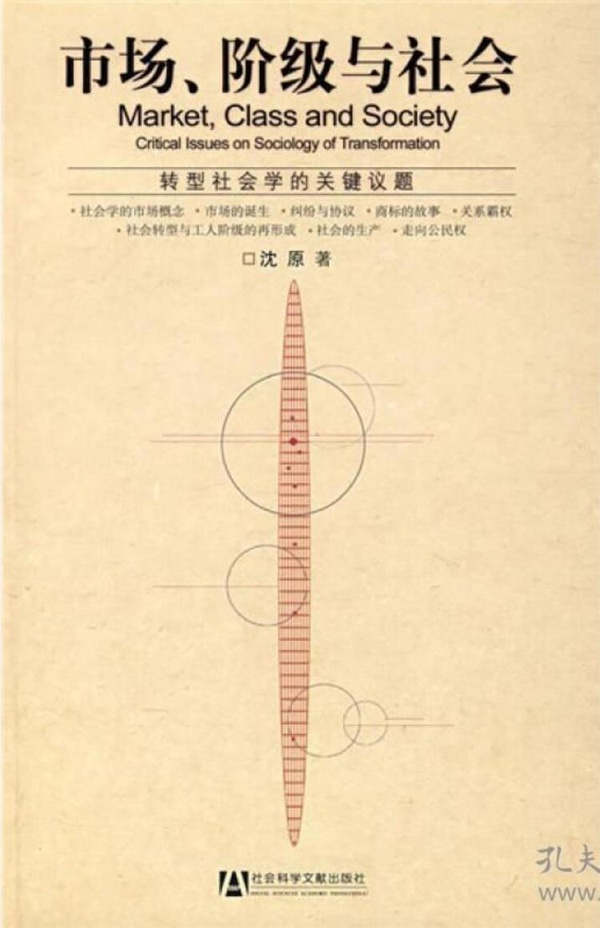
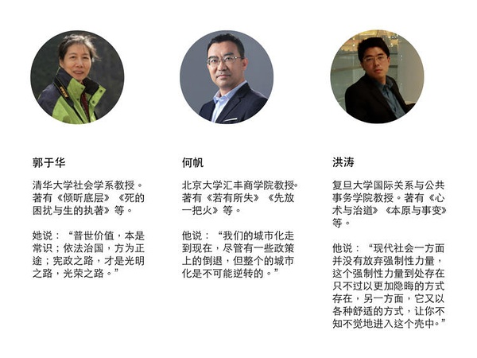
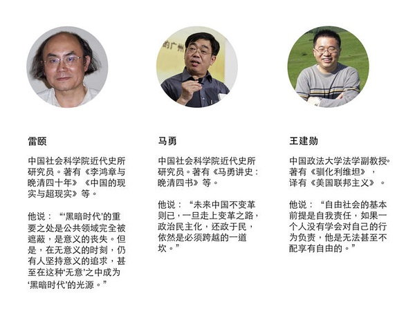
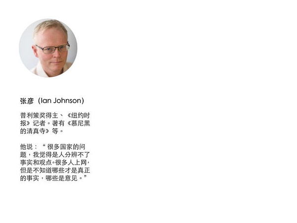

#关于阶层固化和社会割裂，应该了解什么？ | 我们如何与未来相处⑩

 [好奇心日报](http://www.qdaily.com/)  2018-06-23 06:07:26

本文作者： 曾梦龙

**“有时候，关键不是去改变世界，而是去解释世界。”**

**在某个关键时刻，关于如何解释这个世界，如何与未来相处，我们需要听听睿智、独立的声音。**

**我们邀请了经济学、法学、社会学、传播学等领域的 20 余位专业人士，回答了我们的问题。**

**问题纷繁而且复杂，但与年轻一代的未来生活息息相关。被访者希望，留给未来年轻一代的这个世界运转良好而且文明进步；在复杂而且迷茫的世界中，保持独立与理性。**

那个长期以来的问题，中产阶层究竟在多大程度上是现代社会转型的一个加速器，洪涛教授有不同的见解。他对一个精英主义倾向的中国有一种深刻的担忧。他说： “改革开放后精英主义起来了，发财的人认为我发财是理所当然，因为我有能力；做官的人认为我做官是理所当然，因为我是贤能；有文化的人看不起普通人，因为你不会讲英语，不是西方留学回来，你讲话讲不过他，学历也没他高。人格观念是泊来品，中国人传统上也较少有人格平等的观念。社会在整体上倾向于赢者通吃，强者优先。”

这种前景并非无先例可循，拉美化的社会就是一种。“多年前就有人说过，中国要提防拉美化。……在这种状态下，国家其实分裂为两个国家，其一是富人的、权贵者的少数人的国家，其二是沉默的、没有发言权的、相对弱势的多数人的国家。”洪涛教授补充说道。

王建勋副教授说，何止两个中国，发展阶段的巨大差异，实际上存在着多个中国。

如果不能解决社会断层、发展差异的问题，这会造成更大的割裂。

这种割裂实际上已经在更近的尺度内存在于我们的生活中。2017 年底、 2018 年初，深圳、北京等地同一个[小区内商品房与“自住房”之间的隔墙问题引发居民之间冲突](http://www.qdaily.com/articles/49581.html)，就是一个缩影。何帆教授论及此：“这个问题它不在于说那道墙，没有那道墙，大家在心理上也已经竖了一道墙。阶层之间缺乏沟通，公众之间缺乏相互理解，这是个事。这个事政府解决不了，政府把那个墙竖起来，还是把那道墙拆掉，都解决不了问题。这个问题的根源在于缺乏（沟通和理解），本来应该是互相之间谈判最后解决的。（但）大家又没有这种谈判的机会，彼此之间都有自己的自私、傲慢、偏见，这个就很难办。”

阶层固化、社会割裂，这是一个结果。多位学者将目光投向城市化过程、对城市化的理解、城乡二元对立的现状、违反经济和社会发展规律的逆城市化政策……所有这些问题共同造成了眼下的结果。

一方面是担忧破坏中产阶层——这个社会稳定器的自身是否稳定，另一方面则是中产阶层是否能承担促进社会现代化转型的功能。某种意义上，城市化问题成为其中的一个最重要节点。

这可能需要更长久的时间。

社科院研究员雷颐认为，中国的改革开放才 40 年时间，中产阶层真正形成或者被提及也是近年才有的事。40 年前，中国的民间社会还很弱小。“目前从经济或者各方面来看，还是处于一个初发期、萌芽期，真是小。它要长成一个比较大的时候，还要假以时日，包括对自身的责任、权利、意识。”他说。

美国记者、普利策奖得主张彦（Ian Johnson）要乐观一些，作为长期驻德国和中国的记者，他既研究德国，又研究中国。他以德国的现代化进程为例子说：“ 1848 年有个革命，全欧洲的革命。这些保守主义的反动分子（reactionaries）一直有，但那时候失败了； 1870 年，德国统一，他们也失败了；一战以后，魏玛共和国也失败了。但慢慢成功了，可能是 100 年以后才算成功。 1949 年，西德才建成了德国历史上唯一一个比较稳定的民主政府。不是说中国也需要 100 年，但是这个东西，有的时候时间比我们想的要长一些。”

“长期来看，富有、受教育程度高的公民，国家用简单的方法是不太容易控制的。但我现在觉得这可能是一个很长的过程。”张彦对《好奇心日报》说。

>**【1. 发展阶段的差异，让中国呈现多个形象】**

**王建勋  中国政法大学法学副教授**

我们有好几个中国。这是大城市。如果你再到那些二线城市、三线城市，那又是一个中国。如果你再到那些小县城，那又是一个中国。你再到农村、再到中西部农村、西部最穷的农村，那又是一个中国。我们有很多中国。

我也有这种感受。与 1980 年代、 1990 年代比，现在好的大学里来自农村的孩子可能越来越少。当然，我也看到一些相关的实证研究，一些调查也证实了这样的一种看法，确实如此。

这毫无疑问是非常糟糕的一件事情。为什么会导致这样的一个后果？其实在我们过去这 20 年当中，大量资源集中在了这些大城市、这些好的地方。如果你生活在大城市，你会接受更好的教育，你更有可能上北大、清华这样的学校。当然也因为招生制度不公平所造成的，它本来就对这些城市招得要多，比农村里边（多）。

我觉得诸多原因造成了这样的一种结果，包括投入不平衡，城市的学校比农村的学校要好得多。如果说 20 年前 、 30 年前差别还没那么大的话，今天差别可以说非常非常大。因为城市里有更多的资源，我们大量的资源都投入到了城市里面。城市里马路建得很好，楼很高，地铁很多，农村里什么都没有，投入严重不平衡。这种人为的原因导致农村孩子们接受的教育更糟糕，机会当然就更少。

还有一个原因，可能这些农村的孩子从小就是留守儿童。他们没法跟父母生活在一起，爷爷奶奶根本无力关心他们的教育问题，他们自己也没受过什么太好的教育，也没有精力去关心孩子的教育问题，就造成了这些孩子学习可能普遍不如城市的孩子好。

我觉得问题非常多，各方面可能都需要改变，才能够扭转现在这种局面。多年前我就跟外国来的一些教授、朋友说，不要因为来了北京、上海、深圳，你就知道这是中国。这不是，这只是中国的一部分。我们有好几个中国。这是大城市。如果你再到那些二线城市、三线城市，那又是一个中国。如果你再到那些小县城，那又是一个中国。你再到农村、再到中西部农村、西部最穷的农村，那又是一个中国。我们有很多中国。

>**【2. 为什么在一个常态下，没有战争，没有其他问题，能够停止高考 12 年？】**

**马勇  中国社会科学院近代史所研究员**

对知识的尊重应该是人类的一个普遍性，是人类的一个天性。尊重知识，尊重有知识的人是人类的天性。但是在 1949 年后，我们确实经历了这么一个人类历史上的反常过程。

“新教育”在 1949 年之前，我们可以看到，在北洋和国民政府时期，给中国造就了一大批人才。而这批人才我们今天去分析一下，就是民国时期的大学生、高中生、初中生，从“新教育”产生出来的各个层面知识人，你可以看到，他们来自于社会各个阶层，并不（只）是来自于家庭优良的中产阶级、先富阶级、资产阶级，不是这样的，也有来自底层的。来自底层的，第一代人可能就考一个初中，可能就读一个高师，这种免费的师范教育，或者只读到了教会学校，因为教会学校也不要钱。那么在民国时期，这才使得中国的社会阶级开始有一个很大改变。

到 1949 年之后，毛（泽东）反智的思维出现。他对知识有一种很不以为然（的态度）。从最高统治者（的角度）来讲，这在中国历史上，在人类历史上，从来没遇到过的。

我读中国史还是比较细致的，我们没有遇到一个统治者，怎么对智慧带有这样一种很瞧不上的姿态？我没看到过。人类历史上也没有这样一个统治者，怎么能够讨厌知识？因为当时给我们传递的就是什么？那句话怎么讲，意思就是有知识的人可能是最低贱的（注： 1958 年 5 月 18 日，毛泽东为丹东市五一八拖拉机配件厂写了批语：“卑贱者最聪明，高贵者最愚蠢”。），就“知识越多越反动”这样一种价值观。

这是人类历史上没有出现过的。对知识的尊重应该是人类的一个普遍性，是人类的一个天性。尊重知识，尊重有知识的人是人类的天性。但是在 1949 年后，我们确实经历了这么一个人类历史上的反常过程。那么这个反常过程是什么？就是把民国时期给中国积累的人才逐步消化完。

大概等到江泽民、朱镕基退出政治之后，其实民国所留给中国的人才，包括自然科学的钱学森、人文科学的季羡林，这一拨人去世之后，就是民国所积累的给中国留下的遗产，基本上也全部结束了。后来我们自己培养的，就到了我的老师辈，大概都是 1950 年代读书，到了受“文革”影响，“文革”之后开始恢复，那么这一拨人现在也都到了垂暮之年。这一拨人接受的是 1949 年之后这种新的意识形态教育，也经过了 1950 年代的政治改造和 1960 年代的政治风波。但是他们有一点，这一代人是亲历了民国的学人，毕竟他的老师还是陈寅恪，还是一拨来自民国的老师。它使社会在这个过程当中，还能够保持某种对知识的（尊重）。

（再后来），我是高考恢复之后前三届的。高考恢复之后，才使中国真的在 1949 年之后，重新回到一个常态国家。今年高考恢复 40 周年，有人找我访谈。我说，我们不仅应该纪念高考恢复40周年——它使我们获得了读大学的机会，我们更应该反思：为什么在一个常态下，没有战争，没有其他问题，能够停止高考 12 年？12 年耽误了多少人？我在一篇文章算过，按照当年的报考和录取数，我们耽误了大概 600 多万人。这 600 多万人是可以接受高等教育，而没有接受高等教育。这个东西就很荒唐了。

恢复高考使得中国重归了常态国家。但是我们可以看到，后来慢慢又出现了一个扭曲。这个扭曲就是：不（关心）社会整体进步而片面发展经济，导致（进入到）一个人类历史上从来没有过的荒唐（时代）。经济增长压倒一切，对知识结构、知识财富的不上心，不尊重。世界上 200多个国家，我觉得可能也只有我们是这么一种状态。中国社会出现了很大问题。

那么，本来这个时候，高考对中国相当一部分有产者来讲，已经成为鸡肋，有和没有实际上都无所谓了。你注意到没有？我的观察，最近十年，高考对中国的中产阶级、先富阶级、官僚阶层，已经不是问题。他们的孩子都在国外留学。中国的教育搞到这个样子，本来就应该反思：为什么（这些人不愿意让自己的）子女留在国内接受中国的教育？我们和世界教育的差距在哪儿？为什么我们愿意把孩子送到哈佛去，而不愿意送到北大来？

这个反思就应该去改善我们的教育，恰恰我们下面是走扭掉了。到中国来留学的外国学生、港澳台学生，可以不上政治课，可以非意识形态化教育，没有意识形态地传授知识，但是国内的平民子弟，来自底层的，对社会观察已经很清楚。什么叫幸福？什么叫痛苦？他们都很清楚，结果还一天到晚灌输那种令人生厌的政治信条。这时，我们的教育本身就很荒唐了，很扭曲了。那么，这种很扭曲，再加上现在整个社会用工，大规模人才流动当中，又限制身份。

这一系列事情导致就回到你问题的主题——社会的固化。本来高考、做工、流动人口才使这个社会充满活力。有活力的人、有办法的人、有想法的人到城市中打拼。城市是流动的。之后，社会结构就该“告老还乡”。发展农村，让农村重新自然地活起来。结果我们现在整个把这个都扭掉了。

>**【3. 城市化的过程，本来应该是中国国民素养得到改善的过程】**

**马勇  中国社会科学院近代史所研究员**

对家庭来讲，可能他在北京打工 20 年，那么可能他是打工第一代，但是他的第二代在 20 年后，可能通过高等教育就改变了自己的命运。整个国家才能在这过程当中得到进步。

（关闭农民工子弟学校）就是逆历史潮流了，逆工业化、现代化、城市化的潮流。城市本来应该是最大限度接纳外地人口。如果不是后来中国发生国民革命、共产革命，我们今天中国人口不论达到多少，现在 80% 的人口都应该在东部、南部沿海这些城市群当中。20 世纪初全球性的民族主义运动崛起使我们错过了东部经济带的发展。后来我们又不懂这种布局，去开发西部，反而是越弄越糟糕了。这样使我们的贫困人口、没有知识的人口比重一直很大，越来越大。

在工业化和城市化过程当中，人口一定会向城市流动。这种流动应该是政府不能管制的流动，应该是一个自然的、（需求导致的）市场流动。这种市场流动，政府能够做的，就是政府拿税收去调剂，比如给农民工子弟学校补贴。如果你聘请一个正儿八经的师范毕业的学生做老师，我给你补贴多少钱。台湾就是这么做的。为什么今天台湾教育能够冲到世界前茅？就是因为在过去几十年当中，政府一直在对教育实行引导式补贴，你办教育，政府支持你。如果你办一个中等教育，从国立大学聘请一个教授过来，这个钱政府来出。我当年在台湾教书，专门了解过这个事情。现在我们完全都弄扭掉了。

本来城市化过程中，应该是中国国民素养得到极大的改善。改革开放之后，农民工、打工的、做生意的，他们的后代，城市都应该尽最大的限度、最大的可能给他们土地，办学校，让他们的第二代、第三代经过这种教育的城市化改造，逐步城市化，整个国民的素养才会改变。特别在经济下行、经济不好的时候，更应该（这么做），甚至可以把它作为稳定城市正常运转的一个经济性手段。不应该是赶回去，而是应该把这些人请进来，（让他们从农村）把孩子带出来。你在北京卖菜，政府就应该帮助他在附近盖学校。

政府应该提供一个标准，学校的标准应该达到我的每个标准。像台湾一样， 1980 到 1990 年代，台湾的教育就是制定教育的标准。你办一个什么样的学校，应该达到有什么程度毕业的人在这儿当老师。如果你聘请一个北大毕业的到这里当老师，政府给你补贴，每个月给老师补贴多少钱。这样才能把学校办好，经过 10 年、 20 年，一点一点，整个国民素养才能改变。

对家庭来讲，可能他在北京打工 20 年，那么可能他是打工第一代，但是他的第二代在 20 年后，可能通过高等教育就改变了自己的命运。整个国家才能在这过程当中得到进步。

中国的底层教育应该是这样，通过城市辐射、城市吸纳，城市把农村人口逐步城市化，这是一个（方面）。另外，因为我们没有竞争，只有统一管理。从幼儿教育一直到高等教育，我们都是来自于一个模式，一个权力系统授权，这是不好的。这是教育落后，也是教育没有活力很重要的一个外部原因。

因为什么？因为我们看民国教育和国外教育，为什么好？比如我们看美国的教育为什么能够出现多的奖项？给人类做那么多贡献？因为他的学校的格局是多样性的——教会背景的、基金会背景的、国家拨款的、公立的，各种性质都保留。我们民国时期的教育，来自于省内的、国立的、教会的、民间的，都有。南开大学当年是自己筹集资金、清华大学靠庚子赔款、北京大学是政府拨款、燕京是教会的钱、圣约翰是教会的钱。这些学校来自不同的拨款系统，它才使这个学校和另外一个学校（相比），办出自己的特色。另外在竞争比较当中，学生考虑说我为什么考北大？ 我为什么考清华？他会有一个价值认同。我们今天是毫无比较，只是在讲程度差别，（比如）北大国家拨的款多，所以老师、学生往那儿集中。

这是很糟糕的。

>**【4. 中国社会的拉美化、精英主义趋势值得警惕】**

**洪涛  复旦大学国际关系与公共事务学院教授**

在这种状态下，国家其实分裂为两个国家，其一是富人的、权贵者的少数人的国家，其二是沉默的、没有发言权的、相对弱势的多数人的国家。

自 1990 年代末以来，中国社会不断往精英主义方向发展，这是一个趋势。在一些电影中，一些社会边缘人群，比如同性恋、胖子，受到了嘲笑，他们的形象被丑化。普通人，非成功人士，在整个社会评价体系中的地位是很低的。这是中国自 1990 年代末以后的一个非常明显的发展趋势。

精英阶层和普通民众之间的距离不仅在扩大，而且在不断加深、加固。我以为这是一个值得关注的问题。但是，这个问题的出现并不奇怪，合乎中国自身的社会、政治、经济的发展逻辑。原因很复杂，一个方面当然跟经济发展阶段有关。改革开放初期，大部人的家底都差不多，但现在不同了，因为积累不同，拉开了距离。其次，在 1980 年代，一个人可以白手起家，不必有较高的文化水准，未必要受较好的教育。现在这样的情况就比较少了。从政策层面来说，改革开放以来的国家政策，总体倾向于拉开距离，当然，这有利于对财富创造的激励，但是，也使富的越富，穷的越穷。

从中国固有文化的角度看，平等不是中国的主流传统。平等观念进入中国是在20世纪初，而影响较大的，也就是在建国后的前三十年。改革开放后精英主义起来了，发财的人认为我发财是理所当然，因为我有能力；做官的人认为我做官是理所当然，因为我是贤能；有文化的人看不起普通人，因为你不会讲英语，不是西方留学回来，你讲话讲不过他，学历也没他高。人格观念是泊来品，中国人传统上也较少有人格平等的观念。社会在整体上倾向于赢者通吃，强者优先。这从一些小事就可以看出，道路总是优先满足汽车通行，其次助动车，其次自行车，最后行人。单位要提拔一个人，所有的资源、荣誉、机会都集中于他，保证他要与其他人拉开距离。结果自然是，有钱的更有钱、有权的更有权、有文化的人更有文化。权贵的后代，总体上会受更好的教育，有更广泛的人脉，有更多的机会，往往也更会做人，因此，在起点上，他们就与普通人家的子弟拉开了距离。总之，已经获得的优势，将积聚成更大的优势，而一旦有微小的劣势，也会变成更大的劣势。

这样经过若干年之后，社会的分层就很明显了，而且，上下两层的距离越来越大。财富在集中，权力在集中，文教资源也在集中。金钱、权力、文化都在向着上层汇聚。近来盛行“贤能论”，有财有势的人，还要证明他们之所以有财有势，是因为他们德行高的缘故。这样一来，普通人真是永世不得翻身了，他们的穷和弱，还要表明他们的德行的缺乏。这是权势集团同时握有文化霸权的一个活生生的例子。说来真很悖谬，在柏拉图《理想国》所设想的一个好国家里，德行高的统治者是不能营家室、不能蓄私产的。对照一下就不难明白，现在的这种德行等级制(贤能制)是怎么回事了。一段时间以来，中国人喜欢批评新自由主义，其实，在某种程度上，中国倒是很新自由主义的，而且是一种极其精巧的新自由主义。

多年前就有人说过，中国要提防拉美化。一方面，是一小部分占有大量财富和握有政治权力的人，他们(至少他们的第二代)往往还拥有西方教育背景，他们独立地构成一个“经一政一教"三位一体的圈子。他们是国际化的，是两头在外的，是超国家的。另一方面，是地方化的大部分普通人，包括城市的中、小白领和大部分农村人口，他们无论在经济、政治，还是在文教方面都没有什么发言权，是沉默的大多数。他们是被动的、认命的、消极的。在这种状态下，国家其实分裂为两个国家，其一是富人的、权贵者的少数人的国家，其二是沉默的、没有发言权的、相对弱势的多数人的国家。

>**【5.中国财富阶层固化的根源】**

**洪涛  复旦大学国际关系与公共事务学院教授**

中国当前的阶层固化及其状况，与西方 19 世纪中期之前的资本主义国家的情况颇为类似，即权力、财富、文化高度集中于同一拨人身上。

现在扶贫政策当然有助于贫困人口的脱贫，但效果是有限的。沿海地区，城市里头房价涨一点，扶贫的那些东西算什么。现在的格局是，已经占据优势的，随着发展，优势会更大。以前邓小平讲“先富带后富”。现在先富的人，因为他的领先而变得更富。他迈一步，你要迈十步，或者，百步，你怎么跟得上？

西方为什么能够消灭贫困？为什么能消除贫富两极分化？一个重要原因是政治制度。因为穷人被赋予了政治权利，得到了政治权力。马克思就曾经这样评论西方国家的普选权：由于有了普选权，国家作为国家，就宣布私有财产无效，就以政治方式宣布私有财产被废除，他引用汉密尔顿的话说：“广大群众战胜了财产所有者和金钱财富。”在普选制下，富人在财富上的优势，被他在人数上的劣势限制了。中国的富人固然也没有投票权，但是，他在财富上的优势很容易使政策倾向于他，更不用说中国的财富往往与权力勾结在一起。中国的普通人处于双重无权的地位，既没有政治权力，也没有经济权力。其实，对普通人来说，民主比所谓社会主义政策来得更重要。民主给予他们以权力，他们可以通过所拥有的权力改善自己的处境，而社会主义政策只是使他们被给予，他们被动地等待别人的恩赐。

中国当前的阶层固化及其状况，与西方 19 世纪中期之前的资本主义国家的情况颇为类似，即权力、财富、文化高度集中于同一拨人身上。它们的这种状况，随着 19 世纪中叶起的普选权的确立、社会政策的实施而开始改变。普选权的确立是关键。因为有了普选权，政府的政策才能在根本上倾向于作为大多数的普通人，而不是少数权贵。

总之，中国财富阶层固化的根源在于权力的固化，即权力集中于少数人手里，大多数人处于无权的、被动的、消极的状态。极少数人操持着一切。无权的多数人，只能靠政府的一些善意，但是，这很靠不住。掌握政、经、教权力的人很容易结成联盟，交换彼此的优势和利益，使各自的利益倍增。从根本上看，他们同出一源。精英之间总是惺惺相惜，要这些权力哲学的信奉者来垂顾沉默的、无势力的大多数，总是很难的。

>**【6. 城市只想解决劳动力问题，不解决农民工进城生活问题，结果制造出更庞大的畸形社会】**

**郭于华  清华大学社会学系教授**

一个家庭，正常的家庭生活都没有。父母子女之间、夫妻之间，一年能见上一面就不错了，这都叫什么生活？你可知道中国有 2.7 个亿农民工，也就是差不多有 1/6 人口处在这么一个状态下，任何社会都难以想象。这社会还能这么维持。

大家都看到了农村在凋敝，其实也越来越意识到它根本症结在什么地方，但就是推不动，就是没有办法。农民对土地没有根本的权利。

农民对土地的产权是不明确的，说集体所有，什么叫集体所有？集体所有是谁所有？它必须要落实到农户、落实到个人头上，才真正归他所有。你看已经发生了多少案件，都是以集体所有的名义，其实是被抢夺走了。集体所有是不落实的。如果这个东西是我的话，它一定就得属于我，我对它拥有完全所有权。你有了所有权之后，才有其他权利。现在非得把这分开，说你没有所有权，然后只有什么经营权、收益权、使用权，那就等于没有啊！

各种研究到这儿就饶。这是个根本性问题。这个问题不解决，农村凋敝不可避免。现在大家都说农民，把他们看成不会过日子的人似的。农民有那么傻吗？农民比你们聪明多了，比你们有智慧多了。你只要给他应有的权利，他自己知道该怎么做，自己知道该怎么让自己过得幸福，这不是人的本能吗？

你非得说教他怎么致富，你让他集体才能致富，这么多年，你教出啥来了，对吧？人家本来是青年一代到城市打工，而且青年一代本身已经认同城市生活方式，你让他在城市工作，为什么不让他在城市生活？所以现在农民工问题其实非常大，而且它持续时间太长。大家原来觉得好像是一个有一定期限的过渡状态，然后这些人慢慢就城市化了。可是现在你都是人为的屏障，你就不让他城市化。你说这些年轻农民工，他们在城市能结婚吗？能在城市安家立业吗？能在城市教育、抚育子女吗？能在城市养老吗？这些问题你都不解决的话，你就让他们在城市干活，然后干完活，你们就回去。这怎么可能有解啊？这问题我们也说了多少年了。我们提出的叫“分割化的农民工生产体制”，就是你一代一代地生产出这样的农民工来，你只解决劳动力再生产，不解决它完整的再生产过程。这个过程包括他的家庭，保障，子女养育、教育……你现在还不让农民工的孩子在城市里读书！

可能北上广深这种大城市比较特殊，但是像有一些城市，比如成都早几年已经解决这个问题了。当时成都市的教育局局长是我大学同学。当然，农民工也抗争了，农民工堵路，他去处理。他说，我要作出承诺，保证不让一个农民工孩子失学。他们不光是教育，成都等于在城乡统筹方面做了好多尝试和努力。教育方面就解决了，所有孩子都可以公平地在城市里面（上学）。

当然，超大型城市可能会有你的问题，但是不是不能解决。你一刀切，就不许农民工的孩子在这儿读书，享受公平教育资源。现在整个农村教育资源跟城市就是两重天。（结果还造成）留守儿童问题。有些父母在城市里发展得还可以，他的孩子也在城市里读了小学、中学，但是高考又必须回到老家去。但有的人都离开老家好几十年，老家什么也没有，让孩子回去高考，那不是疯了吗？这些问题我觉得都要从根本上去解决，从制度上去解决，否则的话，你说你只从什么政策上调整调整、倾斜倾斜。不管用啊，不是根本解决之道。

今天你看新生代农民工，我们也做了好多年的研究。我都觉得他们的婚姻问题都特别令人焦虑。现在新生代农民工，尤其是在打工比较集中的南方，出现了好多种男女关系的形式——临时性的，搭帮过几天；一夫多妻的。他也不是正式妻，就是一个男孩，好多女朋友。

中国的这种现状，在任何一个正常国家都不可想象。一个家庭，正常的家庭生活都没有。父母子女之间、夫妻之间，一年能见上一面就不错了，这都叫什么生活？你可知道中国有 2.7 个亿农民工，也就是差不多有 1/6 人口处在这么一个状态下，任何社会都难以想象。这社会还能这么维持。

*（后续报道，陆续更新）*

**本篇报道涉及访谈对象：**

制图：冯秀霞

题图为纪录片《我的诗篇》剧照，来自：豆瓣