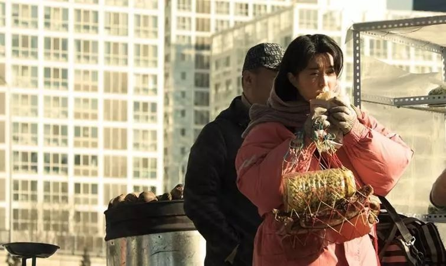
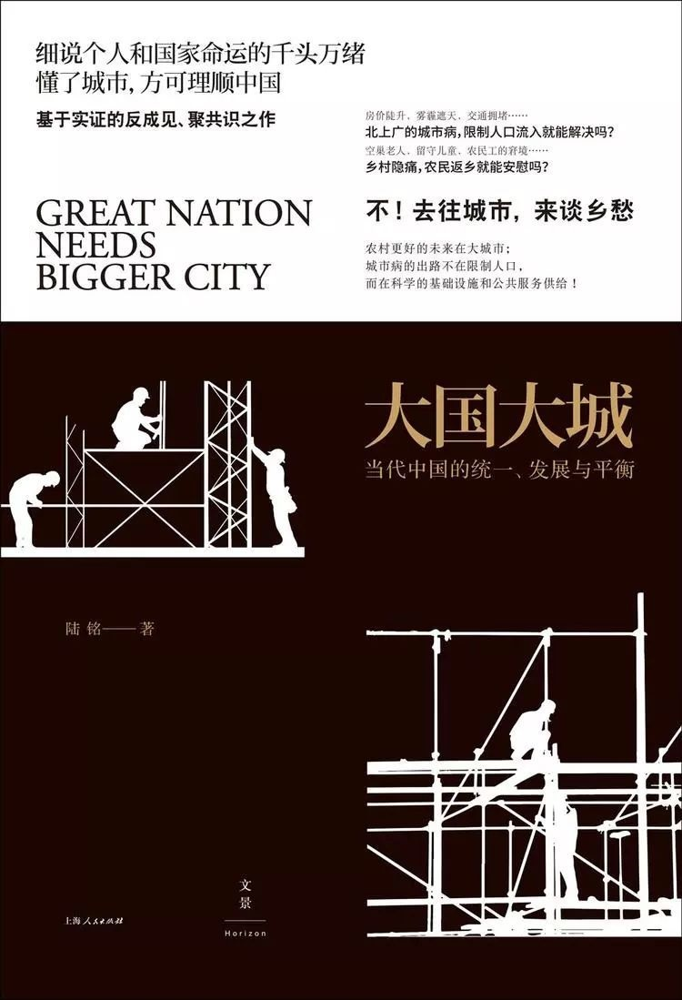
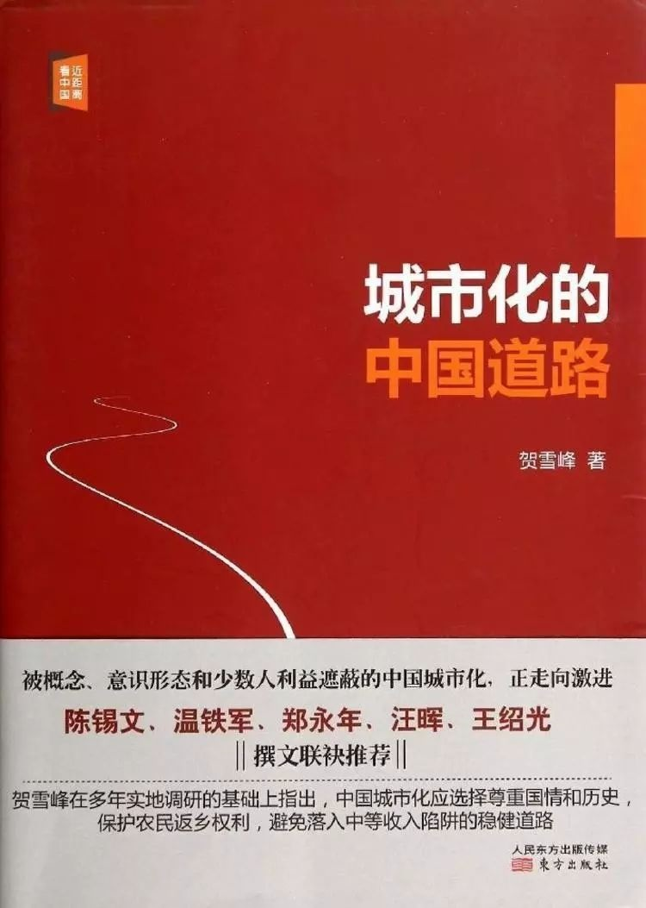
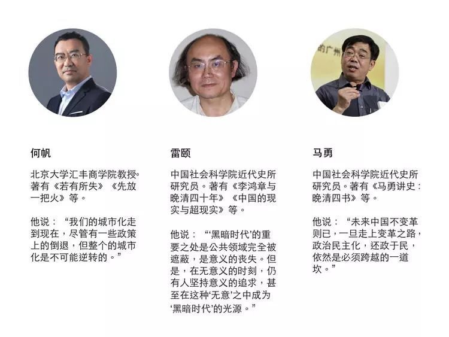
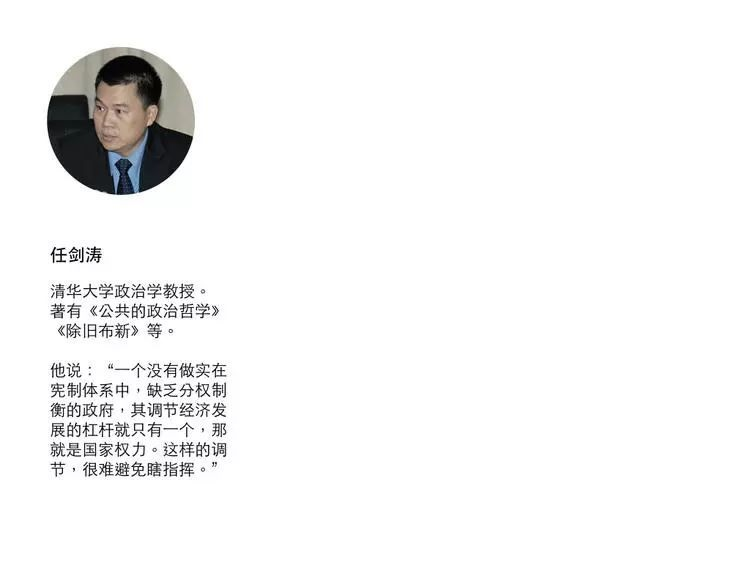

#如何减少阶层固化，建构一个向上流动的社会 | 我们如何与未来相处⑪

 [好奇心日报](http://www.qdaily.com/)  2018-07-01 20:44:09

本文作者： 曾梦龙

这一篇可以告诉我们的是，关于未来，我们应该避免的错误，作为一个庞大的经济体，任何的一个微小的错误所产生的破坏力可能都远远超过它弱小的时候。

社科院研究员雷颐讲了三个他了解到的事实，一个是他在农村看到的，一个农民工可能只有在深圳、北京这些大城市打工以后，才有钱回家盖房子。“在老家干同样重的活，再怎么干活，盖房子也非常困难”；另一个是意大利一个小镇上所有年轻人都立志要到米兰、罗马去；第三个则是东京都的人口，除了大阪可以与之抗衡之外，其它地区很难再聚人口。

雷颐说：“一方面我们确实也很惋惜，农村在逐渐衰弱。所以有人提出来希望城镇化可以在家乡附近一些城市，不必跑到大城市。但是，实际上大多数而言，还是在大城市聚集得多，比如说苏州那几个工业园区容纳多少打工者啊，上海，北京，尤其深圳、东莞。”

他提到的这几个城市也是这一年多以来，关于功能如何定位、人口如何控制的新闻和矛盾比较集中的城市。

雷颐所说的就是城市化，确切地说是大城市化问题。

问题的另一面是农民、农村和略有涉及的农业——中国语境中的“三农”问题。

中国城市化过程与工业化过程一样会产生巨大财富，但并不是所有人都意识到这一点。

城市化的主体是农民的城市化，但往往在面对这个问题的时候——虽然在很多情况下我们已经自诩富裕——资源还是一个巨大的绕不过去的问题：城市饱和、教育、医疗、交通、养老……所有现存矛盾最终指向的都是稀缺问题。

这也是政策制定者——他们本身是城市既得利益者——更愿意选择导向阶层固化政策的原因。

在上一篇文章中，学者们指出的“两个国家”的担忧、拉美化担忧，深层原因无不是政策结果，这个政策结果形成的“中产阶层”或者“权贵阶层”共识，实际上是“既得利益者”的共识，它借助强大的话语权，正在日益成为全社会层面的共识。撕裂的社会正在形成。

这其中的代价就是放弃城市化过程中所蕴藏的巨大财富，以稳定为借口，行逆城市化之实，放弃未来发展的黄金窗口期。

本篇文章中，社会和经济学者从各自专业角度，介绍减少阶层固化的来自中国传统社会、已发展国家的经验；城市应该形成怎样一个生态系统；户口与城乡一体化之间的关系；政府如何配置有利于公平的资源；农业农村和农民问题的背后如何建立一个平权社会。

如何描述一个流动的、向上的、积极的社会应该是什么样子，我们应该拥有一个什么样的未来，这可能不是一件容易的事。但这一篇可以告诉我们的是，关于未来，我们应该避免的错误，作为一个庞大的经济体，任何的一个微小的错误所产生的破坏力可能都远远超过它弱小的时候。

>**1. 美国为什么二战之后没有出现大家预料中的战后衰退？**

**何帆  北京大学汇丰商学院教授**

（现在北京、上海等地关农民工子弟学校）就是一种很简单粗暴的做法。这种到最后就会使得实际上大城市活力下降。因为城市其实就是个生态系统。

一般来讲，增加底层流动性，一个要靠教育，一个要靠移民。但现在你看教育，都把底层已经封死了。农民现在从自己的计算来看，可能对小学和初中，他愿意投资。因为初中基本上就可以识文断字了，找工作没问题。但是高中，它更多是为了准备考大学，这个又有各种不合理（制度）。教育条件最好的地方，分数最低，等于竞争不合理。学费又高，然后现在就业又不好，所以大家就不愿意对这个投资。那解决这个问题，我觉得那是需要政府来。

美国为什么二战之后没有出现大家预料中的战后衰退？跟美国当时采取的政策有关。比如说它有《退伍军人法案》。如果你愿意上大学，国家给你交学费，所以一大批军人就去上学了。你上不了学，去上什么大专、中专，我也给你交学费。现在靠个人去交学费，通过教育来改善流动性，他已经交不起这个钱了，所以我们讲高中要普及就是这么个道理，但高中除了普及，高中到底教什么？怎么教？也是个问题。那么另外一个，人口流动性就是你必须要创造一个更适宜的环境，能够让农村人口长期待在城市。如何能够让他们留下来？相应这些公共服务就要跟上。户口制度、农民工的孩子去哪上学、农民工去哪里上医院，这些问题都要解决。

（现在北京、上海等地关农民工子弟学校）就是一种很简单粗暴的做法。这种到最后就会使得实际上大城市活力下降。因为城市其实就是个生态系统。生态系统里头，肯定是各种都有。有高大的乔木，有低矮的灌木，那还有苔藓和地衣。你不可能是说，我只要高端人口，不要**人口。它是个生态系统，它有高端人才，有低端人才，但他们互相支持。全部都是高端人才，北京全部都是博士文凭，谁给你倒垃圾？谁给你送快递？谁做环卫工人？不可能的。你必须得创造一个能够既让高端人口，又让所谓**人口都能够宾至如归的城市。城市就是一个海纳百川的地方，也不可能去搞歧视，所以这种都是反城市化、逆城市化的政策。

>**2. 中国古代成熟社会是如何实现阶层流动的？**

**马勇  中国社会科学院近代史所研究员**

我们去研读曾国藩、李鸿章等历朝历代顶尖非皇族身份的人，你会发现他上面三世祖、四世祖、五世祖可能就是个小秀才。一代一代人不断奋斗，最终可能会出现一个曾国藩、李鸿章、张謇。那么这样使中国社会的阶级和阶层不断调整，所以儒家讲“五世而斩”，就是社会阶层、阶级的变动性。

过去我在历史学讨论当中讲过，本来科举制度有很多问题，但科举制度确实在中国一千年的农业文明、传统社会，它使阶级处于一个比较变动的状态，底层社会的人可以通过科举，并不一定最后得到状元、进士，他考到秀才就可以改变身份，考到举人就可以影响周边好几十里路了。一个举人在农业社会影响力很大，那么对他家族的改变也非常不得了。我们去研读曾国藩、李鸿章等历朝历代顶尖非皇族身份的人，你会发现他上面三世祖、四世祖、五世祖可能就是个小秀才。一代一代人不断奋斗，最终可能会出现一个曾国藩、李鸿章、张謇。那么这样使中国社会的阶级和阶层不断调整，所以儒家讲“五世而斩”，就是社会阶层、阶级的变动性。

中国到了近代之后，我们引进西方教育体制。说句实在话，我们（之所以）引进西方教育体制，其实因为它就是一个现代社会所必需的东西。过去我写过几篇教育这方面文章，网上应该能搜到，关于科举变成新教育。

这里边实际上就是一个新的制度教育。新教育刚刚传到中国，中国人也很不满。我们是 1910 年代才正式开始新教育， 1901 年新政开始，才真正搞起来。但是到了 1920 年代， 1926 年的时候，梁漱溟就明确表示不满，退出北大。他认为现代教育制度是关于知识传授，缺少师生之间心灵上的沟通，缺少老师对学生一种整体性影响。梁漱溟 1926 年就退出北大，意味着对新教育的不满。这时候，新教育其实在中国只发展了 10 几年时间。

>**3. 一方面粮食进口，一方面农村土地抛荒，这是政策导向结果**

**任剑涛  清华大学政治学教授**

确实农村的土地经营也需要有一个崭新的政策，必须及时跟进。否则，整个农村将大大地被抛掷在中国发展步伐的后面，而变成一个中国经济可能高度不安全的动荡性因素。

因为在某种意义上，中国必须要走向大的、集约化的农业。农村的规模化经营其实就是集约化农业，而集约化农业现在跟我们农村土地经营来说是冲突。因为 1978 年，小岗村的农民就是要恢复土地承包制度。土地承包制度在大土地产权、集体产权的情况下，它有激发积极性的作用。

所以，小岗村的变化成了农村改革开放一个最重要信号。但是到今天来说，农村的承包制度，已经严重地妨碍了我们已经生根千年之久的土地产出。我们的土地产出是非常低的，有些人就把它解释一个自然原因，土地肥力丧失。其实这不是根本问题，而是土地集约化经营。因为我们的政策布局和城乡身份的二元政治，导致我们不能把农村土地集约化经营，提高它的土地经营绩效。所以，第三个就是农村现在如何走向一个新合作化经济？这是左翼朋友爱讲的名词。右翼来讲，或者从现代角度来讲，就是要走向一个集约化的农业工业化机制。其实两者之间可以共识。农村不能再有 40 来年，以家庭为基本单位的承包责任制来维持农村发展。因为我们提出粮食安全的情况下，已经表明农业、农村、农民不足以担当改革开放前那种社会和资源稳压器的作用。我们的粮食已经是需要大量进口。而另一方面，滑稽的是，农村这种土地承包责任制，导致在流向城市的时候，土地大范围地抛荒。我们 18 亿农耕地，究竟有多少抛荒？现在因为国家土地资源调查也没公布数据，我们也搞不清楚。但是我回到四川老家看，我父亲因为从农村出来工作，那么还会回农村老家瞧一瞧，基本上整个村子土地抛荒了，全部转移到县城里头。

乡镇基本上都已经是抽空了。所以这个情况下，确实农村的土地经营也需要有一个崭新的政策，必须及时跟进。否则，整个农村将大大地被抛掷在中国发展步伐的后面，而变成一个中国经济可能高度不安全的动荡性因素。

>**4. 户口并不是制约城乡一体化最重要原因，农民资本盘活才是**

**何帆  北京大学汇丰商学院教授**

穷人其实有资产，但他的资产如果不能够流转，就没办法变成资本。资本是可以交易的资产。财产的价值不是体现在所有权，而是体现在交易权上。没有办法交易，就没有办法发现价格。所以把所有权先放在一边，怎么着能够让他能够交易起来？

我们过去总是说户口户口，那这个户口的问题有误导性。因为要是在北京和上海，它是户口。在一线城市，户口卡着了劳动力流动，但是要到一些三线城市，户口本身不是问题。我们在浙江和福建调研的时候，那些三线小城市很愿意给农民工户口。因为户口其实就是福利。你要住在这里没问题，但是你没有户口，没有办法享受公共福利，那么这些三线城市说，我们很愿意提供同等的（公共福利）——教育、医疗、公共图书馆，甚至投票权，反正各种各样的我全都给你。对他们来讲，这也是理性的。因为你要吸引投资，必须当地要有充足劳动力，所以劳动力在哪里，资本就会跟到哪里去。但是再去问农民，说你愿不愿意放弃原来的农村户口，转到这些小城镇？他不愿意。为什么？他基于一个想法，我在农村我还有一块地，那块地万一啥时候，比如说拆迁了，或者是说，万一我干不动了，我回去还有一块保障。

所以我觉得，其实问题关键在于农村的土地制度。所以你要想解决乡村振兴，唯一办法就是生产要素的交换和流动。生产要素如果从劳动力角度来讲，农村的青壮劳动力到城市去，这基本上都已经走完了。剩下来一个，实际上就是，城市资本能不能够进入到农村？过去是没有办法进入，我过去干嘛？我没东西换。那么如果说，农村土地能够有更多流转机会，这时候可能就有一部分资本会进入到条件比较好的农村，这部分农村可能发展机会就会更大。另外，你不得不承认，有些农村它确实是不行了，那不行怎么办？不行，这就得政府政策兜底。因为有一些地方它本来生态就非常脆弱，也不适合农业或者牧业。你就只能通过国土保护，国家公园等等这些，用公共财政方式，然后把这部分地区、人口的问题解决。那么有条件的地方，我觉得唯一的办法，让更多社会资本能够进入到农村，然后这时候，你把农村这一部分盘活了之后，所谓城乡一体化才能够真正推进。

因为中国的土地非常复杂，它集体所有呢，但是你像宅基地这些，又都是农民自己的。甚至你在“三反”、“五反”的时候，农民宅基地的地契那都还在自己手里头的。所以它形式上是集体的，实质上，农民自己的土地、承包的地、农民的宅基地。怎么样能够维护农民的权利？这是很重要的。赫尔南多·德·索托（Hernando De Soto）讲，穷人其实有资产，但他的资产如果不能够流转，就没办法变成资本。资本是可以交易的资产。财产的价值不是体现在所有权，而是体现在交易权上。没有办法交易，就没有办法发现价格。所以把所有权先放在一边，怎么着能够让他能够交易起来？

比如说能不能够抵押？能不能够作为股权入股？能不能够有转让的权利？能不能够有出租的权利？因为财产权是有很多权利，你要把这些权利细分，然后把他能够在交易环节拿出来的这些权利，能够把它保护起来，它就能够流转。

>**5. 向上流动不光是是解决基本资格的问题，还有整个的资源配置**

**任剑涛  清华大学政治学教授**

社会向上流动本身需要有活性社会和社会普遍向上流动的良性互动。我们最近 20 几年的时间主要强调稳定压倒一切，你要去谋划一个活性社会的政策倾斜度和精力以及投入资源，都是有限的。

社会流动一般是有两个方向，一个是社会的平行流动。这实际上是中国 1954 年宪法，就肯定公民的迁徙自由。我愿意住哪里，就住在哪儿。而中国省区规划和籍贯强调都是限制平行流动。这个跟市场经济发展 40 年来的社会格局非常不适。

但往往更容易引起人们内心关注的是社会的纵向流动。纵向流动倡导的是社会向上运动，你刚才提到的问题就是社会向上流动的空间足不足够？渠道通不通畅？其实社会还有向下流动，但社会向下流动，这就是一个悲剧性社会。一般人们都不去讨论它。你说阿拉伯事件之后，很多社会动荡，中产阶级变成无产阶级，那就是恶性的社会向下流动。我们现在关注的还算是一个积极的话题。虽然有些党政机构的领导可能也不会喜欢，就觉得你讨论社会向上流动，好像我们就社会僵固了，阶层僵固，地位僵固，贫富僵固，是不是这样？不是的。其实首先肯定我们在讨论社会如何向上流动？这个话题是一个积极面的话题，不是讨论社会怎么向下流动，那么这个社会就烂掉了，我们对这个社会充满了怨恨。只要我们还在关注社会向上流动，证明我们还是积极心态，只不过觉得向上流动的渠道不够畅通，手段不够多样，效果不太令人满意。

因为对于中国来说，确实今天已经进入到一个社会向上流动的困难时期。原因在于，改革开放初期的社会向上流动之所以迅速，那是因为毛泽东的无产阶级文化大革命十年，使社会高度静态、静止化，基本没有流动。高考也取消掉了，底层社会只有通过非常勉强的工农兵学员推荐来改变自己的身份地位，但是因为办学规模的限制，工农兵学员的数目还不大，所以大家也不关心社会向上流动与否。那么通过 1978 年的高考，教育变成了社会向上流动最强有力的一个杠杆。万马争过独木桥，使得从 1970 年代末期到 1990 年代中期，完成了新的国家精英群体的建构。

因而从客观上来讲，向上流动的位置、空间小了。这个是客观原因，我们要承认。向上流动的代际交替完成之后，它使得空间趋于静止的状态。另一方面，当然更重要的是我们关注的是政策调整。政策调整空间越来越小，调整的主动性越来越不足。比如说高考在发挥它既有作用的时候，我们怎么样通过一个国家教育政策的精心布局，向农村、向社会底层倾斜？换言之，你得有录取比例保证，而我们这一点，政治上考虑不够。最近三五年，因为农村孩子通过高考进入塔尖大学的机会越来越少，引起了社会的广泛议论。所以像北大、清华等“985”高校群体才开始关注这个问题。

但是，关注的政策配置的细致程度显然是不够。比如说有多少硬比例，必须要是真的农村贫困人口，而学习成绩又好的，使他可以流动。这是不足。相应的匹配政策也不足，比如农村毕业的小孩进入党政机构，社会职位向上流动。学生只不过是解决一个向上流动的基本资格，你还有基本就业空间。那么，你对农村和社会下层不利的小孩，你有没有一个倾斜？这个就是所谓罗尔斯分配正义的两原则所强调，对先天不利和后天不利的人都要倾斜。那么，在政策布局上，相应的回应是非常复杂。在我们目前这种计划色彩非常浓厚的党政机构里头，很难做到这一点。而且由于我们的举国体制，我们的恢弘气势，是很容易体现出来，但是精细的政策不需要你恢弘气势，是要你用精细布局，是要做出扎实细致的工作。这个对我们现有政策的制定套路和实施套路是一个严峻挑战。

那么，第三个就是，社会向上流动本身需要有活性社会和社会普遍向上流动的良性互动。如果我们这个社会现在实际上通过强控，因为我们最近 20 几年的时间主要强调稳定压倒一切，你要去谋划一个活性社会的政策倾斜度和精力以及投入资源，都是有限的。

>**6. 深圳今天变成一个成熟大都市，它的排斥性也非常强烈了**

**任剑涛  清华大学政治学教授**

对于城市中产甚至权贵，他们的发展机会来说，因为太多，因而他就会对那些努力向上流动的人表示轻蔑，而这种蔑视心态是推动社会恶性循环的一个社会心态基础

在某种意义上，比如说我们不要举老城市，举深圳这种新城市，曾经让非常有事业心的领导，非常有创业冲动的草民，都云集深圳。深圳今天变成一个成熟的大都市，它的排斥性也就非常强烈。所以在这个时候，社会的一个动态性不足和向上流动的意愿，只是向上流动的那少部分人，他们的意愿，而不是整个社会公众的意愿，那么就变成一个恶性循环。

所以，要建构一个社会向上流动和活性社会的良性循环，才能够改变人们社会向上流动不足的负面影响，才真正去激发一个社会蓬勃向上，追求卓越，因而他才去追求向上流动的空间。你现在即使农村的小孩考上了大学，他可能也觉得未来的空间并没有敞开，他的发展愿望也不一定是足够。而对于城市中产甚至权贵，他们的发展机会来说，因为太多，因而他就会对那些努力向上流动的人表示轻蔑，而这种蔑视心态是推动社会恶性循环的一个社会心态基础。所以要遏制这样的负面的、恶性的社会心态，就只有通过政策调整和再次营造一个 1980 年代初那种改革开放活泼泼的状态，它就能够进入一个社会向上流动的愿望，和大家追求社会向上流动的状态，一个良性的循环。

>**7. 农民土地可交易能解决一部分土地产权问题，但核心还在于所有公民平权**

**任剑涛  清华大学政治学教授**

国家后续的对农民的职业培训和他们适应城市生活的一个系统政策布局和资源跟进，有没有考虑？看起来还是相对缺乏考虑。

对中国农村来说，涉及到问题非常复杂了。复杂在哪呢？因为中国的产权制度对于农村的安排，一说是有利，但利也可以说是不利。原因在于我们有国有产权、集体产权，还有公民个人产权。那么，农村的土地叫集体所有制，但集体所有制最重大的麻烦就是我们是集体所有，而按户分配使用土地。因此，对于农村来说，集体所有制在某种意义上变成准私有，但是这个时候，农村土地结构也导致了一个非常剧烈冲突的僵化结构。这也导致左右关于农村地权制度、土地流转制度和农村、农业、农民出路的 40 年论战。可以说在三农研究里头，这一直是困扰中国的问题。

这个冲突结构从哪几方面体现出来？第一，其实我们把农村从来没有作为整个国家政策筹划的一个组成部分。我们都知道，最近十几二十年来，中央每年的一号文件都是解决三农问题的文件。于是大家就非常兴奋地在欢呼，农业、农村、农民在中央政策里头有多么重要，但其实没有料到，专门制定三农政策的一号文件，它实际上是把农业从整个中国体系当中切割出来处理。即使他想有政策倾斜、资源倾斜，以及办事先后程序上的重视，但因为他让三农“脱嵌”了，不把它当成整个中国现代化变化当中的一个组成部分。因而，实际上三农问题即使发再多的一号文件，解决起来也是困难。这是让农村脱离了中国的整体。脱嵌，现在要重新把它嵌入进去，要在中国现代化变迁的一盘棋上来考虑三农问题。

第二，土地制度涉及到一个什么？就是一个工人阶级领导的工农联盟为基础的人民民主专政的政权性质。这个政权性质不仅是一个权力分割的问题，它涉及到我们国家意识形态的改变问题。你农民的土地要自由流转，变成私有制，而我们整个国体和政体那都是坚决反对私有制。所以研究三农问题，志在捍卫政党和国家意识形态的这一部分人，他也不是没有道理。你如果不在宪法层次上做一个调整，那你要把农村土地私有化，让农民能够流转，（这就是个问题）。

尤其成都当年就开展了这样的改革，土地流转制度（放）开，土地产权要开一个交易所。土地产权交易确实是一个方法。重庆模式是通过土地换楼房，或者叫土地换身份。你也可以进城来上楼居住，农民上楼，但是交出你的土地。这些可以说是（那批研究）三农（问题）、捍卫意识形态既定格局的人看出来，发现问题的关键所在。它事实上是在某种意义上，剥夺了农民的土地产权。因为农民除了土地可以作为它生产的依据以外，他没有到城市里来谋生的其他的手段。所以这个意义上，也很难说土地私有化和土地流转就能解决问题。因为农民上楼之后，农民的生存手段是什么？国家后续的对农民的职业培训和他们适应城市生活的一个系统政策布局和资源跟进，有没有考虑？看起来还是相对缺乏考虑。

所以，在这个意义上来说，所谓推动土地交易这一批，稍微被指认为靠右的这一批人，他有他的道理。如果农民在目前土地集体所有制，其实牺牲了自己的土地产权的情况下，换言之，村委会就代表了所有农民来签了向城市出让土地这些协议的时候，其实农民的集体土地产权并没有受到充分尊重。那么，右翼已经看到了，与其如此，我们不如把土地产权交给农民本人。他可以通过市场交易原则来实现他应当有的市场土地利益。

所以这个时候，地权的解释就会出现重大分歧。这也是我们在农村土地产权交易上曾经想有重大的突破。而后来因为左右的撕裂，以及我们在政策执行上的具体难度，以及农民接受情况，和我们不敢去承担农村、农业和农民三农秩序崩溃的后果，导致我们收手了。

那么，在这个情况下，第三个问题就凸现出来了。在我们整个建国以后的城乡二元体制当中，我们应当去怎么解决问题？一个是平等公民。从人的角度来说，身份的二元化首先必须要解决。我们是一个工人阶级领导的，工农联盟为基础的人民民主专政。宪法没有修改之前，首先要打破身份的二元化。我们是平等的公民，不能划分出高高在上的城市居民和只有土地产权，而产权又没得到周全保护的农村公民，而应当有一个中华人民共和国平等公民制度。这需要我们宪法层次上要做出调整。

第二个是产权细分。相应地说，在土地产权集体归属上，因为你是绵延了 1968 年的一个基本政策，因而要有历史感。什么样的历史感？要充分尊重农民集体产权当中，每一户和每个人土地产权的具体份额占有，而不能够由农村集体产权，由农村基层权力代表所有农民对土地产权的所有，而应当把产权细分。产权细分就要保证在农村生活，比如说男女，按我们传统惯例，男女产权也是不平衡的。女的一嫁出去，她就丧失了产权所有者。其实三农的左翼朋友从来没有考虑这些不公平，抽象地谈资源。农民产权有性别，有父子，有兄弟。这些细分的结构一定要搞清楚。农村的土地一定要产权细分，让每一个农民有切实的土地产权利益。

第三就是产权交易。究竟是趋向于大土地制度，还是要吸纳中国传统的“限民名田”？中国要有一个深入考虑。

本篇报道涉及访谈对象：

制图：冯秀霞

题图为电影《我不是潘金莲》剧照，来自：豆瓣