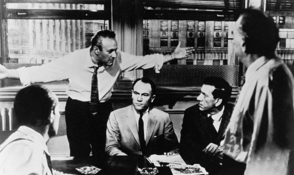
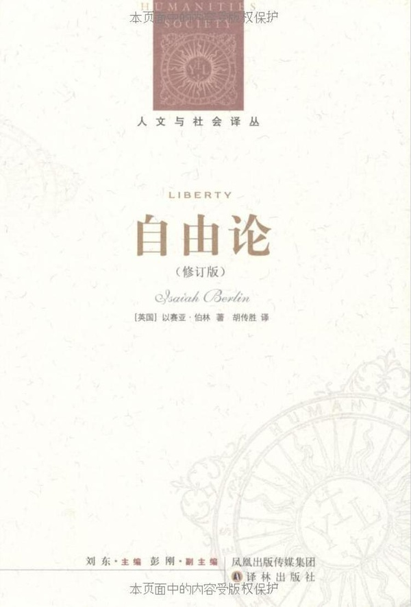
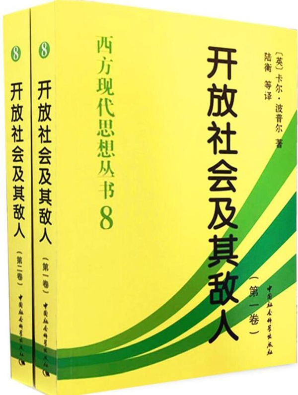
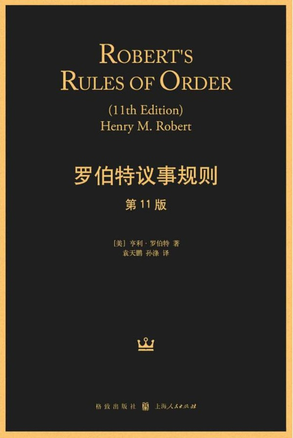
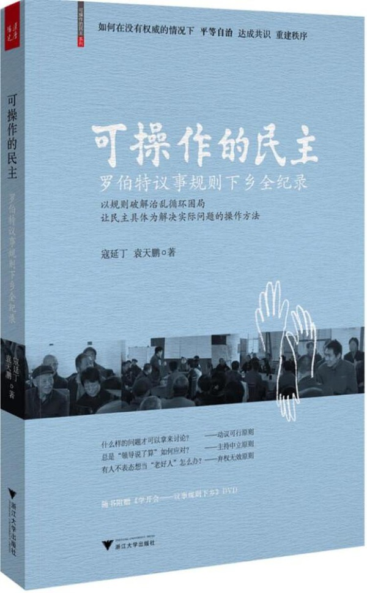
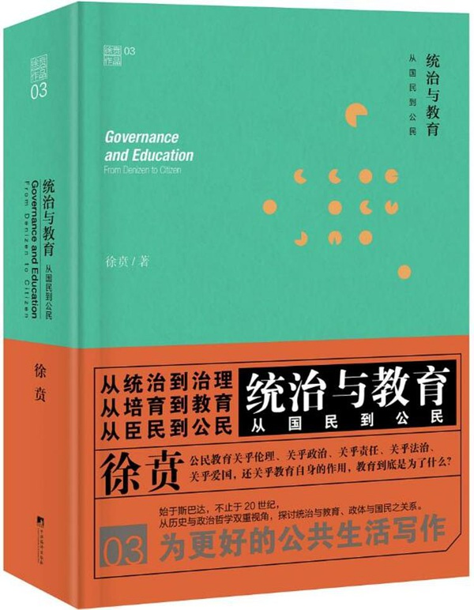
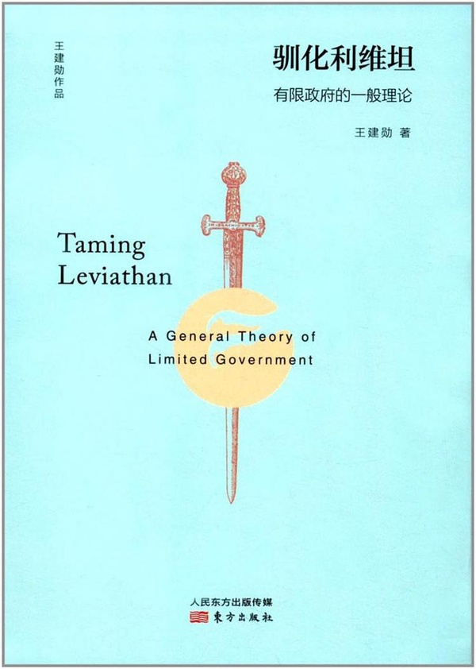
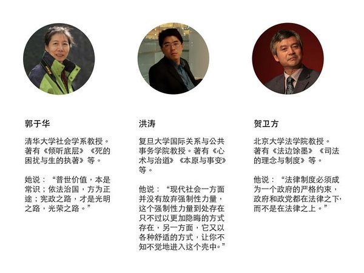
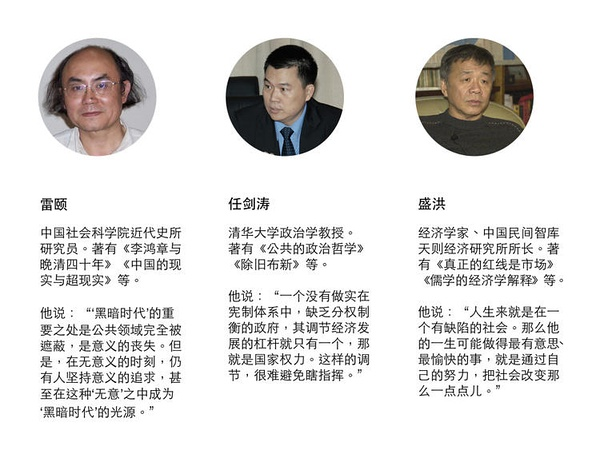
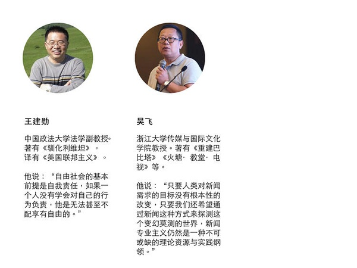

#如何培养公民意识，怎样才能建立健全的公共讨论机制？ | 我们如何与未来相处⑫

 [好奇心日报](http://www.qdaily.com/)  2018-07-07 06:07:53

本文作者： 曾梦龙

**“有时候，关键不是去改变世界，而是去解释世界。”**

**在某个关键时刻，关于如何解释这个世界，如何与未来相处，我们需要听听睿智、独立的声音。**

**我们邀请了经济学、法学、社会学、传播学等领域的 20 余位专业人士，回答了我们的问题。**

**问题纷繁而且复杂，但与年轻一代的未来生活息息相关。被访者希望，留给未来年轻一代的这个世界运转良好而且文明进步；在复杂而且迷茫的世界中，保持独立与理性。**

中国社会科学院研究员雷颐讲了一个故事。

几年前，北京计划将动物园搬走。最初被称为“万牲园”的北京动物园在兴建之初的清末处在标准的偏远郊区，北京城区范围逐步扩大，西直门外如今是寸土寸金的市中心，有人就打这块地的主意。这个搬迁的风一放出来，引起许多北京市民的反感，网上有很多讨论，最后就没搬成。

雷颐认为这是公共空间舆论影响政策的一个好例子，他说：“我觉得确实因为政府的治理，它人员有限，很多东西不能，也不可能伸展到每一个缝隙里面。恰恰这些地方就是民间社会所起的作用。有些事通过社会组织来对成员进行管理，那么，同样成员有什么事，有什么要求，也通过社会组织有序地进行一种反映，不是那种骚乱似的群体性事件。如果他相信这个组织可以有效地保护我，所以这种组织恰恰是承上起下。既把上面政府的意图灌输给下面的成员，同时成员有什么利益诉求需要保护的，这个组织也能够理性的、通过有组织的方式来反映自己成员的利益诉求。这是一个最良性的社会。”

雷颐把公共空间讨论称为“政府和公民之间的中间的一种减震器或者是传导器”，双向传导，这样有助于社会健康。

我们的问题大都围绕于这样的问题展开，这其中，有我们最初的担忧——很少看到有比较高质量的公共讨论，网上骂人和站队是主流。一个普通人，当他现在有网络空间可以表达自己看法时，我们除了站队、骂人，应该有什么规范？什么是好的公共讨论？

我们采访的学者多数都表现出乐观的一面：抱怨、极端、站队、情绪化甚至非理性、骂人都不足虑，在这个过程当中会有正确的思想形成。

当然，他们也有悲观的一面，就是这个过程当中，公共管理者应该扮演一个什么样的角色？

是否以自己的“浩然正气”压制不同意见的产生？所作所为是否有助于“思想市场”的形成？只有在充分交换意见的空间（市场）里，最优结果可能才趋向于出现。

当公权力表现出克制美德，公共讨论空间里相对弱势的那部分主体——我们每个普通人——可能要锻炼的则是独立思考、判断力、审慎地面对不同意见。

>**【1. 公共舆论空间如何表达的核心还是一个公共管理问题】**

**在游泳过程中学习游泳，前提是要先有水**

**贺卫方  北京大学法学院教授**

这种东西其实没有办法预先地去说。你是要在游泳的过程中学习游泳，在真正讨论过程中间慢慢地就学会了。

比方说，一个良好的判断力。你能判断什么样的一种言辞是可以信赖的？什么样的言词是表面看起来很诱人，其实是非常可怕的？有这种良好的判断力，我认为是所有教育追求的非常重要目标之一。同时呢，你也越来越会表达，会通过理性的方式，运用证据，用事实来论证你的观点。然后呢，才会写出来越来越具有可读性的一些文字，让人们非常喜悦的文字，才会知道如何跟自己观点不同的人进行商榷。

像这些东西都是属于在水里边学游泳，在做的过程中间才可以慢慢地学习。当然，我相信有些人可能一辈子也学不好，有些人可能很快就能够学得非常好。这取决于每个人的修养。从小的一种教养环境，以及后来的读书情况，都有关系。

（前提是要）先有水。

**成为公民，不是一句空话！**

**洪涛  复旦大学国际关系与公共事务学院教授**

照亚里士多德的定义，公民就是政治的参与者。他是在严格意义上使用参与一词的，即担任议事团议员、陪审团成员，参与政治审议、司法审判。因此，公民的意思就是做统治者。譬如，雅典民主采取抽签制、任期制，公民任职比例非常高。多数公民一生至少能有一次出任公职。苏格拉底并不热衷于实际政治，却也出任过议事团常设委员会的主席，相当于今天的国家元首，尽管任期只有一天。在古希腊，参与政治不仅是公民的权利，也是公民的义务。古希腊人所主张的，是一种积极的公民观。

现代公民观是消极的。公民的生命、健康、财产、言论、思想等等权利在宪法和法律中被规定，法治政府的意思就是要依法保护而不是侵害公民权利。政府唯一服从的应该是宪法和法律，否则它就是一个不法政府。

现代公民也有参与政治的渠道。如竞选公职（主要是政务类公职），但由于现代民主不取抽签而取选举的办法，大多数公民只能止步于公职：民主选举是一种选贤的办法，贤能只能是少数人，故多数人无缘任职。现在流行一种说法，大意是说中国特色式的由上级提拔任命的办法叫贤能制，由老百姓选举的方法不是贤能制，而是民主制，选举民主不是选贤。这是对基本的政治学常识的无知。现代民主选举，怎么不是选贤？所以，因为是选举，因为大多数普通人无缘于公职，古希腊人会把今日之民主视作贵族制。至于民选出来的人是否一定是贤能，不好说，这就好比专由上级提拔任命的人，也未必是贤能一样。两者的差别完全不在于是否选贤，而在于贤能由谁来选：中国特色是由党的领导来选，民主的办法是由人民群众来选。

参与政治的另一现代途径是选别人。少数人被选，多数人能选，这就是现代民主。西方国家自 19 世纪中叶起普及普选制，开始只有部分成年男子有选举权，后来逐步扩大到女性，最终不分职业、阶级、民族、种族。有人说，群众没资格选别人，因为他们是愚味无知的。在一定程度上，这未尝说得不是，法国在 1848 年确立普选权，当时占人口多数的是农民，农民中大多是文盲，他们选了路易.波拿巴。但是，普选权的真正意义在于认为人与人是平等的，尽管这是一种抽象平等，但相比于等级和特权，占人口大多数的群众终于有了一点发言权。可以说，普选制是群众路线落到实处的一种制度。许多现代政治经济制度和主张与平等相关，譬如“打土豪、分田地”、一人一票、公平交易、同工同酬等等，都体现为平等的诉求。

在现代政治的一般观念中，公民是国家的主人。但是，成为一个不是名义上而是实际上的主人，首先得有主人意识。这种意识不可能是天生的，需要塑造。一个国家里，每个公民都成为国家的真正的主人，那么，这就是一个主人民族。主人民族首先是民富民强。如果一国之中，大多数人是孱弱的、自私的、委琐的、奴颜婢膝的，国家再富再强，也是少数人的。中国自秦汉以来皇权发达，到明、清两朝臻于极致，天下只有帝王一人为主，其他人为奴，由此臣妾意识盛行。逢迎上意，名利兼收，于是乎有御用学者；草芥小民，视为忠仆，于是乎有酷吏。只是有主人意识的少。

在建国近 70 年后的今天，公民概念几乎恍如隔世。知识丰富了，能力增强了，未必有助于公民意识和公民实践能力的提升。由权力掌控一切、操持一切，民众自然只需自扫门前雪。仅仅二、三十年的时间，完成了对高度理性自利的国民的塑造，成就不可谓不大。让每个人逐其私利去吧，统治的事交给贤能。看起来很自由放任，但不是给老百姓的，而是给统治者的，若真以为能躲进小楼成一统，未免天真。

人心多倾向于自利，要能使之不只关心一己之利而能关心公共之事，离不开培养和塑造。民主是一种产生贤能的方式，也是一种公民教育的方式。一个人无法通过读政治书成为公民——政治学家们搞起民主来，未见得比一般人来得好；服从也不会造就公民——更能造就官僚；只有公民的政治实践，才能造就公民。但是虚假的公民政治实践，却让人习惯于政治的虚情假意，是培养政治冷漠主义的最好办法。

一种良好的公民政治习惯，如平等待人，尊重他人，在行使权力时的自重、自律、自制，对玩弄权谋的羞耻感，需要长期养成。倘若一个社会中缺乏公民共同体，好的政治习惯便无从培养。官僚组织是官场权谋的渊薮，能在官场中脱颖而出的人，不仅未必是一个好的从政者，而且很可能是一个玩弄秘密政治的高手。

**公共讨论的前提是有公共空间，国家应该让渡部分权力给公共空间**

**任剑涛  清华大学政治学教授**

公共讨论的前提是存在公共空间。因为如果没有公共空间或者公共空间收缩非常逼窄，公共讨论就失去了客观寄托或者叫物质空间，所以公共讨论的物质空间一定是公共空间，公共空间需要权力让渡或者承诺。所谓“让渡”是什么？就要承认国家权力之外，还有一个权力不及的地方，那就是公民们能够互相来讨论公共问题，提升公共政策品质，改善国家公共结构，推进国家公共发展，这些是国家权力有所不及的地方。

另外一个，对于国家来讲，应该让渡的同时，承诺公共空间。什么叫“承诺”？就是国家权力之外，有些事情只能由公共空间的公民们来自主解决。

所以在这种情况下，改革开放 40 年来的一个重要背景就告诉我们，让公民说话是一个紧要的事情。

**自我约束力，尤其是浩然正气在身的人**

**任剑涛  清华大学政治学教授**

公民们自身确实要有自我约束能力。因为中国公民发表偏激言论的空间比较大，尤其是做爱国生意的人，以为自己浩然正气，对别人颐指气使，然后横加指责，尤其以单纯维护权力，长期来说实际上是伤害权力的办法来捍卫。有的时候，我们甚至对“自干五”还进行权力豁免。

实际上，一个国家应当接受那些理性公民们对政策的拥护和批评。非理性的批评，价值有限。非理性的赞美，意义更有限。而目前管理部门和公民们在讨论问题的时候，好像尤其最近几年，没有接受这样的看法。似乎我站在权力的一方，我可以指责那些对权力进行批评的任何一方。

所谓让公共知识分子污名化，这应当是中国的一个悲剧，不是一个好现象。因为公共知识分子说到底，他不是在他专业领域里谈论他的专业问题，他是关注你我他的共同问题。他可能有得当的地方，也可能有失当的地方。公共知识分子并不是公共真理分子，他不负责给你传播真理。因而有错误的地方，大家互相指出，平心静气地来讨论。而“自干五”的权力职责和道德职责，其实并无益于维护真正的理性社会空间，所以在这个意义上，可能对公共知识分子一个更理性的评价，而不是让公共知识分子简化为“公知”，使他污名化，也是我们参与公共的讨论的各方，应当高度警惕。

**公共管理者更要警惕舆论群体极化**

**吴飞  浙江大学传媒与国际文化学院教授**

舆论群体极化，中外都是一样。因为人最大的问题都是比较容易接受自己欣赏的观点和人，所以一旦批评自己欣赏的东西，很多人都受不了。群体极化是挺难的一个事情，但如果慢慢形成这样好的氛围，就像罗伯特议事规则所强调的，我们比较真诚地去进入这个场域里面，按照一个规范程序去讨论，那就慢慢会转化。所以，我不那么悲观，也不那么乐观。

不那么乐观在哪里？这个过程一定很漫长。不那么悲观在哪里？还是有可能慢慢进步。作为一个有力量的机构，不管是民间组织，还是官方组织，要允许或者甚至培养公民理性辩论的能力，社会才有可能良性发展。所以某种意义上，从对共产党的领导来讲，你让别人都讲假话，不能够理性评论，对我们党一点好处都没有，哪一天出了啥事都不知道。因为每个人都说共产党好，但实际上心里在骂，那有什么好处呢？实际上是不好。要人家的声音能够展示出来，让我们随时听见，然后随时纠正我们在决策过程中间可能会存在的误判或者误断。这对一个党、国家和整个民族来讲，它都是有意义的，所以我觉得这是需要慢慢去推进的工作。

历史从来都是如此。言论管控越严的时候，其实不是中国最繁荣的时候。当年邓小平南方讲话，说要继续改革开放，开放思想。（比如）不管黑猫白猫，（捉到老鼠就是好猫；计划和市场都是经济手段，不是社会主义与资本主义的本质区别……）你会发现这就是一个思想解放。思想解放了，就促进了中国经济的繁荣，社会比较稳定。你越紧张的时候，它越不好。所以这是一个基本规则。因为你越是开明，思想、媒体越是自由，所透露信息越是真实的时候，我们的决策才越有可能会变得更科学。这是一个普遍规律。

>**【2. 建立起思想市场的可能性在于社会的形成】**

**偏激不可怕，解决偏激应该在“思想市场”中解决**

**任剑涛  清华大学政治学教授**

一个社会成长的时候，当被压制过久，它一开始一定有一个矫枉过正的过程。我就故意要跟你说一些很“陡”的话，但这个很陡的话，很偏激的话，它不是来自于你行政压制就不偏激。行政压制下来了，他只会更偏激，只不过是表现偏激的可能性更低了，但一旦表现出来，你无法收拾。

偏激被矫正的唯一可能性，是让偏激之间的意见在公共空间当中，在讨论中相互冲撞。这也是科斯在 100 岁的时候，对中国提出的善意劝告，要开放思想市场。我有很偏激的看法，在公共讨论当中，人家另外的偏激看法，我发现我接受不了，结果就发现两个偏激点了。两个偏激点，儒家的说法就出来了，叩其两端，执两用中。我就会形成一个比较好的公共舆论的讨论习惯，这个也是非常重要的。 

所以，治理偏激不是骂别人偏激。谁没有偏激？我们现在要问所有参与讨论的人。我们是肉身之躯，我们是七情六欲之人，所以我们都会偏激，但偏激要被其它的偏激所矫正，而偏激不能被行政权力所矫正，所以它一定要有思想市场来趋近于理性化。所以民主社会让公民们能够理性地讨论问题，也就是因为它形成了长期的公共讨论习惯。大家就相互知道我们不要太偏激。你偏激，你有了非常畅快的个人偏执情绪发挥，但别人也就会陷入偏执，你就不可能有一个良性合作的社会。

**动静愈大，愈引起重视？一个恶性循环。**

**洪涛  复旦大学国际关系与公共事务学院教授**

没有经历公民意识和实践能力的培养，突然要对公共事务发言，怎么发？消息不灵通，即使有所知，竟然被指点说要逆向理解。既然一切都似是而非、隐秘难解，自然就只能发发牢骚了。拿起筷子吃肉，放下筷子骂娘，出于不得已；无知，所以骂娘；如果只晓得吃肉，就近乎禽兽了。有人说，我们老百姓的素质这么糟，哪里可以让他们参与政治。不过，即便老百姓政治无能，也不是他们自己造成的，他们的政治能力得不到开发，是因为他们从来没有实践过政治。

老百姓愈被动、消极、无知，玩弄权力的人也就愈无阻碍，如入无人之境，老百姓也就愈被动、消极，两者互为因果。对小民百姓来说，倘若没有成为政治权力操弄的对象，真是万幸，小心翼翼地过他的私人生活去，一旦不幸被政治权力看中，或者连生活也过不下去，往往走极端。没有公共空间，更乏公论，上网叫一叫，无人理睬，或者，被封杀。为什么好走极端？想想大概还能引起注意，或者，只是绝望地泄愤。“小人穷斯滥矣”，君子摇摇头。

暴力是沉默的，低调的，无影无形、无声无息的，却足以让公共空间无法发声。它向所有人示范：暴力是唯一的声音。上行下效，这就是走极端的根源，就是滥杀无辜的根源。

**不要害怕，互动中会有有见解的思想产生**

**盛洪  经济学家、中国民间智库天则经济研究所所长**

这没法去要求别人（有高质量的公共发言）。我倒反过来说，恰恰是对表达自由的压制，反而会使社会的思想不够发展。不够发展，就没有什么很好的表达。可能就只是骂人和站队。只有这个社会可以自由表达，虽然在最初可能会出现一些确实不堪入目的文字、谩骂或者只是简单站队，但是，我觉得不要苛责，只要没有对别人有直接伤害，是不能限制的。但是，正是因为能够让大家自由的去发言，就会涌现出非常优秀的思想家、理论家，他们就可能带动社会往前发展。任何社会，推动社会的思想文化发展的一定是极少数人。

当然，你事先不知道这极少数人是谁，但是你有一个方法能发现他们，就是你要让所有人都说话，包括整天骂人的也要说话。这个时候，极少数最优秀的思想家就会涌现出来。他们出来以后，会带动这个社会。那些骂人的话，大家很快就忘掉了，不要介意。那些话是没有生命力的，不要害怕。甚至我们说，你骂人就是骂自己，只能表明自己很低劣。我为什么要介意？为什么要制止他？不要制止，因为他在损害自己，没有损害别人。

但是，同时我们就给了那些真正思想家机会。他们不仅是有思想，他们的思想是在跟别人的互动中才能受到激发，才会更有思想。假如你说他只是一个沉思冥想的人，那不够，必然是应该在跟别人的交流和互动中，甚至是辩论中，发展出、激发出那些思想来。所以，我觉得不要担心一时半会儿的，大家发言质量不高。完全不看就完了。

**警惕一个原子化的社会出现**

**王建勋  中国政法大学法学副教授**

没有信任的社会必然是一个一盘散沙、没有粘合性、没有办法采取集体行动的社会，这样的社会最容易被少数的专制者所统治。因为你们之间根本联合不起来，谁也不会信谁。高度信任的社会，很难专制，联合起来反抗是件比较容易的事情。

信任跟公共空间、公共精神有很大关系。假如一个社会没有公共精神、公共空间、公共生活，那么也就意味着每个人孤立地生活在自己的世界里。托克维尔讨论过这个问题，他认为在人与人之间身份地位平等的时代，每个人必然是孤立的。因为在贵族时代，平民都依附一个贵族。贵族其实把所有人联合在一起，我们都跟着他。他为我们承担一切责任，我们为他效忠、卖命。它具有这种非常强的纽带关系、人身依附关系。

但到了平等时代，我们每个人都是独立的人，我们谁也不欠谁，我们谁也不比谁等级、地位更高。那这样的社会，假如我们没有某种公共生活把我们联合在一起，我们每个人必然是原子化的。我们每个人都生活在自己的世界里边，不关心他人，不关心社会。这样的一个社会我们可以想象，它是非常容易被一些人自上而下控制着，专制是非常容易出现的。

很重要的一点，如果没有这种公共生活，也就意味着没有公民社会，只有私人生活。每个人享受着自己的生活，都吃得很好、喝得很好，但是如果要处理公共事务的时候，我们完全无能为力。假如说我们这里治安非常糟糕，有坏人来了，怎么样把这些问题解决？我们解决不了。我们就呼吁政府有更多的警察，更强大的军队。完蛋了。我们就必然受制于强人统治。我们不能自治，不能自己成为自己的主人。

当我们越孤立，我们越要求一个强大的政府来介入，越依赖于它，只有它能够帮助我们，只有它在我们眼中是强有力的，并且是一个永恒的存在，我们每个人都是转瞬即逝的。所以，它就彻底把我们每个人之间的纽带统统都切割掉，以至于我们相互之间没有关联。

一旦我们没有了公共生活，没有了相互之间的联系，你就不会同情、理解，和其他人合作。我干嘛要同情你？要和你合作？我根本就不关心你，我关心我自己。这会（给）一个社会带来极大的问题。当没有一个强有力的、强大的公民社会的时候，暴政就非常容易降临了。

>**【3. 我们对自己是什么样的要求】**

**先让思维正常，使用正常话语、从正常概念开始**

**郭于华  清华大学社会学系教授**

无非是读书和思考。读书要读对书，可别再读那些控制意识形态的书。你得读一些经典、常识这种书，然后也要读一些历史的书，不是伪历史。这些年也有很多很好历史研究方面的书。你得知道你身处其中的社会，怎么走到今天？怎么过来的？得读真的历史，知道这个社会是怎么过来的。我觉得这个很重要。

另外，要去思考。思考首先基于正常人的常识、常理、逻辑，这是最基本的。有这几个东西，然后你读了一些书，有了基本的、正常思维的一些训练，其实很多问题可以想得很清楚。所以，我为什么老说，以现实为基础，用常识去思考，用正常逻辑去思考。其实我觉得人人都能够明白、知道，这很重要。

你知道这个之后，要有一个基本的东西——你要意识到你是一个有自己权利的个体。你要知道自己有什么权利？不要说这个权利都是党和政府赐给你的。不是。你生而有这样的权利。然后现在你会发现有一些年轻人，他们很自然地说，什么事就感谢党、感谢政府。我要是碰到这样学生都会说，你摸着良心想想，你能考上北大、清华，首先应该感谢谁？

难道不是你的父母？难道不是生你、养你、教育你、供养你的父母？首先就要感谢他们。然后你要感谢自己。你经过努力、奋斗走到今天，不要随便认别人做爹。这就不是正常人的（思维）吗？

你意识到你的权利是什么？有哪些自由？然后你必须承认，所有的人，包括跟你观点不同的人，他和你一样是一个有权利、有尊严的人。你不能在伤害他人的情况下去做你想做的事。因为每个人在这个意义上是平等的。你跟别人讨论的时候也是一样。不要刚一说不同，你就去诛心了，质问什么动机。很多讨论都是这样，站队也是。一上来就“你什么动机？”就事说事，然后讲常识、讲逻辑，就能进行讨论。

所以，现在有很多人，包括很多企业家，这些年来一直在读罗伯特议事规则。其实这个我觉得也是一个基本东西。（罗伯特议事规则完整版）太繁琐了，可以读一个简要版。最基本那几条，你要把持住。包括不跑题、不超时、不打断、不人身攻击……[有人好像简化成 12 条（原则）](http://www.sohu.com/a/192394133_99925890)。你保持这几个原则，就去讨论吧。

**真实和真诚很重要，即使信息是不完整的，但一定是建立在尽可能完整信息基础之上的真诚判断**

**吴飞  浙江大学传媒与国际文化学院教授**

因为人除了私人空间之外，总是有自己的公共生活。公共生活会涉及我们如何生活地更好或者我们的生活如何可能这种类型的问题。其实古老信条里面都有这种相关的东西，比如《圣经》里面有“十诫”，佛教里面是“八戒”……这种信条的建构不是纯粹私人的，它考虑人的群体生活过程中间，一定有一个相互调适和妥协的过程，所以才会有你不能杀人，不能讲谎话之类的。

当我们面临信息流通公共领域的时候，最基本的信条就是要有足够丰富、真实的、准确的信息在这里流动。我们才有可能在这样一个环境之下，对我们自己的公共生活做出一个比较准确的判断。如果都是流言或者谣言，我们想要知道的信息不清楚，比如说这个官员他怎么当上去的？他是不是一个坏蛋？我们一点不知道。你不允许别人去揭露或者报道他。为什么就让他来管理我们，理由是什么？所以从这种角度来讲，我们的公共生活一定是开放的，相对越来越透明。当然，完全透明也不可能做到，但它一定是一个开放社会、透明社会，一定是每一个人可以就公共议题能够发表意见的社会。

所以从这个维度来讲，新闻专业主义需要这些。新闻专业主义强调，我即使收集的信息不是很完整，因为没有一个人就一个事情能够得到 100% 完整的信息，但我一定是基于我能够尽可能收集到完整信息之上所作出的真诚判断。所以这两点很重要，真实和真诚都很重要。

我们现在就会出现很多情况。你根本没看我的文章或者没看我写的信息，然后就胡乱点评。很多人只是看了一个标题，就开始去点评了。甚至 140 字微博，可能后面人家接了一个链接，那链接都没打开，然后就开始评论或者骂了，很容易变成一个排队或者站队的情况。

回到头来，当年苏格拉底在辩论的时候，你发现他是让别人把观念给充分展示出来。即使苏格拉底很狡猾，用那种类似诡辩术的方式，让你讲你的观点，他不停 yes or no ，然后发现你被他引到了一个阴沟里面去了，最后你只好否定自己的观念。但不管怎么样，他是让你说出来。

这就是一个很有意思的过程。公共生活一定要比较理性。不是说拍拍脑袋，信息不全，信息不真，然后又不是很真诚，我纯粹是为了排队，或者收了别人的钱，我就把你骂一顿，（就像）所有的水军一样。这种东西都是特别可怕或者可恶的。所以我觉得新闻专业主义其实面临的这种类型公共空间，讲的就是这些问题。

**建立共识指的是什么？**

**王建勋  中国政法大学法学副教授**

当然这个也需要多方面的因素或者条件。首先，人与人之间能不能有一个相互交流的平台或者机制？假如说我们相互之间，谁都不和人交往、打交道、交流，你就不可能有公共生活。因为我们首先就不了解对方，不知道他对这个问题怎么看，他想要什么，没有共识。形成共识的过程首先是我们必须得有一个能够公共交流、公共沟通的机制、平台。比如有没有各种各样的协会、读书会、公共活动？有没有很多发达的 NGO ？有没有志愿活动？等等。如果没有这些的话，你到哪里去交流？和谁一起交流？你不可能有公共交流。这些东西都非常关键。一个就是需要我们有交流的平台、机制、方式、场所，等等。

但这需要一个前提，你得有一定限度的言论自由，比如我讨论某些话题，你不能抓我；得有一定限度的结社自由，我们要组织一个社团、协会或者读书会，你得允许。如果连这个都不行，怎么可能有公共生活？完全没有。还有小区里能不能组织业主委员会？业主之间为了解决小区里的垃圾问题、电梯维修问题、停车问题，他们可不可以联合起来？如果你作为一个小区的居民，我不管这事，你们要出钱，我就出钱，反正我不参与，怎么可能有公共生活？所以，它其实涉及到方方面面的努力，要有交流平台、参与热情、参与机制，等等。这一切都需要，才可能有（公共生活）。

长期不享有自由所带来的后果就是不会运用自由，你不知道该怎么使用它。言论自由本来是针对政府不应该干涉我们发表言论，结果你把气全撒在了其他普通老百姓身上，动不动上去就是骂别人。你就在滥用这种自由。这其实是一个非常有悖论的事情。一方面，言论自由的空间非常小，但是同时你发现，人们又滥用这一点点仅有的自由。本来有互联网，在互联网上可以随便说几句话，结果他不是在那里理性表达，上来一看标题就骂，根本不看内容。这说明什么呢？你根本不懂得怎么运用自由。

（结果就）呼吁政府要管管这种乱骂人。空间岂不是更小？为什么我说它是一个悖论。一方面，造成这个原因是因为你自由太少导致的；另外一方面，又是你有一定自由的情况下，不会运用自由、滥用自由所造成的，所以它是一个悖论在里面。

但要想解决这个问题，从长远来说，还是要把言论自由放得更大，让你有更大的自由。我们可以想象在刚开始的时候，人们肯定会滥用（自由）。假如你根本就乱骂，觉得反正现在更没人管了，就肆无忌惮了，尤其觉得别人不会起诉你，就什么都不怕。但我觉得经过一段时间之后，人们慢慢地会冷静下来，学会在什么情况下我该说什么，什么情况下我该表达什么样的看法。我觉得要给他一个学习过程。他不会游泳，刚下去肯定乱扑腾，有可能会淹死。但是，如果不让他下去，永远学不会。

要想解决，理性交流肯定是个基本前提。你得学会理性教育。怎么学会理性？当然这又跟教育有关系。首先，家里父母要教育孩子，怎么样能够理性对话？我们的父母从来不会关心跟孩子一起讨论任何公共问题。我们只关心学习好不好。我们没有人关心、讨论一下现在社会上发生了什么事件？咱们可以陈述一下各自的观点，看谁的更站得住脚，看谁的辩论更加有说服力。我们没有这种公共辩论。这个是非常可怕的事情。你要去美国，看电视上每天都在辩论，主持人会请一个正方、一个反方，两个人辩得一塌糊涂。美国的小孩从几岁开始都会这种辩论。因为天天在电视上看。一个问题，一定是争论得一塌糊涂。一个民主党，一个共和党，最后看到底谁能说服谁，不是靠暴力。

如果不能靠说服，最后的结果一定是靠暴力和拳头，就这两种办法解决问题。

如果我们和其他人不能够通过这种理性交流来达成一致，最后就是用强力来实现这个目的。当然后者是不可取的。所以我们唯一的办法就是怎样来改善我们交流质量？学会理性交流确实是不容易的事情。因为我们长期以来，说理的空间非常狭小。因为大量的事务，政府不允许你说理，不是靠说理来完成的，而是拳头、枪来完成的。

这个对整个社会产生的这种负面影响，他长期生活在这社会当中，都沾染在自己身上，也跟政府一样的暴力倾向、习气。或者反过来说，有了民间暴力，才有了政府暴力。因为政府来自于民间，政府里边的每一个公务员都来自于这个社会。大家都已经从小习惯了暴力，政府当然是他的一个产物、一个结果。

*（后续报道，陆续更新）*

**本篇报道涉及访谈对象：**

制图：冯秀霞

题图为电影《十二怒汉》剧照，来自：豆瓣